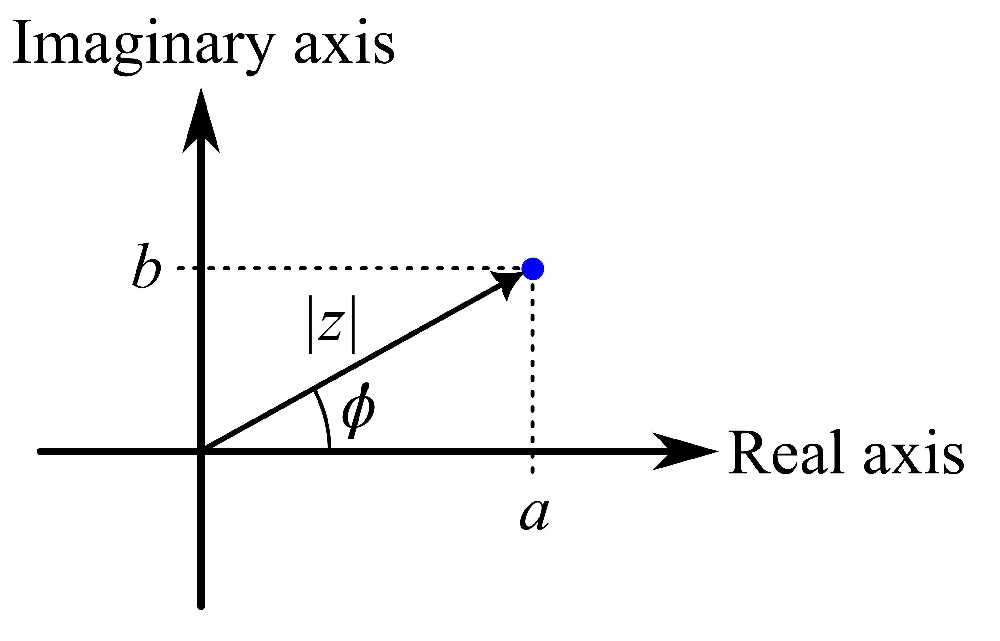

# Introduction
## The Imaginary Number

The imaginary unit is $\sqrt{-1}$. It is often referred to as $i$, but in electronics, often $I$ is used for a DC current (time independent) and $i$ is used for an AC current (time dependent)... also sometimes this convention is flipped. For sake of clarity, even if $i$ is not being used to represent current, $j$ is often used in the context of electronics for representing the imaginary unit

$$j=\sqrt{-1}$$

## A Complex Number

Complex numbers, generically are represented with the variable $z$. In general, complex numbers have real and imaginary parts

$$z=a+jb$$

where $a$ is the real part and $b$ is the imaginary part

$$\text{Re}{[z]} = a$$
$$\text{Im}{[z]} = b$$

It is easy to add and subtract complex numbers in this form

$$z_1 + z_2 = (a_1 + a_2) + j (b_1 + b_2)$$

Multiplying and dividing in this form is a bit trickier

$$z_1\cdot z_2 = (a_1a_2-b_1b_2) + j(a_1b_2+a_2b_1)$$

$$\frac{z_1}{z_2} = \text{no thanks}$$

## The complex plane

{#fig:complex-plane1 width="15cm"}

Another common representation of complex numbers is to write them in terms of their amplitude and phase

$$z=|z|e^{j\phi}$$

where

$$|z| = \sqrt{a^2+b^2}$$

$$\tan\phi = \frac{b}{a}$$

This representation is better for multiplication and division

$$z_1\cdot z_2 = |z_1|\cdot|z_2|\ e^{j(\phi_1 + \phi_2)}$$

$$\frac{z_1}{z_2} = \frac{|z_1|}{|z_2|}\ e^{j(\phi_1 - \phi_2)}$$

# Complex Conjugates

A complex conjugate $z^*$ can be determined by replacing all instances of $j$ with $-j$.

If

$$z = a+jb = |z|e^{j\phi}$$

then

$$z^* = a - jb = |z|e^{-j\phi}$$

The magnitude of a complex number $|z|$ can be calculated by taking the square root of the product of the complex number with its complex conjugate

$$|z| = \sqrt{zz^*}$$

# Sinusoidal functions

## Taylor expansions of sin, cos, and exp

\begin{split}
e^{x} &= \sum_{i=0}^\infty \frac{x^i}{i!} = 1 + x + \frac{x^2}{2} + \frac{x^3}{6} + \frac{x^4}{24} + \frac{x^5}{120} + \frac{x^6}{720} + ...\\

\sin{x} &= \sum_{i=0}^\infty \frac{x^{2i+1}}{(2i+1)!} = x + \frac{x^3}{6} + \frac{x^5}{120} + ...\\

\cos{x} &= \sum_{i=0}^\infty \frac{x^{2i}}{(2i)!} = 1 + \frac{x^2}{2} + \frac{x^4}{24} + \frac{x^6}{720} + ...
\end{split}

## Complex Exponential

\begin{split}
e^{jx} &= \sum_{i=0}^\infty \frac{(jx)^i}{i!} = 1 + jx - \frac{x^2}{2} - j\frac{x^3}{6} + \frac{x^4}{24} + j\frac{x^5}{120} - \frac{x^6}{720} + ...\\

&= \bigg(1 + \frac{x^2}{2} + \frac{x^4}{24} + \frac{x^6}{720} + ...\bigg)+j\bigg(x + \frac{x^3}{6} + \frac{x^5}{120} + ...\bigg)\\

&= \cos{x} +j\sin{x}
\end{split}

This is the best form for keeping track of the phase of a wave.

### Complex Transfer Functions

A transfer function is a time-independent relationship between an input and an output. It can be defined as

$$T = \frac{\text{output function}}{\text{input function}}$$

In this course, we will mostly use transfer functions to relate output voltages to input voltages, such that

$$V_\text{out}(t) = TV_\text{in}(t)$$

A transfer function can be complex. This means that applying it will not only scale the magnitude, but also shift the phase. A generic complex $T$ is best put into the form

$$T = |T|e^{j\delta}$$

so that 

$$V_\text{out}(t) = |T|V_\text{in}(t)e^{j\delta}$$

All waves can be represented in terms of sine or cosine wave components in a Fourier series.

$$\begin{split}V_\text{in}(t) =& \sum_i a_i \cos{(\omega_i t + \phi_i)}\\
V_\text{out}(t) =&\ T\sum_i a_i \cos{(\omega_i t + \phi_i)}\\
=&\ \sum_i a_i |T| \cos{(\omega_i t + \phi_i)}e^{j\delta}
\end{split}$$

However $\cos(\omega_i t+\phi_i)e^{j\delta}$ is not the easiest to work with. Instead, you can represent all cosines and sines as the real and imaginary parts of a single complex exponential

$$\cos{(\omega t + \phi)} \rightarrow e^{j(\omega t + \phi)}$$

This will make the math much easier to work with and then at the end, you can just take the real part. The equations above become

$$\begin{split}\tilde{V}_\text{in}(t) =& \sum_i a_i e^{j(\omega_i t + \phi_i)}\\
\tilde{V}_\text{out}(t) =& \sum_i a_i |T| e^{j(\omega_i t + \phi_i)}e^{j\delta}\\
=& \sum_i a_i |T| e^{j(\omega_i t + \phi_i+\delta)}
\end{split}$$

And then the real part can be taken to find $V_\text{out}$

$$\begin{split}
V_\text{out}&=\text{Re}[\tilde{V}_\text{out}]\\
&= \sum_i a_i |T| \cos{(\omega_i t + \phi_i+\delta)}
\end{split}$$

So each cosine component gets scaled by $|T|$ and shifted by an amount of time of $\delta/\omega_i$ (aka a phase shift).

# More identities

\begin{split}
\cos{x} &= \frac{e^{jx}+e^{jx}}{2}\\

\sin{x} &= \frac{e^{jx}-e^{-jx}}{2j}\\

\cosh{x} &= \frac{e^x+e^{-x}}{2}\\

\sinh{x} &= \frac{e^x-e^{-x}}{2}\\

\cos{x} &= \cosh{jx}\\

\sin{x} &= j\sinh{jx}\\

e^{j 2\pi n} &= 1;\ \ \ \ \ \ \text{where } n\text{ is an integer}\\

e^{j (\pi + 2\pi n)} &= -1;\ \ \ \text{where } n\text{ is an integer}\\

e^{j (\frac{\pi}{2} + 2\pi n)} &= j;\ \ \ \ \ \ \text{where } n\text{ is an integer}\\

e^{j (\frac{3\pi}{2} + 2\pi n)} &= -j;\ \ \ \text{where } n\text{ is an integer}

\end{split}

# Practice Problems

1. Write the following complex numbers in terms of magnitude and phase

   (a) $$z=\frac{A}{1+jx}$$

   (b) $$z=\frac{jx}{1+jx}$$

2. Let $z_1=\sqrt{8}e^{j\frac{3\pi}{4}}$, $z_2=2e^{j\frac{\pi}{6}}$

   (a) Represent $z_1$ and $z_2$ in the complex plane and find their real and imaginary parts

   (b) Evaluate $z_1 + z_2$ and $z_1^2z_2^3$

3. By writing out $\cos\theta$ in terms of exponentials and using the binomial expansion, express $(\cos\theta)^5$ in terms of $\cos\theta$, $\cos 3\theta$, and $\cos 5\theta$.

4. Evaluate the sum

$$\sum_{n=-N}^N\cos(\theta+n\phi)$$

5. Suppose that frequencies $\omega_1$ and $\omega_2$ differ only slightly. Using the complex exponential, express the sum

$$A_0\cos\omega_1 t +A_0\cos\omega_2 t$$

&nbsp;&nbsp;&nbsp;&nbsp;&nbsp;&nbsp;&nbsp;&nbsp;&nbsp;&nbsp;&nbsp;(where $A_0$ is a constant) in the form of

$$A(t)\cos\frac{\omega_1+\omega_2}{2}t$$

&nbsp;&nbsp;&nbsp;&nbsp;&nbsp;&nbsp;&nbsp;&nbsp;&nbsp;&nbsp;&nbsp;where $A(t)$ is a slowly varying function of time.