# Goals
Today you will learn to use equipment that are useful for building and testing electronic circuits. You will use all of these instruments extensively throughout the semester.

-   Power supply
    -   This is used to provide DC power to your circuits
    -   It can be used as a voltage source (constant voltage) or a current source (constant current).
    
-   Function generator
    -   This is used to create signals with various waveforms
    -   This is an incredibly useful tool for characterizing the frequency dependance of your circuits.

-   Digital multimeter (DMM)
    -   This is an extremely versatile tool that can measure DC and AC voltages and currents, resistances, and sometimes more (depending on the model)
    -   It has a simple display that can only show single values such as a root-mean-square voltage *or* the frequency of an AC signal.

-   Oscilloscope (aka scope)
    -   This is a voltage meter that can "plot" voltage over time
    -   This is a far more powerful tool for characterizing voltages than the DMM because you can characterize wave shapes and noise.

<!--
*** added "further" to imply continuation. some other minor edits 
-->
In this course you will continue to develop essential laboratory skills. Not only is the above equipment found in nearly every lab space, but you will practice keeping a lab notebook in a practical way and practice a model based approach to experimental design.

<!-- 
*** had difficulty parsing the feedback for this part, but I think I improved it
-->
In this course, you will practice implementing, testing, and refining models. Extremely accurate and nuanced models are often difficult to implement, so it can be desirable to adjust physical systems to accommodate simpler models. Balancing accuracy and simplicity is a skill and takes practice.

Today, you will

-   Connect your circuit to *Earth ground*,

-   Set up the power supply so that you can get voltages both above and below ground (positive and negative voltages),

-   Operate the power supply in constant voltage and constant current modes,

-   Measure physical properties, such as voltage differences, current, and resistance,

-   Trigger the oscilloscope,

-   Operate the function generator,

<!--
*** added this 
-->
-   Use a caliper or micrometer to measure the diameter of a wire and estimate the resistance,

-   Measure resistors using 2-terminal and with 4-terminal measurement methods,

-   Develop familiarity with the model-based approach to experiment.


# Lab Notebook Guidelines

Lab notebooks are an essential tool in research and development settings. They may seem tedious to maintain, but if you develop good habits now, you will avoid unnecessary headaches in the future. Poor notetaking can cause you to lose track of data or the meaning of data which can force you to unnecessarily repeat experiments and/or calculations.

The lab notebook will play an essential role in this course and will be graded each week.  You will use your notebook for keeping records of many things including:

-   Answering prelab questions from the lab guide to prepare you for upcoming lab activities,

-   Answering in-lab questions,

-   Measurements and data,

-   Plots, diagrams, pictures, and sketches,

-   Experimental procedures and designs,

-   Analyses and results.

The lab notebook will be an important part of your grade because learning to keep a good lab notebook is crucial for your professional development. Keeping a physical notebook is very common, but many people like to keep digital notebooks nowadays, usually as a supplement to a physical notebook. There are many popular tools; since the University now uses a Microsoft ecosystem, OneNote ends up being very convenient for integrating with other Microsoft tools such as Teams and OneDrive. Jupyter notebooks are another useful tool as they can integrate Python code with Markdown (with LaTeX compatibility) which can streamline your calculations and allow for nice and easy plots. Your lab notebook is the main mechanism for communicating your processes and results of the lab experiments. Each week, you will be responsible for turning in both your pre-lab work and your lab notebook / analyses via Canvas. See the syllabus for more information.

<!--You may find it helpful to write up many of your notes on the computer, for example, within Mathematica, Jupyter Notebooks. This is fine. However, before your notebook is turned in, the notes, plots, and analysis should be transferred to the lab notebook by printing and taping the pages or keeping them in a three-ring binder. This is standard practice in research labs. Your lab notebook is the main mechanism for communicating your process and results of the lab experiments. Each week, you will be responsible for turning in both your pre-laboratory work and your lab notebook / analysis via Canvas in scanned format. See the syllabus for more information.-->

# Cables and Adapters

There are many kinds of cables and adapters found in the lab. The following are some of the more common ones you will encounter.

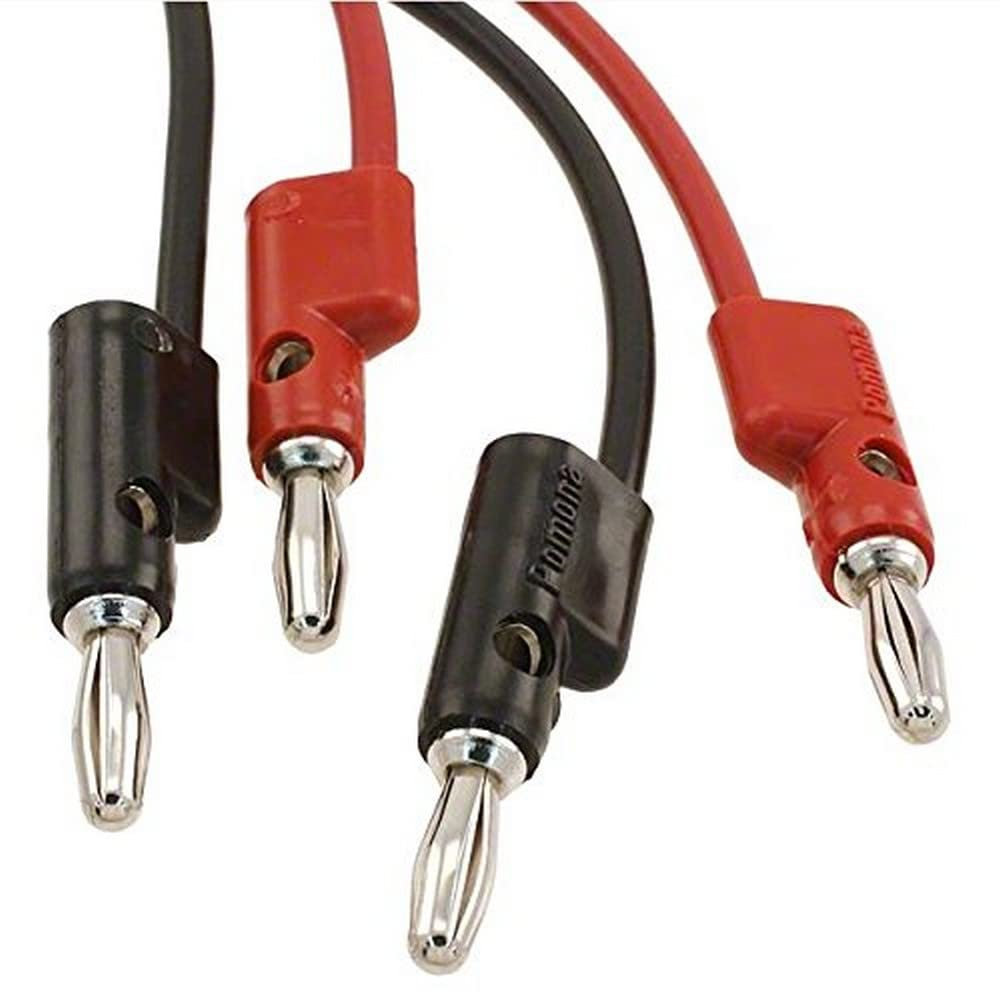{#fig:banana width="8cm"}

{#fig:coax width="10cm"}

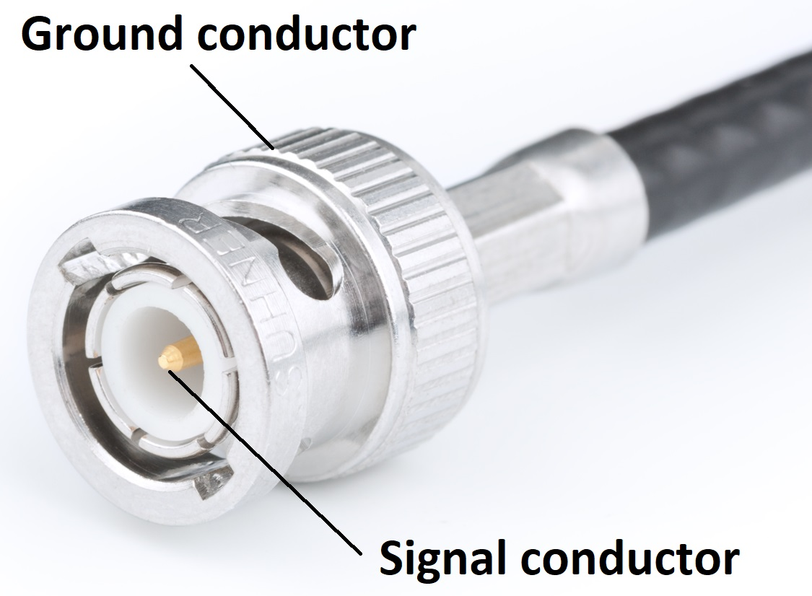{#fig:bnc width="10cm"}

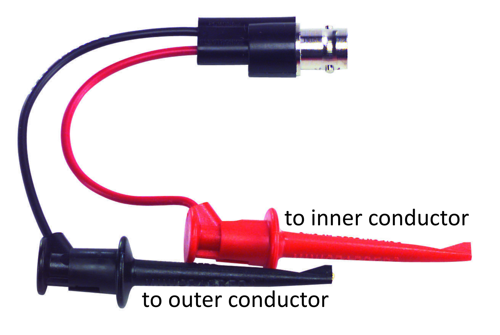{#fig:grabber width="10cm"}

{#fig:banana-to-coax width="10cm"}

# Some Useful Definitions

**Common ground** - there are many types of ground and people often confuse them and use the word "ground" to refer to any one of them. A common ground is any part of a circuit which is (arbitrarily) referred to as $0\text{ V}$ and that all other voltages are measured with respect to.

**Earth ground** - a common ground which is ultimately connected to the Earth. The 3<sup>rd</sup> prong on wall outlets is Earth ground. Under buildings large metal plates are buried and are connected to via a *ground wire*. Earth ground allows for certain kinds of short circuit failures (and lightning strikes) to have the power diverted away and avoid excessive damage to devices, buildings, or **YOU**.

**Chassis ground** - a common ground which is a metal frame around the circuit. If a device plugs into the wall with 3 prongs, it is likely that the chassis is also connected to **Earth ground**. Chassis grounding can help facilitate the safety of Earth grounding, but also acts a Faraday cage, shielding the circuit from external EM waves.

**Electrical load** - a load refers to the impedance/resistance (in ohms) connected from the output of a power source to the circuit's ground. This could be a speaker, a light bulb, a microwave oven, or anything else which is drawing power from the circuit.

**RMS (Root Mean Square)** - the square root of the average of a periodic function squared over one period $V_\text{RMS}=\sqrt{\langle V(t)^{2}\rangle}$. Example: For the function $V(t) = V_0\sin(\omega t)$, the RMS value is $V_\text{RMS} = \large\frac{V_0}{\sqrt{2}}$.

*Note:* $\frac{1}{\sqrt{2}}=\frac{\sqrt{2}}{2}\approx 0.707$. This number will come up **a lot** in this course, and is worth committing to memory!

# Text Books

This course does not require purchasing a textbook, but we recommend using an external resource to read as a supplement. Each prelab will point out sections in each of these books that are relevant to the content of the lab that week.

1.  [Analog and Digital Electronics - D. A. Steck](https://atomoptics-nas.uoregon.edu/~dsteck/teaching/electronics/electronics-notes.pdf)
    - This text is freely available as a PDF, so you may want to download it and keep it handy.

2.  The Electronics Companion - A. C. Fischer-Cripps
    - This is a great reference for quick information.
    - There is a copy of the first edition in the lab.

3.  The Art of Electronics - P. Horowitz and W. Hill 
    - This is a very practical (and in depth) textbook
    - This book is an invaluable resource for designing your final projects
    - Very comprehensive discussions of advanced topics, but sparse on the introductory basics.
    - There are 3 copies of the 2<sup>nd</sup> Edition in the lab.

For today's lab, the following sections are useful and relevant readings

1.  Steck Sections 1.1 -- 1.3.2

2.  Fischer-Cripps Sections 1.1 -- 1.11, 2.1 -- 2.5, 3.1 -- 3.3
    - Resistor color code chart on p. 247 (Here's a [Code calculator](https://www.digikey.com/en/resources/conversion-calculators/conversion-calculator-resistor-color-code) and an [online chart](https://www.allaboutcircuits.com/textbook/reference/chpt-2/resistor-color-codes/))

3.  Horowitz and Hill 2<sup>nd</sup> ed. Sections 1.01 -- 1.12

4.  Horowitz and Hill 3<sup>rd</sup> ed. Sections 1.1 -- 1.2.2, 1.3 -- 1.3.1
    - Multimeters on p. 10

5.  The following manuals, which can be found on on the [lab manuals page](/PHYS-3330/manuals-data-sheets):

    -   Keysight EDU33210 Series Waveform Generator User Guide and Data Sheet

    -   Keysight EDU36311A Power Supply User Guide (p. 43-45) and Data Sheet

    -   Tektronix TBS2000 Series Oscilloscope User Manual

6.  There's also a [math review on complex numbers](/PHYS-3330/resources/complex)

# Prelab

Answer the following questions in your lab notebook and with Jupyter Notebooks. Scan the relevant pages and upload the PDF file to Canvas. Note that the lab prep activities are directly related to the lab and by completing them (and having them available during lab) you will be able to work through the lab more efficiently and be able to understand what you are doing during the lab.

For your calculations, you should write a reusable function in a Python script that you can import into your Jupyter Notebooks. This will allow you to easily update calculations and recycle code in a practical way.

For example, with a script called `jlab.py`

```

"""
Python script to import useful functions for J-Lab
"""

def parallel_resistance(resistors: list) -> float:
    """
    Calculate the parallel resistance of a list of resistor values
    Conductance is 1/Resistance
    returns sum(R_i^(-1))^(-1)
    """
    conductance = 0.0  # initialize result of sum
    for resistance in resistors:
        conductance += 1.0 / resistance  # add each term to sum
    return 1.0 / conductance

```

This function can be used in a Jupyter Notebook like this

```

import jlab as jl

r1 = 2e3  # 2 kOhm
r2 = 500  # 500 Ohm
r3 = 1e3  # 1 kOhm
rp = jl.parallel_restance( [r1, r2, r3] )
print( "R_p = {:.1f} Ohm".format(rp) )

```

Throughout this course, there will be many calculations that you will use repeatedly. It may seem like extra work now, but adopting this practice early will help streamline your workflow throughout the semester and make your life easier in the long run.

## Physics 2 review: Resistors

In Physics 2, you learned introductory basics to circuits. Metals have free electrons that can flow through the material (current) when there is a difference in electric potential across it (voltage applied). Ohm's law describes the relationship between current and voltage:

$$\Delta V = IR$$

where $R$ is resistance with units of $\Omega$ (Ohm's). The resistance of a uniform piece of metal can be described by

$$R = \rho\frac{\ell}{A}$$

where $\rho$ is resistivity (a property that depends on the type of metal), $\ell$ is the length of the metal in the direction the voltage is applied, and $A$ is the cross-sectional area in the other two directions.

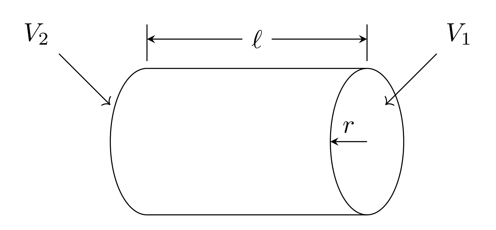{#fig:resistivity width="14cm"}

Adding two resistors in series adds their lengths together, so the resistance goes up. In general, $n$ resistors in series will have a total resistance of

$$R_\text{series} = \sum_{i=1}^nR_i$$

However, adding resistors in parallel adds the cross-sectional area, so the total resistance will decrease. The total resistance of $n$ resistors in parallel obeys

$$\frac{1}{R_\text{parallel}} = \sum_{i=1}^n\frac{1}{R_i}$$

### Prelab question 

What is the total resistance of two resistors in parallel that each have a resistance of $R$?

### Prelab question 

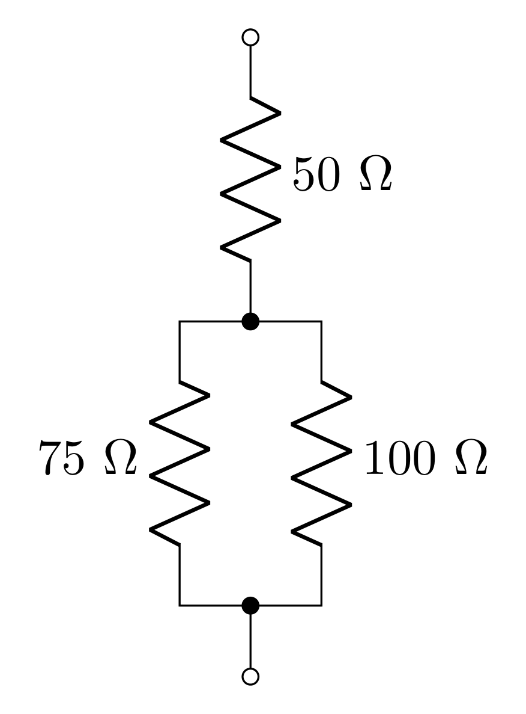{#fig:resistor-prob width="8cm"}

Find the total resistance of the combination of resistors shown in Figure @fig:resistor-prob.

## Physics 2 review: Joule heating

When current flows in the metal, there will be power dissipated due to heat. This phenomena is known as Joule heating, and the power (energy/time) can be calculated by

$$P=I\Delta V$$

where $I$ is the current through the metal/resistor and $\Delta V$ is the voltage across it. This can be expressed in terms of the current and resistance or the voltage and resistance using Ohm's Law

$$P = I^2R = \frac{(\Delta V)^2}{R}$$

## Physics 2 review: Capacitors

A capacitor stores energy in the form of electric fields that are generated by separated charge. In Physics 2 you considered the parallel plate capacitor.

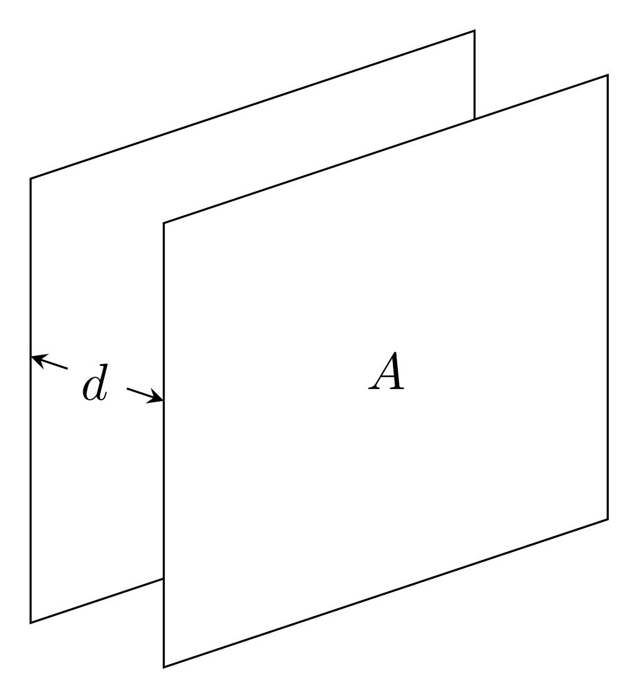{#fig:pp-cap width="7cm"}

When a voltage difference $\Delta V$ is applied to the plates, equal and opposite charge $Q$ will accumulate on each plate according to

$$Q = C\Delta V$$

where $C$ is the capacitance of the capacitor with units of F (Farads). The capacitance can be determined through considering the electric fields produces by the charged sheets. At some point, you've worked this out using Gauss's law. The result is

$$C = \varepsilon_0\frac{A}{d}$$

Adding capacitors in series then increases the total gap distance, decreasing the capacitance. The total capacitance of $n$ capacitors in series is

$$\frac{1}{C_\text{series}} = \sum_{i=1}^n\frac{1}{C_i}$$

Adding capacitors in parallel is like adding more area to a single capacitor. The total capacitance of $n$ capacitors in parallel is

$$C_\text{parallel} = \sum_{i=1}^nC_i$$

### Prelab question 

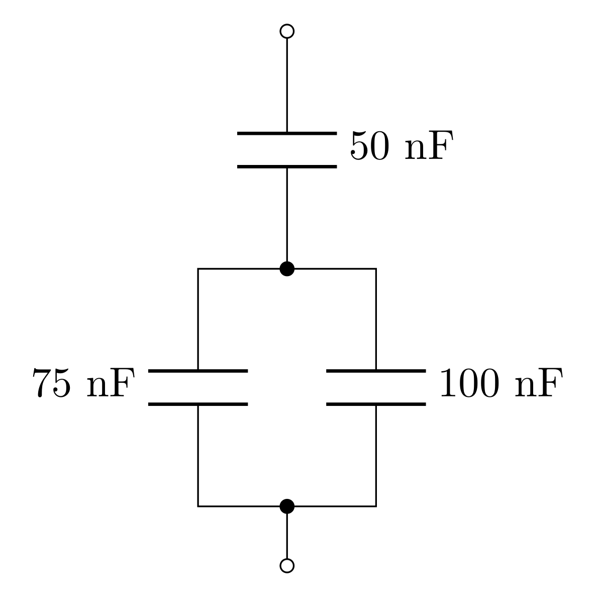{#fig:cap-problem width="8cm"}

Calculate the total capacitance of the combination of capacitors shown above.

## SPICE simulation

SPICE (Simulation Program with Integrated Circuit Emphasis) is an open-source circuit simulation tool that is commonly used to help prototype and analyze circuits. There are many implementations of SPICE, but for this class, we will use Analog Devices' LTspice (because it's free!).

- [Download and install LTspice](https://www.analog.com/en/resources/design-tools-and-calculators/ltspice-simulator.html). Sometimes, the website changes; if the link is broken [please report the issue to the technical staff](/PHYS-3330/report-lab-issue), and search "site:analog.com LTspice download" to locate the download page.

- Download and save this [useful PDF of shortcuts](../resources/ltspice-resources/ltspice_shortcutflyer.pdf) <!--
  - *Note:* Mac users should keep these two references handy
      - [Tips for LTspice on Mac](https://ucboulder.github.io/PHYS-3330/resources/ltspice-resources/TipsForLTspiceOnMac.pdf)
      - [Shortcuts](https://ucboulder.github.io/PHYS-3330/resources/ltspice-resources/LTspiceShortcutsForMacOSX) -->
- On the download page there are several tutorials.
    - Watch the [LTSpice Tutorial - EP1 Getting started](https://www.youtube.com/watch?v=JRcyHuyb1V0) by FesZ Electronics.
        - Mac users should check out [LTspice - Getting Started in 8 Minutes](https://www.youtube.com/watch?v=abyxz8jfgK4) by CircuitBread.

### Prelab Question 

- Start a new project and place a voltage source somewhere. Right click on the element and set the voltage to $10\text{ V}$ (you can just type the number "10" in the text box). Leave the series resistance blank.

- Place a resistor next to the voltage source. Right click it and set it's value to $1\text{ k}\Omega$ (you can just type "1k" in the box) 

- Use the wire tool to connect the source to the resistor to create a complete circuit.

- Use the ground tool and place the ground somewhere along the wire connected to the $(-)$ terminal of the source. This tool tells the simulation what voltage you are referencing from; all voltage measurements will be relative to this voltage (i.e. you can refer to this as "$0\text{ V}$").

- **Take a screen shot of the circuit and include it in your prelab.**

- Use Ohm's law to predict the current through the resistor. What is this current (don't forget units!).

- Use the Joule heating equation to predict the power dissipated in the resistor (don't forget units!).

- Configure the analysis:
    - Select the "Transient" tab
    - Stop time: 1 (for 1 second)
    - Time to start taking data: 0
    - Click okay

- The simulation should now be running.
    - hover the mouse over the wire connected to the $(+)$ terminal, so that the mouse icon turns into a red probe-like object. Click on the wire to measure the voltage. The voltage here should obviously be $10\text{ V}$.
    - hover the mouse over the resistor so that the icon turns into a blue arrow through a loop. Click to measure the current through the resistor. What is this current? Does it match what you calculated using Ohm's law?
    - hold the **Alt** key to turn the current measuring tool to a power measuring tool (the icon should look like a mercury thermometer). While holding **Alt** click the resistor to measure the power dissipated in the resistor. What is the power? Does it match your calculation?

# Lab Activities

*IMPORTANT NOTE:* In this course's lab manuals, "ground" refers to Earth ground; other kinds of ground will be explictly differentiated.

## Power Supply

Your DC power supply will provide your circuits with the required power. The Keysight EDU36311A DC Power Supply has **three** outputs that can be independently controlled. Pages 43-45 of the User Guide (which can be found in the [Data Sheets and Instrument Manuals page](/PHYS-3330/manuals-data-sheets)) discuss this in detail.

### Set up the DC voltage bias

We want two of the power supply channels to be set up such that the potential difference (voltage) set on one of the channels is ***<span style="color: red;">positive</span>*** **with respect to ground** and the other is ***<span style="color: blue;">negative</span>*** **with respect to ground**. 

By default, all 3 outputs are ***FLOATING*** with respect to ground. You have to manually connect one of the terminals of an output to ground in order to "tie" it to ground. This gives you the flexibility to use the power supply in a number of different ways.

When you set $5\text{ V}$ on channel 2, the power supply will make the $(+)$ terminal $5\text{ V}$ above the $(-)$ terminal. In order to get $5\text{ V}$ **relative to ground**, you will need to connect one of these terminals to the ground terminal.

1.  Get some <span style="color: green;">green</span> or black wire (from the wire spool rack on the top of the blue tool cabinet) to make these grounding connections. Connect channel 2's $(-)$ terminal to ground and channel 3's $(+)$ terminal to ground (see the green lines drawn on Figure @fig:ps). You can unscrew the input jacks on the power supply to expose a small hole where the jumper wires can be inserted.
<!--

*** I hadn't considered this in detail, but now that you mention it: for single phase AC, hot is black, neutral is white, and ground is green. For DC red is positive, and black is negative: which I believe implies just 2 voltages. Since we use 3 voltages DC, I think the best way to comply with other standards would be for

Green - Ground

White - Neutral

Red - DC above ground

Black - DC below ground

*** This way, Red and Black which are both considered "HOT" in some standard, are both considered "hot", and green is considered "cold".

*** The distinction between neutral and ground being that, even though they are the same voltage, the ground wire is not connected to a load. In this way, making green connections from the ground port to the + and - ports of the outputs and a white wire from the power supply to the bread board would probably be the most "compliant" with safety standards. 

[//]: # (We harp on that black is ground in this course - I'm not certain why that was historically done here and I'm certainly on board to converting to conventional standards (including shifting red to white and blue to black {I might have that backwords}). But, we should change all the proto board connections to be consistent? Buy a bunch of green banana cables? I'm genuinely in favor of this and it will require revisions to subsequent lab guides.)
-->

2. You will set the outputs of channel 2 and 3 to $15\text{ V}$. Predict what the voltages will be at each of the 4 output terminals (whenever someone refers to a voltage at a location, they always mean "relative to ground").

3. Using banana cables, how would you connect your DMM to the power supply to measure the voltage at these terminals? Sketch it in your notebook (*Hint:* don't use the mini-grabbers since there's no sensible place to grab with them).

4.  Set the voltages and turn on the outputs of channels 2 and 3. Set up your DMM to measure the voltages at each terminal. Do your results match your predictions?

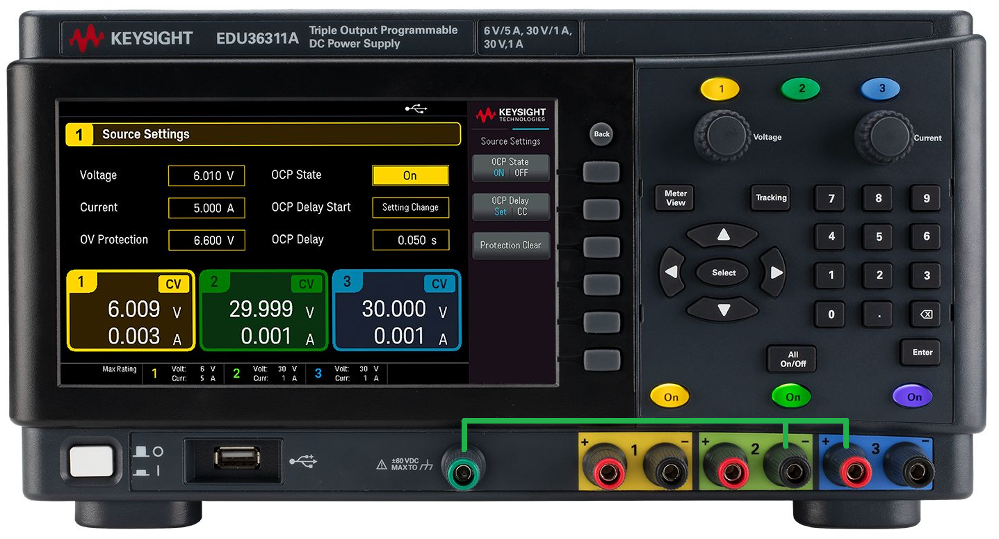{#fig:ps width="20cm"}

### Investigate operating modes

**Ohm's Law** states the voltage drop across a load is

$$\Delta V = IR$$

But as the load $R$ changes, either the voltage or the current will have to adjust. A *voltage source* supplies a *constant voltage* (the current changes), and a *current source* supplies a *constant current* (the voltage changes). Mathematically:

-   Voltage source: $I(R) = \frac{V}{R}$, where $V$ is a constant.

-   Current source: $V(R) = IR$, where $I$ is a constant.

The power supply can be used either as a voltage or current source. When it is a voltage source, it will display **CV** for *constant voltage* in the top right corner of the channel's display, and when it is a current source, it will display **CC** for *constant current*. The power supply will automatically switch between these modes depending on the voltage and current limits you set as well as the load attached.

1.  With no load attached, what mode is the channel in (CV or CC)? 

2.  Try adjusting the value of the voltage limit and the current limit. Why is the current output always zero? What value could you reasonably assign as the load?

3.  Use a banana cable to short the $(+)$ rail of Channel 2 to ground. What mode is the channel in now? Use the voltage and current readings on the screen and Ohm's law to determine the load on the output. Why does the voltage output not reach the voltage limit?

4.  Vary the value of the voltage limit and current limit again. Describe the behavior of the voltage and current readings and the mode (CV/CC) of the power supply. What happens when you short the output to ground (have too small a load)? What is the maximum output of current and voltage your supply can produce?

5.  Remove the short.

6.  Given a known load of $50\ \Omega$, describe how you would set the voltage and current limits to get CV mode with $15\text{ V}$ or CC mode with $300\text{ mA}$ (this is a good place to check in with an instructor).

CV and CC modes are not settings you select in a menu. They are modes inherent to the voltage and current limits set for given ranges of loads. Whichever limit the power supply reaches first (which depends on the load), will determine which mode the power supply is in. If this is not clear, please check in with an instructor.


## The Oscilloscope (Scope)

The goal of this part of the lab is to be able to use an oscilloscope (aka scope or o-scope) to make voltage measurements over time. Old, analog scopes scanned an electron beam horizontally across fluorescent screen, and applying a voltage at the input would cause the beam to deflect up and down with the voltage, allowing you to visualize how the voltage behaved over time. Today, most labs are equipped with digital oscilloscopes which rapidly measure the voltage and then plot the data on a screen in real time. This has many advantages over using the DMM as a voltmeter because it gives you much more information about the voltage you're measuring.

There are a few precautions to observe when operating the oscilloscope:

-   Avoid overheating the instrument. Do not block ventilation of the interior.

-   Do not apply more than 300 V to any input terminal.

-   Avoid serious or fatal injury from electrical shock. Do not remove the case to expose the 120 V mains.

Otherwise, the instruments are robust and cannot be damaged by wrong settings. So, try whatever you're curious about and measure and document what happens.

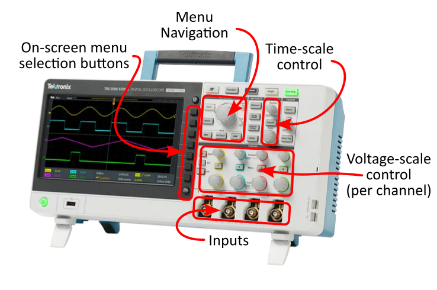{#fig:scope-guide width="14cm"}

The front panel of the scope is organized in a very particular way:

-   Vertical refers to controlling the y-axis of the plot (which is voltage).
    -   These scopes have 4 separate inputs which can all be used at the same time, and have individual controls for scaling and offsetting the voltages of each.

-   Horizontal refers to controlling the x-axis of the plot (which is time).
    -   All 4 channels have to be displayed with the same time scale, so there is only one set of horizontal controls for all 4 channels.

-   The black buttons allow you to select options displayed next to them on the screen.

-   Knobs can be pressed like buttons (read the labels to see what they do).

### Setting up the Scope

<!--The Tektronix TBS 2000 Series has four independent channels so that four separate signals can be displayed at once. Each trace is color coded with the buttons on the panel, and you can open a menu specific for each channel with the rectangular, colored, numbered buttons in the vertical control area.-->

{#fig:scope-default-setup width="10cm"}

1.  Turn on the scope and once it's booted up, press the **Default Setup** button to reset all the user settings. The default setting is to have the reported voltages be 10x what is actually measured (we'll get to why this is the default later).

2.  Press the yellow 1 button to open channel 1's menu, and set the *Probe Setup* setting to 1x (see Figure @fig:probe-setup). Repeat this for the other 3 menus.

3.  Turn off channels 2, 3 and 4. To turn a channel off (so you don't see it on the screen), you can press the menu button for that channel to open the menu, and then again to disable the channel.

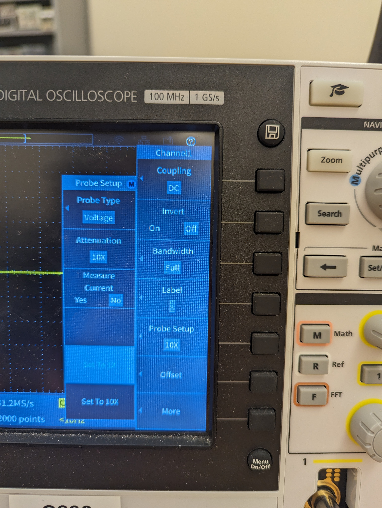{#fig:probe-setup width="10cm"}

### Measuring a DC voltage on a scope

1.  Use a BNC cable and a BNC to double banana adapter to connect channel 1 of the scope to the power supply. <!--Measure the voltage on scope using the cursors. Try exploring the different knobs and menus on the scope to make the measurement. Refer to the appendix listed at the end of this document if you get stuck.-->

2.  Apply a voltage from your power supply and confirm that this is what you see on the oscilloscope. The yellow triangle on the left of the screen indicates where $0\text{ V}$ is (this can be moved with the yellow vertical position knob). *Hint:* moving the zero position to the bottom of the screen allows you to choose a smaller voltage scale (zooming in) so that you have more resolution on the screen.
    1.   Try to estimate the voltage by counting the number of divisions and using the reported vertical scale (voltage / division) in the bottom left of the screen (see Figure @fig:scope-screen).
    2.   Try using the cursors option in the **Navigation** portion of the controls.
    3.   Press the **Measure** button in the **Resources** portion of the controls to open a menu of data processing options. Which one of these options would be best to use?

***IMPORTANT NOTES:*** 

-   Even though this button is called "measure," the real measurement is already being done to display the line on the screen.

-   The scope stores the real measurements of voltage and time in an internal log.

-   "Measure" allows you to analyze the stored data by applying computations to report certain values.

-   It is important to read the details of an option before using it because it may not do what you think it does.

<!--
*** good call, I meant to put it back in somehow, but forgot
-->

-   Oscilloscopes can only distinguish about 100 different values on the vertical axes of the screen. Before you use the "Measure" button, make sure that the trace covers at least half the screen vertically without clipping at the top or bottom. This way you get a resolution/accuracy of approximately ±2%.

3.  In your lab notebook, describe the setup of the electric circuits (diagrams are useful) and the outcomes measured.

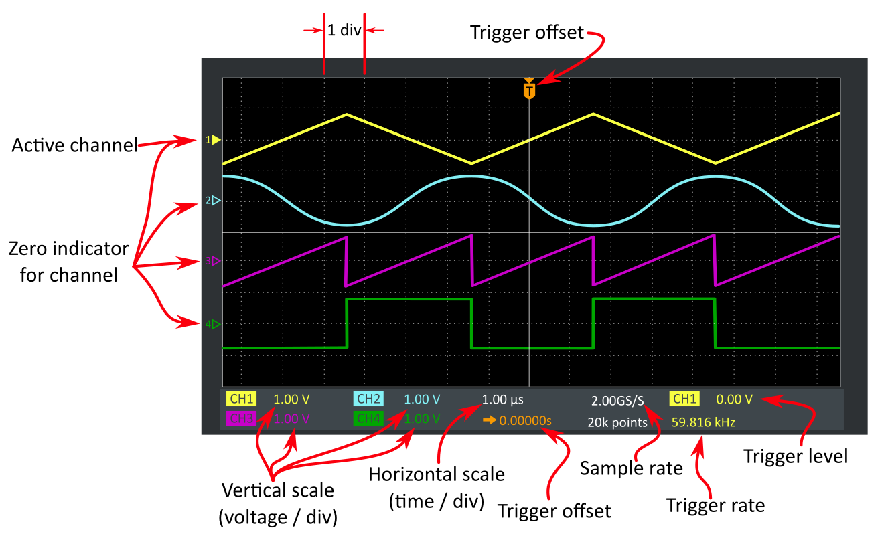{#fig:scope-screen width="18cm"}


## Creating an AC waveform using a function generator and measuring it on a scope

The Keysight EDU33212A function generator can produce a number of different waveforms over the frequencies from $10^{-6}\text{ Hz}$ to $20\text{ MHz}$. The output amplitude can be varied between $1\text{ mV}$ and $20\text{ V}$ peak-to-peak with an output impedance of $50\ \Omega$.

<span style="color: red;">There is one main **precaution** to keep in mind: ***Do not connect any output of the EDU33212A directly to DC power*** or to the output of any other instrument or circuit. Doing so will burn out the output amplifier!</span> In a later lab, we'll learn how to use different tools to allow you to safely interface the function generator with DC power.

1.  The function generator has an output impedance of $50\ \Omega$ (there is a $50\ \Omega$ resistor in series with the output), and it assumes, by default, that you will use a $50\ \Omega$ load. This means that half of the voltage will drop across the output impedance, and half will drop across the load, so by default, the function generator displays only half the voltage that it is actually trying to apply (because this is how much "reaches" the load). <span style="color: red;">**Every time you turn on the function generator, you have to set the output termination setting to High-Z**</span> so that it displays the full voltage (see the appendix or page 53 of the user manual).

    - We will explore the idea of output impedance (and input impedance) in much more detail next lab.

2.  On Channel 1, create a $1\text{ V}_\text{pp}$ (volts peak-to-peak) sine wave at 1 kHz with no DC offset, and turn the output **on**.<!-- (you may want to use this standard setup in the future if you have trouble).-->

## Triggering

In order to view waves on the oscilloscope, it needs to redraw the wave in the right place at the right time. "Triggering" is the process of stabilizing a repeating signal on the screen.

1.  Use a BNC connector to connect the output of the function generator to the input of channel 1 on the scope.

2.  Set the *voltage / div* and *time / div* so that the sine wave appears nice and big on the screen. Remember that the period is the inverse of the frequency. Always consider the frequency you are using and adjust the scope's horizontal scale appropriately to avoid aliasing! Talk with an instructor to learn more about aliasing.

3.  The **Trigger** options are in the top-right corner of the oscilloscope's front panel. Open the *Trigger Menu*. You should see that the Channel the scope is triggering on is Channel 1.

4.  There are 3 options that you will change most regularly. Paraphrase these in your lab notebook for future reference.

    -   **Trigger channel:** the input that the scope uses to trigger (this setting can be changed by pressing the vertical-scale knob corresponding to the channel you want to trigger to).

    -   **Trigger level:** the scope knows to trigger the wave when the voltage changes through the trigger level voltage (this setting can be changed with the *Level* knob below the *Trigger Menu* button).

    -   **Slope:** selects whether to trigger when the voltage rises to the trigger level (rising edge), or falls to the trigger level (falling edge).

    -   **Trigger mode:** of the modes, there are 2 you will mostly use for this class:

        1. **Auto (untriggered roll)**: This setting is needed to measure DC voltages that don't pass through a trigger level. It does a poor job of triggering on slower waves (less than a few hundred $\text{Hz}$).

        2. **Normal:** If no trigger event occurs, nothing will be displayed (so measuring DC can't be done). But this setting allows you to trigger on slower waves.

5.  Change the trigger channel. Since there is nothing to trigger on on other channels, you will see that the wave no longer displays in a measurable way (this is what "untriggered" looks like). Describe what you see. Change the trigger channel back to Channel 1.

6.  Play with the trigger level. Describe what you see. Why does the wave move? Get help if you don't understand.

7.  Press the slope button to change between rising and falling edge triggering. Describe what happens (*Hint:* the wave is **not** "flipping").

8.  Set the trigger level to $-400\text{ mV}$. Is the wave still triggered? If not, increase the trigger level a small amount until it is.

9.  On the function generator, change the amplitude to $100\text{ mV}_\text{pp}$. The waveform should no longer be triggered. Why?

10. It is annoying to have to adjust the trigger every time you adjust your waveform. To accommodate this, the function generator has an output specifically for triggering on: **Sync / Trigger out** (just to the left of the Channel 1 output).

    - Use a coax cable to connect this output to Channel 4 of the scope.

    - Turn on Channel 4 on the scope.
    
    - Adjust the vertical scale to fully view the waveform. A good habit is to have the wave occupy roughly 75% of the screen vertically.

    - Describe the waveshape.

11. Change the trigger channel to Channel 4. Adjust the trigger level. Does the trigger level matter? Why?

12. Play with the waveform (from channel 1) on the function generator. What happens to the **Sync / Trigger out** when you change the

    - the amplitude,

    - the frequency,
    
    - the DC offset,

    - the phase offset,

    - the wave shape?

14. Why is the **Sync / Trigger out** a square wave?

## Measuring Waves with the Scope

1.  Make a waveform of your choice with the function generator. Measure the period, frequency and peak-to-peak amplitude

    -   by estimating using the divisions,

    -   using the cursors,

    -   using the *Measure* button. ***Be careful to read how the result is calculated in the bottom-left corner of the screen to make sure you're choosing the right option!***

2.  Repeat with a sine-wave.

## Measuring Quantities with the Digital Multimeter

**The multimeter is a useful device to make quick and easy measurements of all sorts of things.**

1.  The first thing you'll notice is the dial on the DMM. This allows you to select what kind of measurement you'd like to make. There is also a yellow button which allows you to cycle through different measurement settings on each of these dial positions. What is the difference between the voltage channel with the squiggly line over the $\tilde{\text{V}}$ and the straight line over over the $\overline{\text{V}}$?

2.  The second thing you'll notice is the single **COM** port and separate ports for current measurements and for everything else (voltage, resistance, etc.). Why would there be separate ports for current?

<!--To measure various quantities with the DMM, you must set the dial on the DMM to the correct setting that you want to measure. The Fluke 115 DMM that is in your toolbox at your workbench has three banana jack input ports at the bottom. Based on the quantity that you want to measure (voltage, current, resistance, etc.), you need to be sure that you've installed the leads into the appropriate input ports (NOTE: one of the leads will always be connected to the **COM** port).-->

3.  Connect the leads and set the dial to measure resistance (the mini grabbers are great for this). Get three resistors close to $5\text{ k} \Omega$ (5%) from the stock drawers. Measure the resistance of each resistor. Do all the resistors meet the 5% specification?

4.  Measure the voltage across the resistor. Why is it $0\text{ V}$?

5.  Connect the resistor to the power supply using alligator clips (these can attach to banana plugs) and set the output to $10\text{ V}$. Use the DMM to measure the voltage across the resistor. Does the DMM voltage reading agree with the voltage reading displayed on power supply? Sketch a circuit diagram representing the arrangement of the supply, resistor, and DMM.

<!-- 
*** I was thinking of letting them flounder a bit here. The "correct" way I had in mind would be with the mini-grabbers. I think letting them try to be creative so that they can be told why it's a bad idea to jerry-rig connections.

[//]: # (How do you intend them to do this? Should we provide some direction given they'll have no clue where to start?)
-->

6.  Switch the DMM to the $\tilde{V}$ mode. What does the voltage read now? Does this meet your expectation? If not, there is either a mistake in your reasoning or with your experimental setup. Once you're confident the measurement is correct, explain why it is actually correct.

7.  To measure the current you will have to rearrange the circuit and change the DMM configuration. Set up the DMM properly so that current flows *through* the correct port of the DMM. Does the current measurement match the display on the power supply? Sketch a circuit diagram representing the arrangement of the supply, resistor, and DMM.
<!--
*** Not sure! I am open to ideas. I think having some ambiguity here is fine, as I expect everyone should be getting through this part during the 3 hours.

[//]: # (Same as above, do we instruct them?)
-->

8.  Switch the DMM to the $\tilde{A}$ mode. What does the current read now? Does this meet your expectation? If it does not, this is a good time to get assistance from an instructor.

<!-- 
*** I have been working across a few computers and sometimes it seems to not sync. I don't remember what I did, so I will take another stab at it!


9.  Now take the output from the function generator and measure the AC voltage with the DMM.
[//]: # (maybe combine with next step? This feels offputting - not sure.)

4.  The DMM also has an AC voltage setting. You will need to use the function generator to produce an AC (sine) waveform. Over what frequency range is the reading accurate to 2%?  Note: the DMM displays the RMS amplitude of the waveform. See Definitions at the beginning of the guide for an explanation of RMS. You will also need to consider how [“Amplitude” and “Peak-to-Peak”](https://en.wikipedia.org/wiki/Amplitude) are related.

5.  Remember in the future that this is the usable frequency range for the AC setting of the multimeter. Record this frequency in your lab notebook for future reference.
-->

9.  It should be clear by now that, on the DMM, ~ is a symbol for AC and -- <!-- should render as a long dash --> is a symbol for DC. Use the $\tilde{V}$ mode to measure the AC voltage from the function generator. Set the function generator to $2\text{ V}_\text{pp}$ at $1\text{ kHz}$. Note: the DMM displays the RMS amplitude of the waveform. See Definitions at the beginning of the guide for an explanation of RMS. You will also need to consider how [“Amplitude” and “Peak-to-Peak”](https://en.wikipedia.org/wiki/Amplitude) are related. Is the measurement from the DMM consistent with your expectation? If your measurement does not match your prediction, please review the definition of root-mean-square and rework your prediction.

## Measuring Small Resistances (4-Terminal Measurement)

In the previous section, you measured resistances using the ohmmeter in the DMM. You will now use all the measurement techniques and devices you have learned about to determine the most accurate way to measure a small resistance. A 4-terminal measurement is a method of measuring small resistances in a way that "ignores" lead resistance and contact resistance.

###  Measure a small resistance using a DMM ohmmeter

1.  Use a ~$2\text{ m}$ length of magnet wire as your small resistor (this can be found on the wire spool rack on top of the blue tool cabinet next to the entrance of the lab - there should also be a 2m stick near the tool cabinet). Magnet wire has a very thin amber-colored insulating coating (about 0.001" in thickness). Make sure you remove the insulation from the ends of the wire to make a good electrical connection and measurement of the diameter of the wire. You can burn off the insulation with a flame or use sand paper to scratch it off.

2.  Calculate the resistance based on the diameter, length, and resistivity (the resistivity, $\rho$, of copper at room temperature is $1.68\text{ μ}\Omega$-$\text{cm}$)? Remember that $R = \rho \ell/A$, where $\ell$ is length and $A$ is cross-sectional area. You'll find dial calipers and a micrometer in the "Measuring Tools" drawer of the blue tool cabinet. The spool of magnet wire should be 28-gauge. Look up a copper magnet wire gauge chart online and confirm that your diameter measurement agrees with what you find.

3.  Use the ohmmeter in the DMM to measure the resistance of the wire. **Document your setup, measurements, and calculations in your lab notebook.**

### Measure a small resistance using a 4-terminal approach

The way the DMM makes a resistance measurement is by delivering a very small, calibrated, current to the magnet wire, and then it measures the voltage drop across it's internal resistor (in parallel with your resistor) and calculates $R$ based on Ohm's law. The issue here is that the voltage doesn't just drop across the resistance of the magnet wire, but also the contacts and all the leads. This is called a 2-terminal measurement because you are using the same 2 terminals to supply the current and measure the voltage. You will now make a more accurate measurement using a 4-terminal measurement.

1.  Use your DC power supply in CC mode to deliver a specified current. Connect this to the magnet wire. You now have 2 terminals connected to your wire.

2.  Use your DMM to make a voltage measurement of the voltage drop across just the magnet wire (this adds another 2 terminals connected to your wire).

3.  Using the current reading on the power supply and the voltage reading on the DMM, use Ohm's law to determine the resistance of the magnet wire.

4.  Draw a diagram of your experimental set up in your lab notebook.

5.  Consider how the amount of current flowing through your wire affects the sensitivity and accuracy of your measurement (consider precision of your measurement devices as well as heat/temperature dependances).

### Compare the two measurement techniques

1.  The ohmmeter in the DMM works by supplying a calibrated current and measuring the potential difference between the outputs. How is this measurement different than the 4-terminal approach you built?

*Hint:* consider where the current is flowing and what resistances are involved with each measurement technique. It is usually helpful to draw a diagram including all the resistances (including the wires and the contacts).

2.  Which method is more accurate for measuring small resistances based on your explanation above?

3.  Do your two measurements confirm the scientific argument you just made? Defend your assertion using your data.

# Appendix A: Tektronix TBS 2000 Series Oscilloscope Controls {#appendix-a-tektronix-tbs-2000-series-oscilloscope-controls .unnumbered}

**To change the horizontal (time base) scale:**

1.  Horizontal scale knob changes the time per division

2.  Horizontal position knob changes location of the trigger (labeled as a orange arrow on the top of the screen)

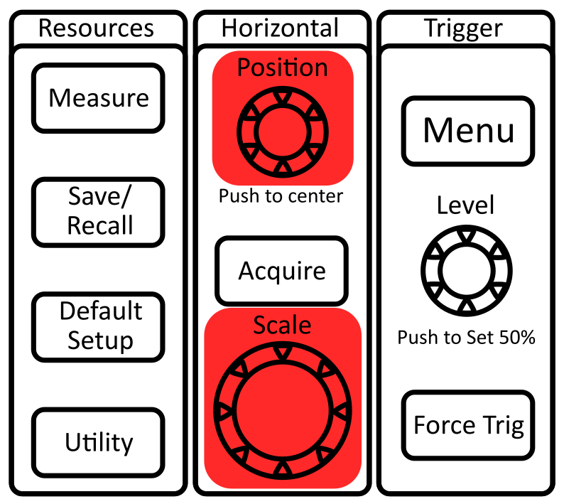{#fig:hori-dials width="10cm"}

**To change the vertical (voltage base) scale:**

1.  Vertical scale knob changes the voltage per division

2.  Vertical position knob changes location of the ground (labeled as a colored-coded arrow on the left of the screen)

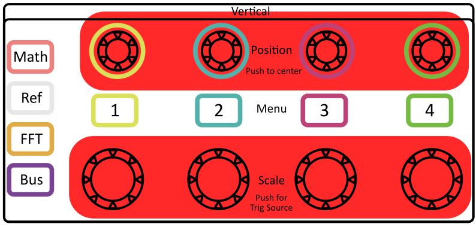{#fig:vert-dials wdith="14cm"}

**To access the parameters for each channel:**

The channel buttons open the corresponding channel menu with the following options:

1.  Input Coupling (AC/DC/Ground)

    - This should **ALMOST ALWAYS** be set to DC! AC coupling removes DC offsets, which can be convenient if you know what you're doing with it.

2.  Invert Signal (this should be left off)

3.  Probe Setup

    - This setting multiplies the measured voltage by the amount specified. In most cases, this should be set to 1x.

If a channel menu is open, pressing the channel button again will turn off that channel's trace.

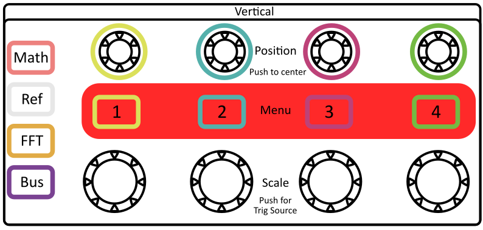{#fig:ch-menu width="14cm"}

**To adjust the trigger:**

1.  Trigger knob changes the voltage level of the trigger

2.  Trigger MENU button

    - Select which channel to trigger off of (trigger level arrow changes color to show which channel is being triggered). You can also change the trigger channel by pressing the vertical scale knobs like buttons.

    - Slope: can trigger off a rising or falling edge.

    - Trigger Mode:
      
        - Auto: (will display a "roll" of measurements when not triggered). This setting will cause the wave to crawl across the screen at low frequencies.
        
        - Normal: (won't update the display if not triggered). This setting will not allow you to display DC without an external trigger source.

3. The "Force Trigger" button should be avoided. If you're having trouble triggering, this button often won't help, and it will stunt your growth with regards to learning how to use the scope properly!

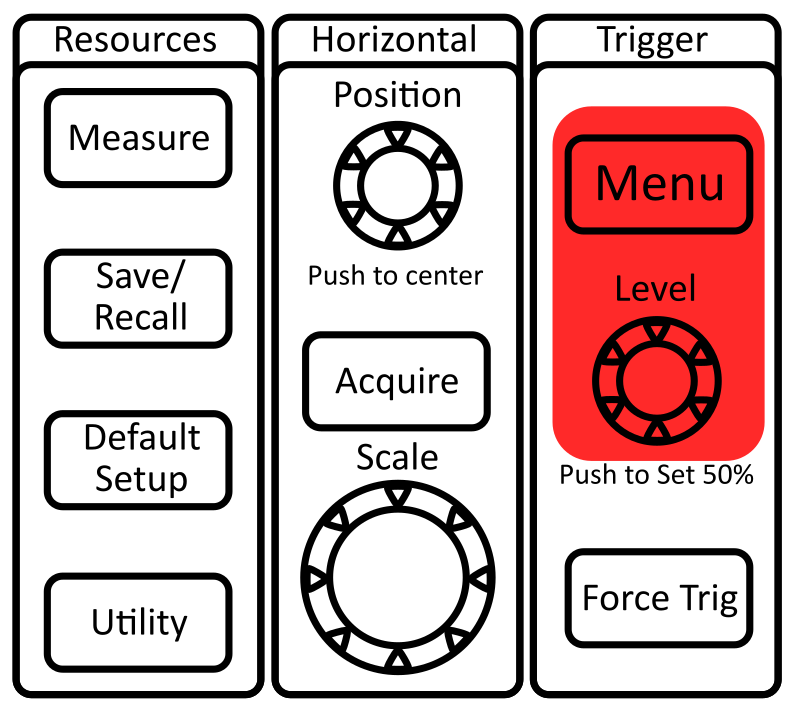{#fig:trig-menu width="10cm"}

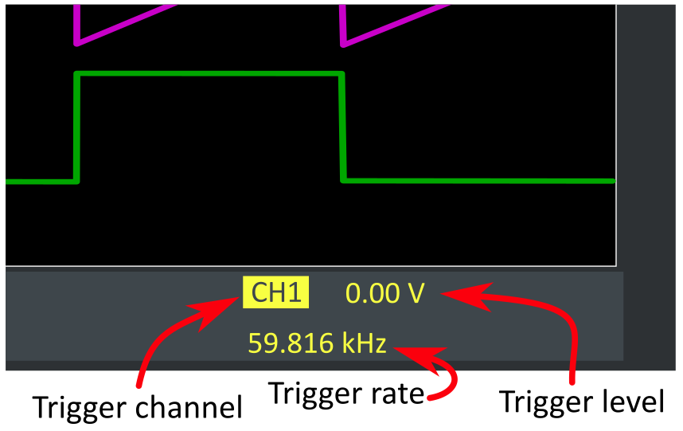{#fig:trig-indic width="10cm"}

**To select the AQUIRE mode:**

1.  Run/Stop: sets the scope to continuously acquire or freeze after last trigger. The button will glow red when "stopped" and green when "running."

2.  Single: (aka single shot) acquires a single trace from the trigger and then doesn't continue to update.

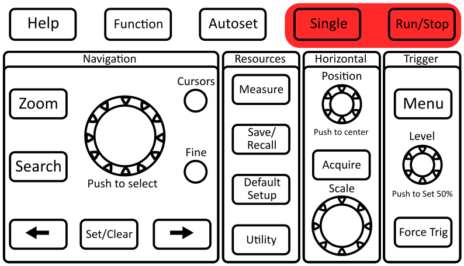{#fig:scope-shot width="14cm"}

**Measure Menu (top of panel):**

You can select various operations to perform on the measurements on various channels. *Be very careful* with these because they can be very deceptive and may not give the result you are expecting, and how you display the wave on the screen greatly affects the number that "Measure" will report. Generally use cursors to make accurate measurements. 

**Cursor Menu (under Navigation):**

1.  Choose time (vertical bars) or voltage (horizontal bars) measurement.

2.  Choose which channel to measure (measurement cursors are the same color as the channel they are measuring). You can change the channel by pressing the numbered channel button.

3.  Big top knob moves the cursors. You can press "Fine" to make it move more smoothly (this will also cause other knobs to move more smoothly which can be very annoying).

4.  Press the knob like a button to switch cursors.

5.  Position relative to ground (trigger zero time) is displayed on the screen with the T symbol.

6.  Relative distance between cursors is displayed on the screen with the $\Delta$ symbol.

# Appendix B: Changing the Output Termination on the Function Generator (Keysight EDU33212A) {#appendix-b-changing-the-output-termination-on-the-function-generator-keysight-edu33212a .unnumbered}

1.  Press a channel \[Setup\] key to open the channel configuration screen. Note that the current output termination values (both $50\ \Omega$ in this case) appear at the top left of the channel display.

{#fig:setup width="15cm"}

2.  Begin specifying the output termination by pressing Output Load.

{#fig:output width="15cm"}

3.  Select the desired output termination either by using the knob or numeric keypad to select the desired load impedance or by pressing Set to $50\ \Omega$ or Set to High Z. You can also set a specific value by pressing Load.

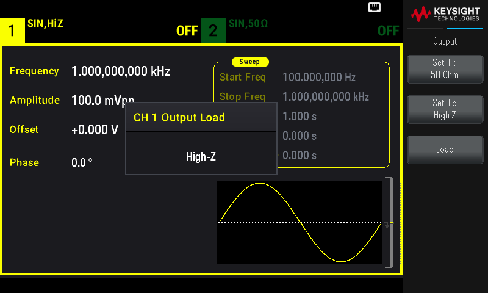{#fig:termination width="15cm"}
