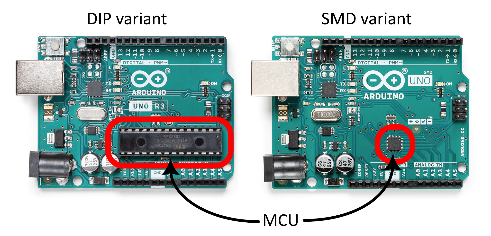
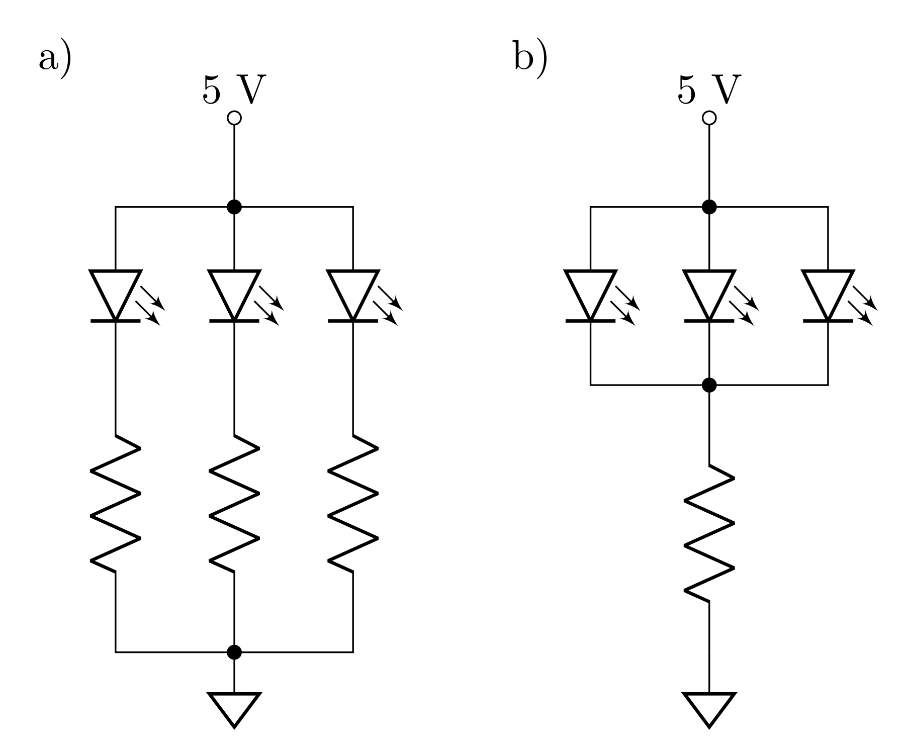
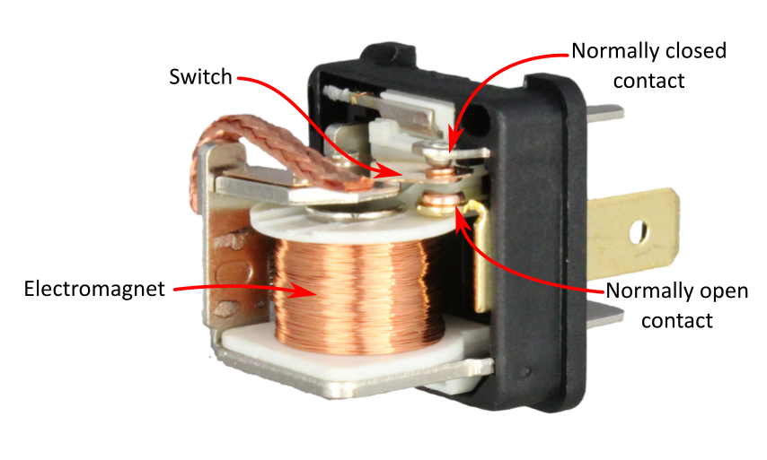
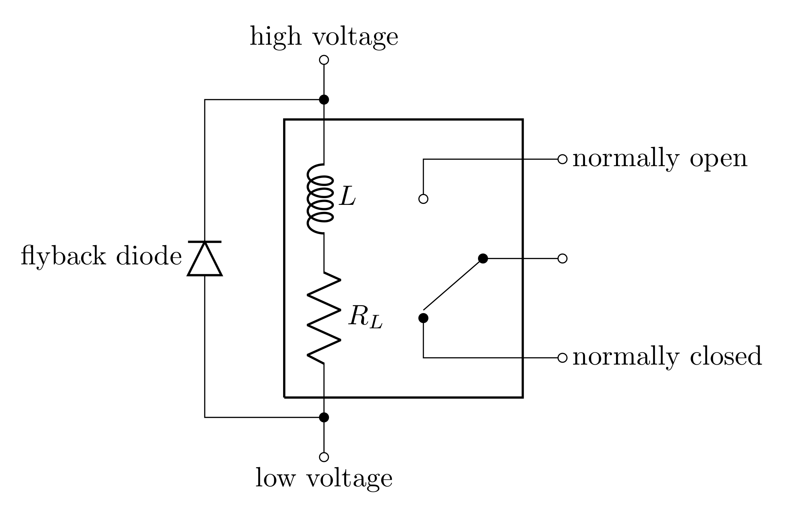
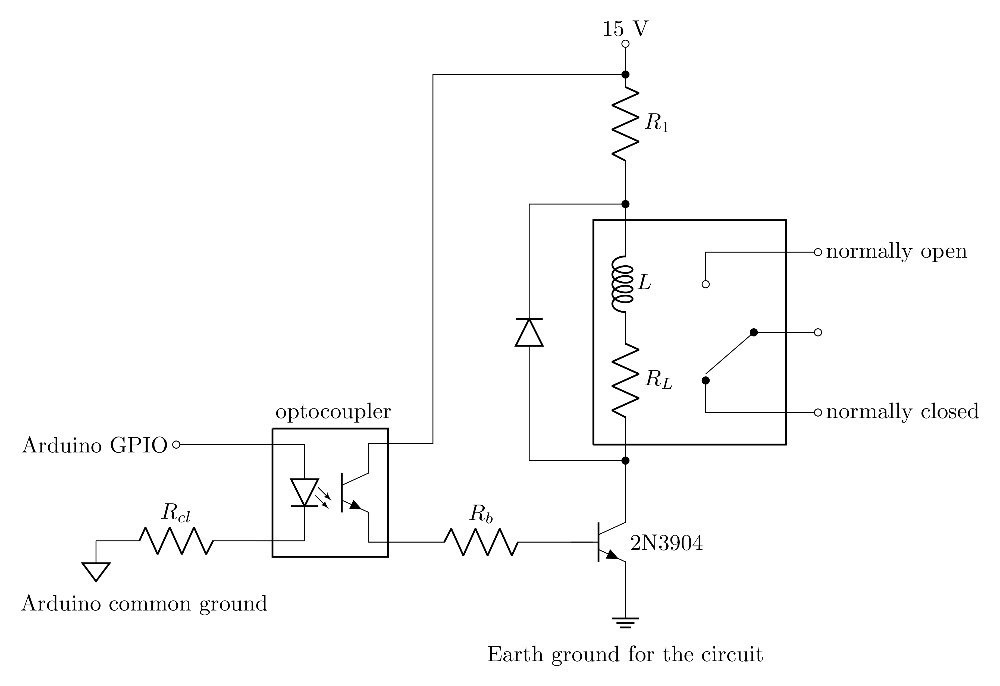
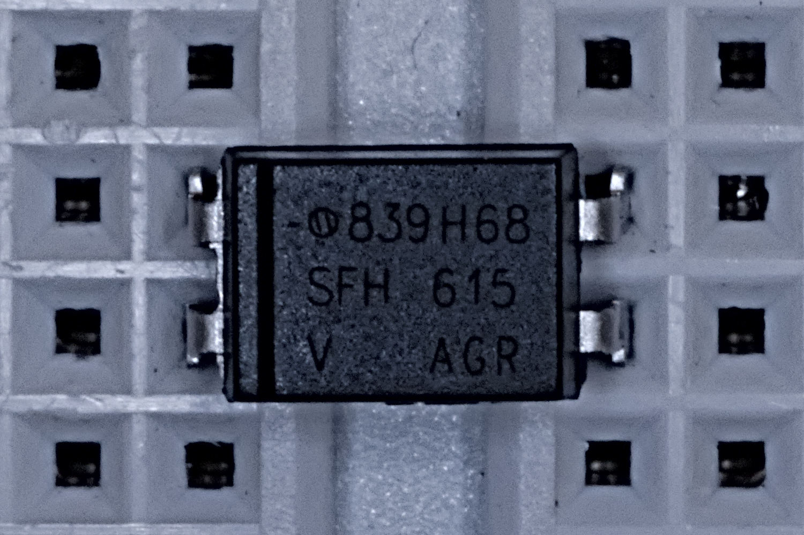

# Goals

In this lab, we will get a sense of the capabilities of Arduino microcontroller boards. Microcontroller units (aka microcontrollers, MCUs, or μCs) are *computers on a chip*; they are programmable ICs (integrated circuit) that contain

-  a central processing unit (CPU)
-  volatile memory (RAM)
-  non-volatile memory (ROM, EPROM, EEPROM, or flash) to store programs
-  digital inputs and outputs
-  analog inputs and outputs
-  serial inputs and outputs (for communication)
-  clocks or timers

They are simple computing machines on a single chip designed for control in embedded systems. You can find MCUs in

-  toys
-  refrigerators
-  cars
-  televisions
-  cameras
-  microwaves
-  washing machines
-  **laboratory equipment**
-  you name it!

Even though microcontrollers are *technically* computers, they are used in far more specialized applications than the *general purpose computers* you're used to thinking about (like your laptop, tablet, smartphone or desktop computer). They are not used for running operating systems (like Linux, Windows, macOS, iOS, or Android) and are programmed to run specific tasks, like managing the operations of a refrigerator (e.g. monitoring the temperature and running the refrigeration cycle when needed).

In this lab you will learn to

-  write C++ programs (sketches) in the Arduino IDE
-  control LEDs with the Arduino
-  control a relay safely without risk of damaging the Arduino

# New Terms

**General Purpose Input/Output (GPIO)** - these are digital signal pins on microcontrollers that can be programmed to either measure or set digital signals. If they are programmed as an input, they can read either 0 or 1, and if they are programmed as an output, they can either set 0 or 1.

**IDE** - “Integrated Development Environment.” Software specifically designed for writing programs in a certain setting or context. The Arduino IDE is specifically designed to greatly simplify the process of programming compatible microcontrollers.

**Sketch** - the program files you write in the Arduino IDE. Sketches are written in the C++ programming language, but it is also possible to use [Python](https://realpython.com/arduino-python/) and other languages (we will use the C++ default in this lab).

**Relay** - a current controlled switch. Relays differ from transistors in that they are electro-mechanical objects: they are true, physical switches controlled by an electromagnet. Running current through the electromagnet pulls or pushes the switch into either an open or closed position (there are many constructions for different applications).

**Optocoupler (aka optoisolator)** - this device is similar to the optical-link you built in lab 6. It has two isolated parts: (1) an internal LED, and (2) a sensor which modulates current as a function of measured light. This allows you to send a signal from one circuit to another without any electrical contact between the two.

# Prelab

## Programmable Circuits - Introduction

Suppose you want to build something more complex than the digital circuits we studied in lab 9. For example, you might have a photodiode that you want to hook up to a computer so you can automatically adjust your experiment in response to changing light intensity, maybe by adjusting the current powering a laser. Or, say you want to build a tiny, battery-powered data transmitter to feed to a dolphin and find out how her body temperature varies while she’s swimming around in the ocean. Since it’s hard to transmit signals through a dolphin, the transmitter should store the temperature data until it is excreted by the dolphin and floats to the surface where your receiver can detect the signal.

These and many other applications require complex digital circuitry. Any digital system, including a programmable computer, can be built by combining the gates you worked with in lab 9 that utilize (BJT-based) [transistor-transistor logic](https://en.wikipedia.org/wiki/Transistor%E2%80%93transistor_logic) (TTL). In fact, the first personal computer to reach the market (1971) had a CPU built out of many TTL chips. However, TTL isn't practical for scaling. Modern computer design utilizes [very large scale integration](https://en.wikipedia.org/wiki/Very_Large_Scale_Integration) (VLSI), which is the process of integrating millions to trillions of MOSFETs into compact ICs which are fabricated using a process called [CMOS](https://en.wikipedia.org/wiki/CMOS). MOSFETs have lots of advantages over BJTs in this particular application: [here's a nice post on Stack Exchange discussing the pros and cons of MOSFETs](https://electronics.stackexchange.com/a/527268), but most importantly, they're easier to shrink down and fabricate en masse than BJTs.

There are plenty of applications where TTL chips are the best solution, but if you find yourself needing more than a small handful of these chips, it is probably time to consider using a different tool.

### Prelab Question {#sec:1.1}

Give 3 reasons why MOSFETs would be used for **very large scale integration** programmable circuits instead of BJTs


## MCUs vs MPUs vs SBCs vs FPGAs

Here is the full section leading up to that question. The title of the section is "MCUs vs MPUs vs FPGAs"

**Microcontroller unit (MCU)** – a small computer on a single IC that includes a processor, volatile and non-volatile memory, and input/outputs. These are used for specialized tasks in control systems. MCUs can be found on pre-built boards that facilitate interacting with the MCU (the Arduino that you will use for this lab is just one example of this kind of microcontroller board). Microcontrollers are technically computers, but they are not general computers like a laptop or a smartphone; they lack operating systems and are programmed for specific tasks.

**Microcontroller development board** - an Arduino is a development board designed to greatly simplify the process of interfacing with and programming the microcontroller.

**Microprocessor unit (MPU)** - a chip that processes tasks. Both CPUs and GPUs (graphics processing units) are examples of MPUs. Often, people refer to *single board computers* as microprocessors because of the symmetry of "MCU vs MPU," but the microprocessor involved is just the CPU chip on a single board computer. A microcontroller chip contains all the functions of a microprocessor but with supporting elements like memory.

**Single board computer (SBC)** - a general computer on a single board that is small enough to embed in a system. Often these have inputs and outputs like a microcontroller board. The most popular SBC is the Raspberry Pi, but there are also many alternatives. SBCs are more costly and consume more power than microcontrollers. SBCs can run full operating systems and can technically do anything your laptop can, like edit spreadsheets, browse the web, play games, and edit, compile, and/or run code. Because they typically have built in ethernet and/or Wi-Fi, they are often used as servers which can accept commands from other devices, perform tasks, then return information (this is how hosting a website works). In physics labs, these SBC servers can be used to interface with lab equipment to automate experiments and allow you to communicate with them over a local network. SBCs also typically have HDMI output and USB ports allowing you to connect a monitor, keyboard, and mouse so that you can write programs directly on them (microcontrollers require you to write programs on another computer and then send the programs over a serial connection).

**Field Programmable Gate Array (FPGA)** – A single IC containing an array of logic gates. FPGAs are "hardware LEGOs®" that have configurable logic blocks (the LEGO® pieces) that can be programmed to act as different logic gates. FPGAs are extremely versatile since they can be programmed to do anything on the logic gate level, and can even be programmed to be the same hardware as an MCU or MPU (just buy an MCU or MPU at that point). FPGAs can be used to replace a large pile of TTL chips. FPGAs can also be programmed to process information in a highly parallel fashion making them far faster than microcontrollers (if you know what you're doing). However, FPGAs are much more costly than any of the above options and are usually only used in applications where rapid prototyping or on the fly development of digital circuits is needed. The largest FPGAs can contain 300,000 gates or more, and the programming effort can become a major project in and of itself.

For more on FPGAs:

-  Horowitz and Hill 2<sup>nd</sup> ed - Sections 8.15, 8.27

-  Horowitz and Hill 3<sup>rd</sup> ed - Sections 11--11.2.5

### Prelab Question {#sec:2.1}

Match the following three tools to the applications you think they would be best suited for

(a) Microcontroller board (like an Arduino)

(b) Single board computer (like a Raspberry Pi)

(c) FPGA

1. You need to control an array of LEDs based on RPM measurement of a motor.

1. You need control a satellite that requires highly parallelized computations, and you will likely need to update the system regularly.

1. You need to control measurement equipment, record data, and access the stored data over a network.

1. You need to rapidly prototype a complex digital circuit.

1. You need to automate an experiment and plot the data on a screen *live* as it is being taken.

1. You need to build a temperature controller that reads temperatures and sets an appropriate amount of power to a heater to reach a setpoint.


## Arduinos
{#fig:arduino}

In this lab, we will take a look at what microcontrollers can do by working with the Arduino Uno board.

>Arduino is an open-source electronics platform based on easy-to-use hardware and software. Arduino boards are able to read inputs - light on a sensor, a finger on a button, or a Twitter message - and turn it into an output - activating a motor, turning on an LED, publishing something online. You can tell your board what to do by sending a set of instructions to the microcontroller on the board. To do so you use the Arduino programming language (based on Wiring), and the Arduino Software (IDE), based on Processing. ([Arduino website](https://www.arduino.cc/en/Guide/Introduction))

Arduino has been highly successful in developing simple, open-source, microcontroller boards that can be programmed easily. These boards have a huge international following that has resulted in a wide range of books, publicly available programs, robotics kits, and the like. These resources make the Arduino a common and easy choice when thinking about a microcontroller project because there is a large and active online community around Arduino development.

The heart of the Arduino Uno is the 28 pin ATMEL [ATmega328P](https://en.wikipedia.org/wiki/ATmega328) MCU chip (see Figure @fig:arduino). It is a member of the ATMEL 8-bit [AVR microcontroller family](https://en.wikipedia.org/wiki/AVR_microcontrollers), with

-  32 kB of 8-bit wide flash memory to store the program you write,

-  1 kB of electronically erasable and programmable EEPROM that is normally used to save data between power cycles,

-  2 kB of 8 bit data SRAM for executing programs (this is where ints, floats, chars, etc will be stored while code is running),


The program you send to the ATmega328P gets stored in flash memory (based on NAND gates), so you can program it over and over again as you debug your hardware and code; flash is non-volatile, so the chip won’t forget its programming when you turn the power off. The Arduino board is designed to allow you to interface with the MCU through a USB port. The Arduino IDE allows you to easily interact with the board via serial connection and the software allows you to upload your code to the Arduino and allows you to see messages sent back to the computer over the serial connection. When plugged into your computer with the USB cable, the Arduino board will also take power through the cable.

Nearly every pin of the ATmega328P MCU can be programmed in multiple ways for various uses. It has

-  up to 23 GPIO pins: they can be used to read *or* set digital voltages. 

-  an internal, variable frequency clock and three separate timer/counter/scalers. 

-  a comparator with a programmable voltage reference

-  6 channels of pulse-width-modulated (PWM) output to simulate adjustable external analog voltages

-  a 10-bit analog-to-digital converter with a 6-channel analog multiplexer, so you can digitize 6 separate analog signals.

Amazingly, you can have all this for ~$3 per MCU (although the full Arduino Uno R3 board runs for ~$25).

The Arduino Uno R3 is a printed circuit board (PCB) with not only the ATmega328P MCU, but several other components on it to make it easy to interact with. [The full circuit diagram of the PCB can be found here.](https://www.arduino.cc/en/uploads/Main/Arduino_Uno_Rev3-schematic.pdf) You will see another microcontroller chip (Atmega16U2) that is used by the board to interface with the USB port. This is largely what makes the Arduino so useful and easy to work with.

Arduino sketches are written in C++ and always take on the following form:

```

// You can define global variables at the top of the sketch

void setup() {
// The Arduino will start by calling this function.
}

void loop() {
// After setup() is done, the Arduino will execute this
// function repeatedly until it is reset or powered off.
}

```

Here is a Pythonic representation of what is happening under the hood:

```

import arduino_stuff

setup()
while True:
   loop()

```

### Prelab Question {#sec:3.1}

Set up the Arduino software

1. [Download the Arduino IDE](https://www.arduino.cc/en/software#future-version-of-the-arduino-ide) on your device of choice (runs on Windows, macOS, and Linux). 

   -  We have USB-A to USB-C adapters in the lab that you can use if your device doesn't have any USB-A ports.

   -  Both you and your lab partner should have the IDE ready, just in case either of you run into issues with your device.

2. Install the software on your computer. You will need the Desktop IDE for this lab (not the Web IDE).

3. Download [this](../resources/lab10fig/ardunio_starter_sketch.ino) starter sketch file.

4. Open it in the Arduino IDE.

5. Read through it.

6. See the ["Language Reference" section of the Arduino website](https://www.arduino.cc/reference/en/). 

Describe:
   1. the `pinMode()` command

   2. the `digitalWrite()` command

   3. what the script will do.


## Arduino Circuits

In this lab, you **will not** connect the Arduino to Earth ground. You have connected all of your circuits to Earth ground up to this point. You will power your Arduino via the USB cable from your computer. 

{#fig:grounds}

In this lab, all the circuit diagrams show a common ground symbol (see Figure @fig:grounds) for connections to the **GND** pin of the Arduino board. Connections to the ground of the power supply, oscilliscope, and/or function generator are connections to Earth ground, and will be labeled with the Earth ground symbol in circuit diagrams.

When you draw your diagrams, make sure to use the right ground symbol when appropriate. We will take care to separate and isolate the Arduino circuit from the power supply, and the distinction between these two grounds is important.


### Prelab Question {#sec:3.2}

The GPIO on the Arduino board can programmatically set $5\text{ V}$. The ATmega328P datasheet says that each GPIO can source a maximum of $40\text{ mA}$ of current.

What's the ***minimum*** load that should be applied to a GPIO pin?

### Prelab Question {#sec:3.3}

The [HLMP-C625](https://ucboulder.github.io/PHYS-3330/resources/manuals-and-data-sheets/ds-HLMP-C625-LED.pdf) LED has a recommended operating current of $20\text{ mA}$ and has a typical forward voltage of $1.9\text{ V}$.

What resistance should you put in series with this LED to get the recommended current when powered by the microcontrollers GPIO pin?

### Prelab Question {#sec:3.4}

In many microcontroller applications, LEDs are used as indicators to alert users what might be happening in the system. When multiple LEDs are being used, there are two ways to limit the current through them as seen in Figure @fig:led-limiting. In the lab you will be using the MV57164 LED bank of 10 LEDs. This LED bank has a similar design to a DIP chip with 10 LEDs running down chip with all the anodes on one side and cathodes on the other side. The forward voltage of these LEDs is about $2\text{ V}$.

{#fig:led-limiting}

Assuming you have $N$ LEDs with current limiting resistors $R$, for both circuits a) and b):

1. What is the voltage $V_R$ across the resistor(s) (express in volts)?

2. What is the current $I_R$ through the resistor(s) (express in terms of $N$, $V_R$, $R$)?

3. What is the current $I_\text{LED}$ through the LEDs (express in terms of $N$, $V_R$, $R$)? Is your answer consistent with Kircchoff's current law?

4. Write an expression for $R$ with respect to $N$, $V_R$, and the desired LED current $I_\text{LED}$.

4. Given your results, if $N$ is something that will change (i.e. different amounts of LEDs will be turned on and off at different times), which arrangement (a or b) will properly limit the current?

## Analog readings

The Arduino Uno has 6 analog input pins, which convert an analog input (between $0$ and $5\text{ V}$ by default) into a digital value with 10 bits of resolution. This means that it will store the value as a binary number between 00 0000 0000 (representing $0\text{ V}$) and 11 1111 1111 (representing $5\text{ V}$). When this number is sent to a computer to read out, it will be printed as a decimal number (i.e. 1111 $\rightarrow 15$)

### Prelab Question{#sec:4.1}

1. What is the decimal equivalent of the binary number that represents $5\text{ V}$?

2. Write a function in Python that converts a decimal equivalent of the binary stored value to volts
   -  input is a number between $0$ and the number calculated above
   -  output is a number in volts
   -  test that plugging in $0$ returns $0\text{ V}$ and plugging in the number you calculated above returns $5\text{ V}$

### Prelab Question {#sec:4.2}

In the lab, you will use a potentiometer as a variable voltage divider with a $5\text{ V}$ input and use an analog input to read the $V_\text{out}$ of the voltage divider. This is a common way for a user to interact with a microcontroller via a dial.

1. Draw a schematic of the circuit diagram for the potentiometer acting as a control for the Arduino.

*Hint:* The $5\text{ V}$ should come from the Arduino itself.

2. The potentiometers on your breadboard header are $10\text{ k}\Omega$; how much power is drawn by having this potentiometer being used as a control dial?

## Isolating the Microcontroller

Microcontrollers are often used to control elements of analog circuits that involve higher power which could potentially damage the MCU. Inductive elements like relays and motors can be particularly hazardous because they are capable of creating electrical surges and back EMF.

[Optocouplers](https://www.powerelectronictips.com/why-use-optocouplers-in-electronics/) (aka optoisolators) are used to isolate microcontrollers from circuits they control. These are simple ICs, very similar to the optical-link you built in lab 6, that contains an LED and a phototransistor (see Figure @fig:optocoupler).

{#fig:optocoupler}

<span style="color: red;">**TO ISOLATE THE CIRCUIT FROM THE ARDUINO, THE ARDUINO COMMON GROUND MUST *NOT* BE CONNECTED TO THE CIRCUIT'S GROUND**</span>

### Prelab Question {#sec:5.1}

Open the datasheet for the optocoupler (SFH615AGR).

1. What is the maximum forward current that can put through the LED? (any more current than this and you will blow the LED)

1. What is the typical forward voltage of the LED (i.e. the voltage drop when forward biased)?

1. What is the maximum output collector current (steady on, not pulsed)?

### Prelab Question {#sec:5.2}

We recommend targeting roughly $17\text{ mA}$ to activate the optocoupler. What current limiting resistance $R_{cl}$ should you use.

*Hint:* the Arduino outputs $5\text{ V}$ and don't forget the forward voltage drop across the LED.

## Controlling a Relay

Relays are a common thing to control with a microcontroller. They are electromechanical switches that use an electromagnetic coil to throw an internal switch to either break or make contact (depending on the application).



The coil can be modeled as a resistor and inductor in series (see Figure @fig:relay-circuit). A diode must be placed in parallel with the coil to allow stored energy to discharge safely when the coil is switched off. Diodes used in this way are referred to as "flyback diodes," and without them, the inductor can cause unwanted voltage spikes in your cicuit. 

{#fig:relay-circuit}

### Prelab Question {#sec:6.1}

Apart from the moments when the relay is switched, the system is in a state of equilibrium, i.e. the current is constant.

In this case, can the model of the coil be reasonably simplified?

### Prelab Question {#sec:6.2}

Open the datasheet for the relay (J104D2C12VDC.20S). This datasheet covers a few different relays of similar design. The one you will use is the 12VDC 0.2W variation.

What is the coil resistance?

### Prelab Question {#sec:6.3}

Since it is likely that a circuit you build will involve an op-amp, and your experience is with the LF356, it is reasonable to assume you will be powering your circuit with $\pm 15\text{ V}$; however, the relay is rated for $12\text{ V}$. This means you need to put a resistor in series with the coil so that only $12\text{ V}$

1. Draw a diagram

2. Calculate the necessary resistance to get $12\text{ V}$ across the coil when $15\text{ V}$ is applied to both resistances combined.

3. What is the current through the coil in the on state?

## Opto-isalated Relay Switch

{#fig:opto-isolated-relay}

The circuit shown in Figure @fig:opto-isolated-relay shows a fully opto-isolated relay switch that can safely be operated without risk of damaging the Arduino. You already calculated $R_{cl}$ to limit the current through the optocoupler's LED and $R_1$ to get the correct voltage across the relay's coil. Now it is important to understand the role of the base resistor $R_b$ and find a reasonable value for it.

In lab 8, you used NPN transistors (BJTs) in to build an audio amplifier with voltage gain. This is a far simpler *BJT switch* application. In this configuration, the BJT acts as a switch:

-  When no current flows through the base, no current flows through the collector (the relay coil is off)

-  When current flows through the base $I_b$, the current gain $h_{FE}$ means that up to $I_c=h_{FE}I_b$ will flow through the collector (activating the relay)

However, the base current $I_b$ should be targeted such that the collector current $I_c$ is limited by the $15\text{ V}$ applied from the top of the relay coil to the emitter of the NPN. You already calculated this current above. Depending on the exact value of $h_{FE}$ is never recommended as this value depends on a number of factors.

### Prelab Question {#sec:7.1}

Looking at the datasheet for the 2N3904, the smallest value for the current gain shown is $h_{FE}=40$. For switching applications like this, it is best to target a base current such that the current gain will easily hit the full collector current. Using the calculated relay current above (this will be the collector current in this application), calculate the base current needed such that only a current gain of 10 is needed; i.e.

$$I_c = 10I_b$$

This will guarantee that enough current flows through the base to get the full amount of collector current needed.

### Prelab Question {#sec:7.2}

In this circuit, when the optocoupler is activated by the Arduino, the voltage at the phototransistor's emitter will be $15\text{ V}$. 

Calculate the base resistance $R_b$ needed to get the $I_b$ you calculated.

*Note:* don't forget to account for the diode-like voltage drop from base to emitter.

### Prelab Question {#sec:7.3}

The switch of the relay can be used for countless applications. You can pass a signal or power through the switch. Decide on two simple projects that you can do for the "Choose your own project" section of this lab (see below). You’ll only need one in the end, but it will be good to have two options in case one doesn’t work out. You can use internet resources such as those listed under “Useful Readings” or look at the appendix.

## Lab Activities

### Prelab Question {#sec:8.1}

Read through all of the lab steps and identify the step (or sub-step) that you think will be the most challenging.

### Prelab Question {#sec:8.2}

List at least one question you have about the lab activity.

# Useful Readings

1. The internet has bountiful resources regarding Arduino programming and Arduino project ideas

   -  [Arduino Website](https://www.arduino.cc/)
      - [The documentation page](https://docs.arduino.cc/) is helpful.
      - [The Language Reference page](https://www.arduino.cc/reference/en/) is particularly good to know about.
      - [Built in examples](https://docs.arduino.cc/built-in-examples)
   - The multitude of internet resources on Arduino projects:
      - [Arduino tutorials.](https://docs.arduino.cc/tutorials/)
      - [Official Arduino projects.](https://projecthub.arduino.cc/)
      - [Instructables Arduino projects.](https://www.instructables.com/Arduino-Projects/)
      - Your search engine of choice (look out for Stack Exchange discussions: these are typically extremely helpful).

3. Open Circuits has lots of nice relevant teardowns:
   -  76--83, 86--88 to see inside the ICs and the LED
   -  96 to see inside the optocoupler
   -  105--135 to see inside electromechanical objects (all of these are things that could be controlled by an Arduino project)

4. On interfacing computers and microcontrollers with analog circuits:

   -  Horowitz and Hill 2<sup>nd</sup> ed. Chapters 11 and 12

   -  Horowitz and Hill 3<sup>rd</sup> ed. Chapter 14

4. On relays and optocouplers

   -  Horowitz and Hill 2<sup>nd</sup> ed. sections 1.32, 9.10, 14.06

   -  Horowitz and Hill 3<sup>rd</sup> ed. sections 1.9.2, 12.4.1, 12.7--12.7.8

5. On BJT as switches

   -  [Steck](https://atomoptics-nas.uoregon.edu/~dsteck/teaching/electronics/electronics-notes.pdf) section 4.5

   -  Fischer-Cripps section 5.6

   -  Horowitz and Hill 2<sup>nd</sup> ed. section 2.02

   -  Horowitz and Hill 3<sup>rd</sup> ed. section 2.2.1

7. [Steck](https://atomoptics-nas.uoregon.edu/~dsteck/teaching/electronics/electronics-notes.pdf) also has whole chapters on comparators (14), pulse-width waveform generation (15), and digital-analog interfaces (16).

# Lab Activities

## Blink

1. Follow the instructions for [the blink tutorial](https://docs.arduino.cc/built-in-examples/basics/Blink). When you finish, you should see a yellow light on the Arduino board that blinks at 1 Hz.

2. Open up the starter sketch that you downloaded (in the prelab) in the Arduino IDE.

3. The Arduino Uno has 14 GPIO pins (digital pins that can be used for either input or output; though Pin 0 and Pin 1 are reserved for specific purposes). Determine which pin the sketch expects an LED to be connected to.

4. Configure a single LED (HLMP-C625) and resistor on the breadboard such that they are in series and one end is connected to ground. The resistor is added to limit the current in the LED to 20 mA. You should have calculated the resistor value in the prelab.

5. Connect the Arduino digital pin found above and the ground pin to the breadboard such that you have a complete circuit with the LED and resistor (see the diagram in the Blink tutorial).

6. Run the starter sketch. What happens? Does this meet your expectations?

7. Modify the sketch to make the LED flash at a frequency of 4 Hz with a 50% duty cycle. (Hint: Check out the `delay()` command and/or look at the Blink sketch you used above.) Document your changes in your lab notebook.

8. Modify the sketch to make the LED flash at the same frequency but with a duty cycle where it will be on for 3/4 of the time and off for 1/4 of the time.

## Potentiometer as a Control Dial

1. Connect your potentiometer so that you can control the voltage to one of the analog input pins (*Hint:* use the $5\text{ V}$ power pin on the Arduino as well as the ground pin. <span style="color: red;">DO NOT USE THE POWER SUPPLY</span>). Be sure to include your circuit diagram in your notebook.

2. Add code to the sketch to read the value on the input pin and store it as an integer (*Hint:* check out the `analogRead()` command).

In order to see the value on your computer, you will need to send the integer value over the serial bus (USB). If you're experienced with C++ programming, you will be used to printing with something like `std::cout << "Hello World" << \n;` however, there is nowhere for the microcontroller to directly print to. Instead, you will use `Serial.println("Hello World);` to send the string to the computer your Arduino is connected to. The Arduino IDE has a serial monitor button (the magnifying glass in the to right corner) that you have to press to see the messages sent over the USB by the Arduino.

3. Output the stored value of the voltage drop across the potentiometer to the computer over the Serial connection (*Hint:* Check out the `Serial.begin()` and `Serial.println()` commands). 9600 bits per second is a standard rate for serial communication.

4. Load the sketch and determine whether the readings correctly correspond with the voltage of the voltage divider (you can use the DMM to help confirm).

5. Modify the sketch to make the frequency of the flashing LED change based on the setting of the potentiometer. Use a frequency range that covers the range in which you would describe the LED as "flashing" (that is, not too fast and not too slow). Document your changes in your lab book.

This just gives a taste of having a *user input* to control something. Potentiometers are one of the most common ways to take a *user input*, but there are many other tools such as optical encoders, buttons, switches, variable-capacitors, microphones, photodiodes, etc. can all be used in ways to allow a user to interact with the system.

## 10-LED bank

Now use the Arduino to control the 10-LED bank (MV57164)

-  Use 10 separate GPIO pins to control each LED in the bank.

-  For each LED in the 10-LED bank, use a unique resistor (so that would be 10 resistors in total).

-  Calculate the current when all 10 are on and the current when just 1 LED is on.

-  Don't use pins 0 and 1, as these are reserved for direct communication with the microcontroller chip.

*Hint:* use a breadboard column to connect all the cathodes of the LEDs together and then use your resistor connect between this column and ground.

1. Modify your code to make all the LEDs flash together. (Hint: Instead of controlling each one with its own line of code, use `for` loops to do the same thing to all of them in turn. You’ll need to set the `pinMode` of each output to `OUTPUT` in the setup routine. Document your changes in your lab notebook.)

Here's a quick reminder of C++ for loop syntax

```

for (int ii = 0; ii < 5; ii++) {
   Serial.println(ii)
}

```

will print this to the serial monitor:

```

0
1
2
3
4

```

2. Now, further modify your code to make each LED flash in sequence. Document your changes in your lab notebook.

3. Include the final version of your sketch in your lab notebook.

*Hint:* in a Markdown cell in a Jupyter notebook you can use


```

\\ code

```

## Opto-isolated Relay Control

Now you will build the circuit in @fig:opto-isolated-relay with the values of resistors you calculated in the prelab (you may want to corroborate with your peers or check with an instructor to confirm your calculations make sense).

-  The datasheet for the optocoupler (SFH615) has incorrect information on the orientation of the DIP chip. Figure @fig:opto-dip shows the correct orientation with a notch cut out of the left side of the DIP chip.

-  Determine how you will test that the relay switches?

-  <span style="color: red;">**IN ORDER TO KEEP THE ARDUINO ISOLATED, THE ARDUINO COMMON GROUND MUST *NOT* BE CONNECTED TO THE CIRCUIT'S GROUND**</span>

-  Build and test the circuit.

{#fig:opto-dip width="10cm"}

## Explore - Choose Your Own Project

Now that you have a taste of what Arduinos can do, pick a simple project and do it! It can be an extension of the flashing LEDs you just made, or something completely different. Feel free to use any of the components we’ve used in previous labs. Document your goals, approach, progress, and results in your lab notebook. Remember that the lab notebook should be a complete record which someone else could use without difficulty to reproduce what you did. If you are having trouble deciding on a project, there are some suggestions in the appendix.

# Appendix: A Few Project Ideas

- Adjust your current 10-LED setup so that it counts up in binary.

- Use the potentiometer to control the brightness of the LEDs using the concept of Pulse Width Modulation (PWM). As long as the LED is flashing faster than about 60 Hz, it will simply appear solid. You can flash with a varying duty cycle to make it brighter or dimmer. You can do this yourself or with the “analogWrite” function. You could replace the potentiometer with the input from the 3.5mm headphone jack plugged into a device that is playing music so that the LED brightness depends on the volume of the music.

- Connect your speaker to one of the digital outputs. Use the “tone” function to play frequencies. You can control the frequencies with the potentiometer. Or, you can use the photometer circuit from Lab 6 to provide the voltage so that the sound frequency is dependent on the light level. Or you can use the “random” function to play random frequencies.

- Generate a periodic square wave with the 555 Timer circuit from the last lab but configure it to use a potentiometer and a resistor to allow for a range of frequencies. You should power the 555 Timer with the +5 V from the Arduino. Feed the output of the 555 Timer circuit into the Arduino and measure the length of time that the pulse is high and low (see the “pulseIn” function). From that, calculate the period, frequency, and duty cycle. Print out the information and see what happens when you vary the potentiometer.
