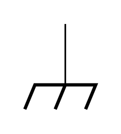

# Goals

The goals of this lab are to

-  familiarize yourself with the prototyping boards (breadboards). You will use this tool extensively for the rest of the semester. 

-  build, test, and explore refined models of voltage divider circuits to include the effects of measurements and loads.

-  learn how to interface your equipment with the prototyping board through the header attached to the board.

-  learn how to use the switches and potentiometers on the header.

-  build a volume knob using your knowledge of voltage dividers and switches.

<!--# Definitions

**Potentiometer (pot)** - a three-terminal resistive device that provides a variable resistance between the ends and the \"wiper\" connection.-->

# Prelab

Answer the following questions in your lab notebook and with Jupyter Notebooks. Scan the relevant pages and upload the PDF file to Canvas. Note that the lab prep activities are directly related to the lab and by completing them (and having them available during lab) you will be able to work through the lab more efficiently and be able to understand what you are doing during the lab.

For your calculations, you should write a reusable function in a Python script that you can import into your Jupyter Notebooks. This will allow you to easily update calculations and recycle code in a practical way.

For example, with a script called `jlab.py`

```Python
"""
Python script to import useful functions for J-Lab
"""

def parallel_resistance(resistors: list) -> float:
    conductance = 0.0
    for resistance in resistors:
        conductance += 1.0 / resistance
    return 1.0 / conductance
```

This function can be used in a Jupyter Notebook like this

```Python
import jlab as jl

r1 = 2e3  # 2 kOhm
r2 = 800  # 500 Ohm
r3 = 1e3  # 1 kOhm
rp = jl.parallel_restance([r1, r2, r3])
print( "R_p = {:.1f} Ohm".format(rp) )
```

## Breadboard

Before modern prototyping boards, to test circuits, people would take wooden cutting boards (aka breadboards) and tack nails into them to provide scaffolding to create a circuit. [Take a look!](https://learn.sparkfun.com/tutorials/how-to-use-a-breadboard/history) Even though we've moved to far more sophisticated prototyping boards, we still affectionately call them breadboards.

Breadboards allow for quickly creating and modifying circuits, with no soldering. Once the circuit works and meets the desired specifications, a printed circuit board (PCB) can be designed and made. All the components can be soldered to the PCB and the circuit can be mounted in a metal case to shield it from external electromagnetic fields. Present technology allows anyone to cheaply design, layout, and print professional circuit boards. For example: <http://www.expresspcb.com/>

](../resources/lab2fig/breadboard-pins.jpg){#fig:bread-pins, width="10cm"}

Breadboards are composed of several holes that you can stick wires into. The holes form rows of metallic connection (as seen in Figure @fig:bread-pins). Each of these rows are constructed like little grabbers that allow for secure connections (as seen in Figure @fig:bread-row).

](../resources/lab2fig/breadboard-row.JPG){#fig:bread-row, width="8cm"}

Our breadboards have a custom built headers (see Figure @fig:bread-header) to allow you to easily interface your equipment (scope, power supply, function generator, etc.) with the breadboard. All the connectors, switches, and potentiometers are connected to the green screw terminals that wires can be clamped in to connect to the breadboard.

{#fig:bread-header, width="15cm"}

The far left and far right screw terminals are connected to switches and potentiometers (three terminal, variable resistors). The mid-left screw terminal is connected to banana ports, and the mid-right screw terminal is connected to the inner conductors of BNC ports.

### Prelab Question {#0.1}



The symbol shown above is chassis ground. This refers to a common connection to the case. Notice that this is labeled in a few places on the breadboard's header (suggesting connection to the metal case).

Which screw terminal should be used to access the outer conductor of the BNCs?

## Voltage Dividers

{#fig:ideal-vd height="7cm"}

An ideal voltage source (no internal resistance) drives current around the loop of  two resistors shown in Figure @fig:ideal-vd (all three circuits in this figure are equivalent!). Each resistor has a voltage drop across it due to the current running through them, so the voltage out will be less than the voltage in.

### Prelab Question {#1.1}

What is the current $I$ through each resistor? Represent these with respect to $V_\text{in}$, $R_1$ and $R_2$. (*Hint:* the resistors are in series)

### Prelab Question {#1.2}

What is the voltage across $R_2$? Express this with respect to the current. Explain why this is $V_\text{out}$.

### Prelab Question {#1.3}

Express $V_\text{out}$ with respect to $V_\text{in}$, and the two resistors (don't have $I$ in the equation).

## Transfer Function

A **transfer function** $T$ is ratio of an output to an input. In this class, we are interested in voltage transfer functions, so

$$\begin{equation}
T = \frac{V_\text{out}}{V_\text{in}}
\end{equation}$$

### Prelab Question {#2.1}

Calculate the transfer function of the voltage divider. (*Hint:* this should only depend on the values of the resistors)

### Prelab Question {#2.2}

For $R_1 = 2\text{ k}\Omega$ and $R_2 = 1\text{ k}\Omega$, what is the transfer function?

### Prelab Question {#2.3}

For a $V_\text{in}$ of $10\text{ V}$, what will $V_\text{out}$ be (using the resistance values above)?

## Voltage Divider with Non-ideal Power Supply

{#fig:nonideal-vd height="7.5cm"}

Real voltage sources have output impedances (modeled with a resistor in series with the voltage as seen in Figure @fig:nonideal-vd).

### Prelab Question {#3.1}

Express the current $I$ with respect to the voltage source, and all the impedances/resistances.

### Prelab Question {#3.2}

Express the voltage across $R_2$ ($V_\text{out}$) with respect to the voltage source and the impedances/resistances.

### Prelab Question {#3.3}

What is $V_\text{out}$ for $V_\text{in} = 10$, $R_o = 50\ \Omega$, $R_1 = 2\text{ k}\Omega$ and $R_2 = 1\text{ k}\Omega$

### Prelab Question {#3.4}

Compare this voltage to the case where you had an ideal voltage source. Why are you getting less output with a non-ideal voltage source?

## Impacts of Parallel Impedances

{#fig:modified-vd height="7cm"}

In the lab activities we will discover that the circuit shown in Figure @fig:modified-vd will provide a more accurate model for certain situations.

### Prelab Question {#4.1}

Express $V_\text{out}$ with respect to the input voltage and the 3 resistor values.

### Prelab Question {#4.2}

Rearrange the equation you just found to solve for $R_3$ given the other values. This equation will be useful when you do the lab.

## Non-ideal power source driving a load

A non-ideal power source has series resistance (output impedance). When it drives a load, the load is in series with the power source's output impedance. The two resistances in this case act like a voltage divider and the voltage across the load will never be the full voltage applied by the source.

### Prelab Question {#5.1}

Draw a circuit diagram of a non-ideal power source with output impedance $R_o$ connected to a load (resistor) with impedance $R_L$, and explain how this is a voltage divider.

### Prelab Question {#5.2}

Write an expression for the voltage across the load $V_\text{out}$ with respect to the resistances and the applied voltage from the source $V_\text{in}$.

### Prelab Question {#5.3}

The power applied to the load is $P=\frac{V_\text{out}^2}{R_L}$. Show that this is equivalent to

$$P = V_\text{in}^2\frac{R_L}{(R_o+R_L)^2}$$

### Prelab Question {#5.4}

Assuming $R_o$ is fixed (you can't change the properties of your power supply), find the load impedance $R_L$ that maximizes the power transferred to the load.

*Hint:* find the $R_L$ that makes $\frac{\partial P}{\partial R_L} = 0$

### Prelab Question {#5.5}

Impedance matching is the process of matching load impedances with power source's output impedance. Use your result from the previous problem to justify what matching these two impedances can be important.

## Lab Activities

### Prelab Question {#6.1}

Read through all of the lab steps and identify the step (or sub-step) that you think will be the most challenging.

### Prelab Question {#6.2}

List at least one question you have about the lab activity.

# Useful Readings

You can find more helpful information in the following sections of the text books:

1.  [Steck](https://atomoptics-nas.uoregon.edu/~dsteck/teaching/electronics/electronics-notes.pdf) Sections 1.3.3 -- 1.4.2

2.  Fischer-Cripps Sections 2.1 -- 2.3

3.  Horowitz and Hill 2<sup>nd</sup> Ed., 1 -- 1.04

4.  Horowitz and Hill 3<sup>rd</sup> Ed., 1 -- 1.3.1

# Lab activities


## Test your protoboard

1.  Get a protoboard (breadboard) from the shelf labeled with your section number. Using the label printer in the lab (and 12mm label tape), make a label for each of your group member's names and place on the metal plate that the breadboards are attached to. Your team will use the same board all semester. It's good practice to note the bin number in your lab notebook and continue to use that bin for the semester. At the end of the lab, you will store your protoboard in this bin (the protoboards may not be removed from the lab).

2. On the protoboard interface panel, you will find:

   -   BNC cable jacks that carry electric signals between your circuit on the board and the function generator and oscilloscope.

   -   Colored banana jacks to bring in DC power for transistors or chips from an external power supply.
   
   -   A precision $10\text{ k}\Omega$ ten‑turn potentiometer with a fuse on the wiper (the fuse is a 125 mA Type 2AG measuring 5 mm x 20 mm if you need a replacement).
   
   -   Four switches.
   
   -   Screw terminals which will be used with jumper wires to bring power/signals from the interface panel to your breadboard.

   <br>The components on the interface panel are pre-soldered to the screw terminals and a wiring diagram is printed on the panel. If you think there are any issues with your interface panel, please notify the [technical staff](/PHYS-3330/report-lab-issue).

3.  The breadboard contains arrays of holes, interconnected by buried conductors. There is a pattern to how the the holes are connected: typically in the form of short rows and long columns (sometimes called rails). Use the DMM, mini-grabbers, and a couple short wires to test the connections of the breadboard.

    - There are hundreds of holes, so testing every pair of holes would take many hours. Take a strategic approach to testing.

    - Assume connections are in single rows or columns.

    - How far does each row/column connect?

4.  Draw a diagram of the basic pattern in your lab notebook of the connections. You can refer back to this diagram throughout the semester as you build new circuits.

5.  Find a $1\text{ k}\Omega$ resistor and measure the resistor directly with the DMM. Now insert the resistor into two holes on the breadboard that you know are not connected and remeasure the resistance. Now insert the resistor into two holes on the breadboard that you know **are** connected and remeasure the resistance. Explain your results. What does this tell you about when you should measure resistors?

### Making power connections to your protoboard

1.  Many circuits require DC power connections (+15 V, -15V, ground). Connect the power supply to the interface panel using banana cables.

2.  **USE A COLOR CODE FOR THE POWER CONNECTIONS!** The convention used in this course is **black = ground**, <span style="color: red;">**red = +15 V**</span>, and <span style="color: blue;">**blue = -15 V**</span>. Using a consistent color code will allow you and others to debug your circuits quickly. You are also less likely to plug something in incorrectly and burn up a component. You should also have a white colored banana jack on your interface panel. You may find that this is useful during your final project phase if you require another voltage. Remember to write down your color code in your lab notebook. 

3.  Once you have power connected to the interface panel, use jumper wires from the appropriate screw terminal to make connections to the breadboard (+15, -15, and ground). The long rails that run the length of the board are best for distributing power to all of your components. **Use these for only DC power or ground.**

4.  Good electrical contact is essential when you plug in components or wires. Use only 22- or 24-gauge solid wire, not stranded wire. The 22- or 24-gauge wire should make a good connection with the conductors inside the board without slipping out easily. Push in each wire until you feel the contacts grip. **Don't force larger wires into the protoboard. You can damage the connectors.**

5.  Reliable ground connections (0 V), readily accessible from any point on the breadboard, are essential to the good functioning of most circuits. The interface panel is wired such that outer conductor on the BNC connectors are connected to the **black** banana jack, which forces a common chassis ground. This is indicated on the wiring diagram printed on the interface panel.


### Supplying power to your protoboard

1.  Turn on your DC power supply such that it produces +15 V and -15 V. Set the current limit to about 100 mA. This will reduce the amount of smoke released from your components when you happen to plug in the power incorrectly. Describe the procedure you followed to set the current limit.

2.  Measure the voltage on your protoboard rails using a DMM. You may need to use a wire to probe the voltage if your DMM probes do not fit in the holes. Always remember to measure voltages with respect to ground. Record the voltages in your lab notebook.

## Building and Testing Voltage Dividers

Components (resistors, capacitors, transistors, etc.) are available from the community stock. Take what components you need for your experiments. If you notice the inventory getting low, please let the [technical staff](/PHYS-3330/report-lab-issue) know.

## Fixed-value voltage divider - $1\text{ k}\Omega$

1.  Build a voltage divider similar to the one shown in Figure @fig:ideal-vd using resistors of around $1\text{ k}\Omega$. Draw a diagram of the circuit in your lab notebook. Make sure to label the resistors and record all measured component values and voltages.

2.  Measure each resistor with your DMM before inserting it into your circuit and record the value. Why should you measure component values before placing them in the circuit?

3.  Predict the output voltage you should measure based on your input voltage and resistance measurements. Include your calculations and numerical predictions in your lab notebook.

4.  Now, apply a DC voltage to the input and measure the output voltage of your divider, first using your DMM and second using your oscilloscope with the mini-grabbers. Record your measurements. *Do not have the DMM and the oscilloscope connected at the same time because each may perturb the measurement differently.*

5.  Compare the voltages you predicted to the voltages you measured. Does your model of the voltage divider agree with each of your measurements? Explicitly record what criteria you used to determine whether or not the model and measurements agreed.

6.  *Complete this step only if your model and measurements did not agree.* If your model and measurements did not agree, you will have to either refine your model or your experiment. Lets start by refining your model. Consider the input resistance of your measurement device. Draw a circuit diagram that includes that resistance. *HINT: See Figure @fig:modified-vd*. Derive an expression for the output voltage now including the unknown measurement device resistance. Use this new model to determine the input resistance of measurement device. (that is, rearrange your equation to solve for $R_3$.. You did this in the prelab).

## Fixed-value voltage dividers of $1\text{ M}\Omega$ and $10\text{ M}\Omega$

1.  Complete the steps in the previous section for two additional voltage dividers, one using resistors 1M$\Omega$ and one with resistors 10M$\Omega$.

2.  Using your refined model, you have determined the input resistance of both the DMM and scope. [Specification (spec) sheets or data sheets](/PHYS-3330/manuals-data-sheets) can also be used to refine your model.

3.  Look up the input resistance of your DMM using the spec sheet at the link above. Does the measured input resistance agree with the instrument specs? Explicitly record what criteria you used to determine whether or not the resistances agree.

4.  There is an easy way to determine the specified input impedance of the scope. Where can you find that information? Does the measured input resistance agree with the instrument specs? Explicitly record what criteria you used to determine whether or not the resistances agree.

## Hidden Voltage Dividers (Output Impedance)

1. Remember last week when we set the function generator to an output termination of *High Z*? We want to do this EVERY TIME we use the function generator in this class. This does not change the output impedance of the function generator: it's ALWAYS $50\ \Omega$, but by default, it *assumes* you are impedance matching everything with $50\ \Omega$ (you worked out why this might be important to do in the prelab). Turn on your function generator and set it to *High Z*. If you don't remember how to change this setting, refer to Appendix B in Lab 1.

2.  Write an expression for the transfer function for the amount of the source voltage should actually be applied to the load.

3.  Grab a speaker (this will be your load) and use your DMM to measure the resistance of the speaker. On your diagram label the resistances of the output impedance of the function generator ($50\ \Omega$) and the impedance of your speaker.

4.  Set up the function generator and the oscilloscope.

    1.  Set up the function generator and the oscilloscope so that you can read Channel 1 from the function generator with Channel 1 of the oscilloscope (use a BNC T-connector so that later you can eventually connect this to your breadboard as well).

    2.  Connect the *Sync* on the function generator with Channel 4 of the oscilloscope.

    3.  Create a $2\ \text{V}_\text{pp}$ sine wave with a $261.63\ \text{Hz}$ frequency and trigger on the *Sync* (in the trigger menu, change the channel to Channel 4). This will provide a nice lower frequency tone (a $\text{C}_4$ note) at a volume that won't be too obnoxious to your neighbors.

3.  Confirm on the oscilloscope that the frequency and the amplitude of your wave match the settings on the function generator (measure them).

3.  Apply the signal from the function generator to the speaker (use the T-connector, so you can still see it on the oscilloscope). You can use mini grabbers to connect to the two ends of the speaker.

    1.  Now what is the amplitude of the sine wave on Channel 1 of the oscilliscope?

    2.  Why did the amplitude change after applying the load to the function generator's output? Disconnect the speaker: did the amplitude recover? Why? Reconnect the function generator to your circuit and confirm the voltage changes.

4.  When you measure the voltage without the speaker, there is (virtually) no current, so no voltage drops across the $50\ \Omega$ output impedance of the function generator. In this case, we are measuring the internal, source voltage ($V_\text{in}$ of our voltage divider model). When you apply the speaker, current flows and voltage drops across the output impedance, so that the full voltage doesn't reach the load ($V_\text{out}$ in our voltage divider model). Using both measurements calculate the transfer function.

Since neither the impedance of the speaker nor the output impedance of the function generator can be changed, in order to get more power to the speaker, you will have to design more circuitry to deliver the signal in a way that draws little to no current from the function generator. In Lab 4, you will learn to build a voltage buffer circuit that does just that.

## Build a Controllable Voltage Source

You will now use your skills with building and testing voltage dividers to build a controllable voltage source using a potentiometer and a switch.


## Testing the Potentiometer (pot)

1.  Set the dial to some point between 0 and 1000, but not 500. Since you have a 10-turn, $10\text{ k}\Omega$ pot, each "tick" of the dial represents ~$10\ \Omega$; therefore, the resistance between the wiper and one of the terminals should be equal to the dial value multiplied by $10\ \Omega$. The resistance between the wiper and the remaining terminal should be the previous resistance subtracted from $10\text{ k}\Omega$.

2.  Use the DMM to measure the resistance between all possible pairs of connections. Determine which terminal corresponds to the wiper, and which terminals correspond to the ends of the dial. Test with a DMM at a few different dial settings to get the hang of it.

3.  Draw a diagram of the pot including a model of the internal components and external connections using the resistance observations (which "resistor" gets smaller and which gets bigger when you turn the dial clockwise?).

## Testing the Switch


1. Connect wires to screw terminals of a switch and test with your DMM which lever position corresponds to which connections.

## Build a variable voltage source

1. Draw a circuit diagram that uses one pot and one switch to create a variable voltage divider that can be switched off (*Hint:* have the switch switch between connecting the output to the voltage divider or to ground).

2. Check in with an instructor regarding your circuit diagram.

3. Derive an expression for the output voltage based on the input voltage and the two resistances. Are both resistances independently variable or a function of the other?

4. Construct your voltage divider using any arbitrary output from the function generator for $V_\text{in}$ and use a scope to measure the output voltage.

    - Do you need to include the scope input resistance in your model? Explain why or why not.

    - Do you need to include the function generator's $50\ \Omega$ output impedance in your model? Explain why or why not.

5. Predict the maximum and minimum output voltage (when the wiper is at one end and then the other).

6. Test your model by making measurements on the scope. Make sure to include the limits of the voltage source. Do your measurements agree with your predictions? Explicitly record what criteria you used to determine whether or not the model and measurements agree.

   <!--Now connect a low voltage light bulb to the output. Do not exceed a current limit of 120 mA or the fuse on your potentiometer will blow out (it is a 125 mA fuse). Describe qualitatively the brightness of the bulb as the pot knob is adjusted. What is the minimum voltage needed to see the light bulb turn on?-->

7. **Bonus question:** A good voltage source has very little (a few ohms) output resistance and thus very little power is dissipated in the supply. What is the output resistance of the circuit (including your power supply and external components) if it produces 10V? Would this circuit be good for creating a variable voltage source in the range of 5-10 V? HINT: Consider the power dissipated in the source. Explain using your diagram, model, and values of resistance.

# Appendix A: Calibrating the 10-turn Potentiometer (If Needed) {#appendix-a-calibrating-the-10-turn-potentiometer-if-needed .unnumbered}

1.  The potentiometer on the circuit board panel has three connections. Two of the connections are at opposite end of a resistor. The third connection is connected to a sliding \"wiper.\"

2.  Your potentiometer is actually a very precise device! You can control the intermediate resistances at the level of 0.1% with a little care. To understand how, examine the dial on the potentiometer. It should have a window with a number in it, and a dial marked with a scale that goes from 00 to 99. The digit in the window increments with each full turn of the dial, so it represents the most significant digit of the setting number: if it says 3 in the window and the dial reads 55, then the setting is 355. For a 10-turn potentiometer such as yours, the dial should be able to run from 000 to 1000 by turning the knob ten full turns.

3.  First, check if your pot is already calibrated! Turn the knob counterclockwise until it stops. If the dial reads 000 in this position, your pot is calibrated.

4.  If the dial reads something other than 000 in this position, do the following procedure:

    1.  Use a 0.050" Allen key to loosen the small set-screw on the side of the knob.

    2.  Pull the entire dial off the panel.

    3.  Turn the inner knob that remains on your panel counterclockwise until it stops.

    4.  Turn the now-detached knob until the dial reads 000.

    5.  Lock the dial by depressing the black switch on knob (and verify that the dial still reads 000).

    6.  Push the dial back onto the inner knob, rotating the outside of the dial **counterclockwise** until it snaps in place against the panel and wont rotate. The dial should still read 000. If it doesnt, repeat the last three steps.
    
    7.  Use the Allen key to tighten the set screw. Check the calibration again: the knob should stop at 000 and 1000.