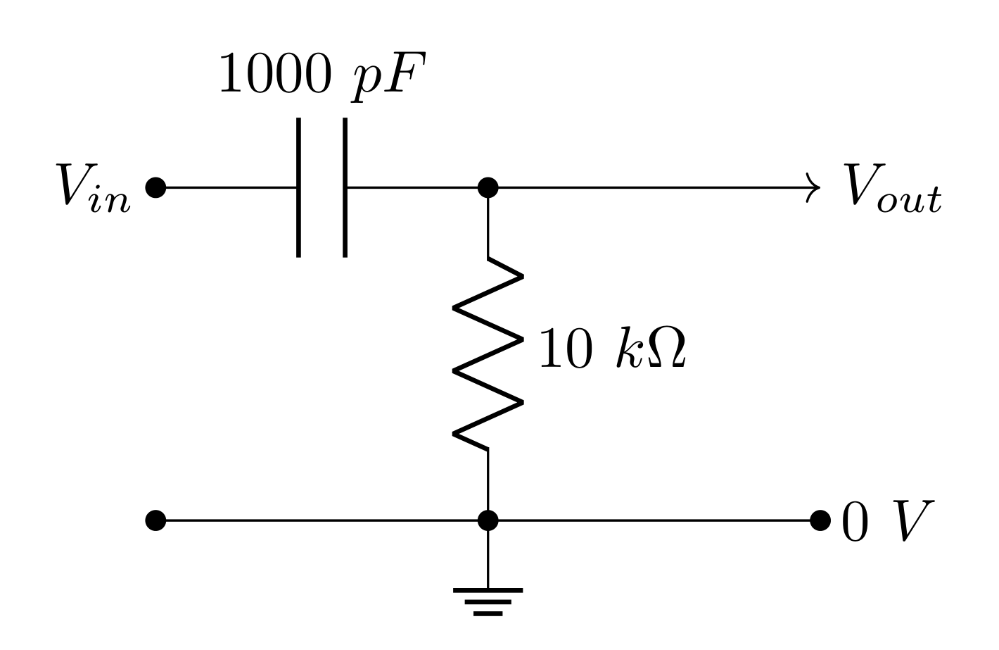
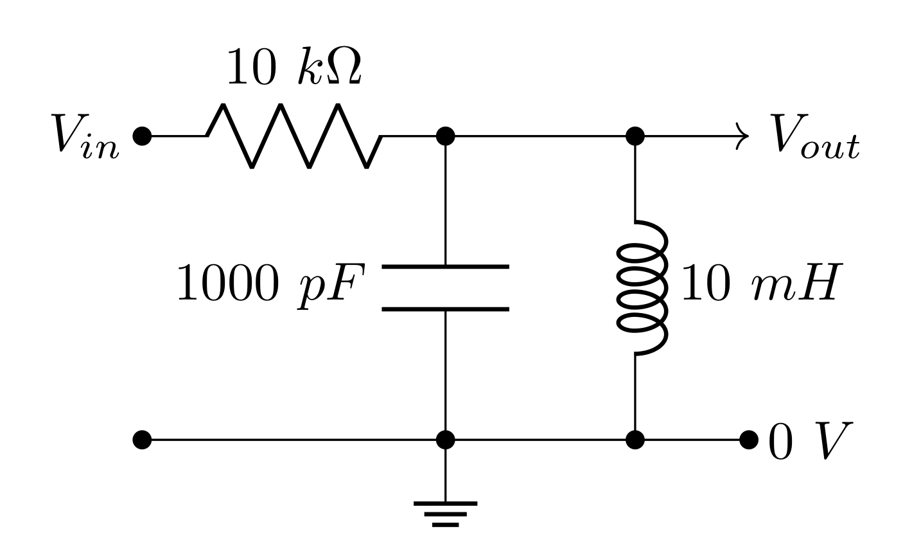
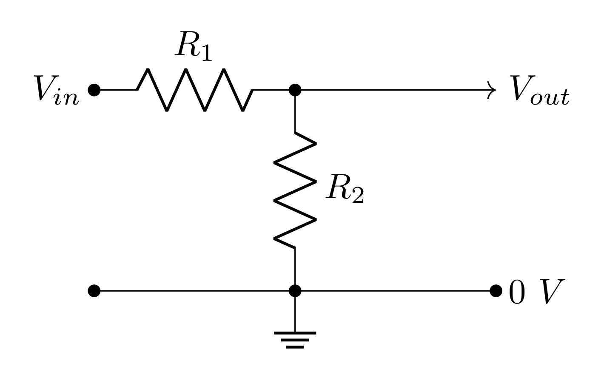
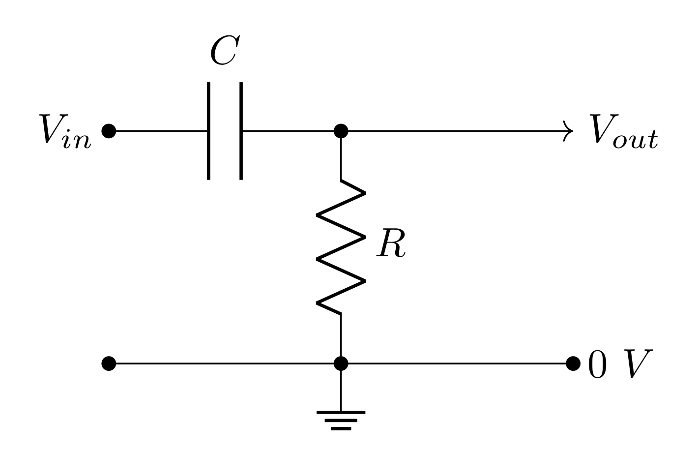
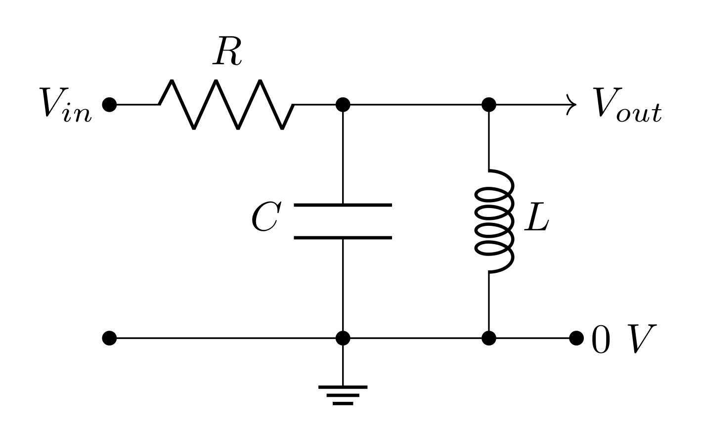

# Goals

In this lab, you will characterize the frequency dependence of three passive filters. You will gain more experience modeling both the response of the filters and how your measurement tools affect your measurements.

Proficiency with new equipment:

-   Oscilloscope probe

-   Capacitors and inductors

    -   Measure capacitance and inductance with an LCR meter

Modeling the physical system:

-   Develop mathematical models of frequency dependent voltage dividers

Modeling measurement systems:

-   Refine the model of scope measurement tool to include capacitance of the coax cable

-   Refine the measurement system to reduce the effect of the capacitance of a coax cable

# Definitions

**Scope probe** - a test probe used to increase the resistive impedance and lower the capacitive impedance compared to a simple coax cable probe.

**Transfer function** - the complex function $V_{out}/V_{in}$.

**Gain** - the magnitude of the transfer function is the voltage gain $G=|T|=|V_{out}/V_{in}|$. The power gain is the square of this: $|V_{out}/V_{in}|^2$. If the gain is not specified, you can assume it is the voltage (or amplitude) gain.

**Decibel (dB)** - a measure of the power transmitted by converting the power gain (or voltage gain) to a logarithmic scale. The difference in power between output and input in decibels (dB) is $10~log_{10}~|V_{out}/V_{in}|^2 =20~log_{10}~|V_{out}/V_{in}|$. One common reference point is where the ratio of output to input power is 1/2, which is $10~log_{10}(0.5) = -3~dB$. This corresponds to $|V_{out}/V_{in}| = 1/\sqrt 2 = 0.707 = 70.7\%$.

**Pass band** - the range of frequencies that can pass through a filter without being attenuated.

**Attenuation band** - the range of frequencies where the filter attenuates the signal.

**Cutoff frequency or corner frequency or 3 dB frequency, $f_c$** - frequency separating the pass and attenuation bands. It is the frequency at the half-power (3 dB) point, where the *power* transmitted is half the maximum power transmitted. The output voltage *amplitude* at $f = f_c$ is $1/\sqrt{2} = 70.7\%$ of the maximum amplitude.

**Low-pass filter** - a filter that passes low frequency signals and attenuates (reduces the amplitude of) signals with frequencies higher than the cutoff frequency. Also known as an integrator.

**High-pass filter** - a filter that passes high frequency signals and attenuates (reduces the amplitude of) signals with frequencies lower than the cutoff frequency. Also known as a differentiator.

**Band-pass filter** - passes frequencies within a certain range and attenuates frequencies outside that range.

**Band-pass filter bandwidth** - the range of frequencies between the upper ($f_+$) and lower ($f_-$) half power (3dB) points: $\Delta f = f_+ - f_-$.

# Application of Filters

A frequent problem in physical experiments is to detect an electronic signal when it is hidden in a background of noise and unwanted signals. The signal of interest may be at a particular frequency, as in an NMR experiment, or it may be an electrical pulse, as from a nuclear particle detector. The background generally contains thermal noise from the transducer and amplifier, 60 Hz power pick up, transients from machinery, radiation from radio and TV stations, cell phone radiation, and so forth. The purpose of filtering is to enhance the signal of interest by recognizing its characteristic time dependence and to reduce the unwanted background to the lowest possible level. A radio does this when you tune to a particular station, using a resonant circuit to recognize the characteristic frequency. The signal you want may be less than 10^-6^ of the total radiation power at your antenna, yet you get a high-quality signal from the selected station. Many experiments require specific filters designed so that the signal from the phenomenon of interest lies in the pass-band of the filter, while the attenuation bands are chosen to suppress the background and noise.

This experiment introduces you to the filtering properties of some widely used but simple circuits, employing only a resistor and capacitor for high- and low-pass filters and an LCR (inductor, capacitor, resistor) circuit for a band-pass filter.

# Filter Basics

Whenever we discuss frequency in the lab, measured in Hz, we mean $f$, and this is the most relevant. However, to avoid a bunch of factors of $2\pi$, the angular frequency $\omega$ often appears in theoretical derivations. Just remember that $\omega = 2\pi f$ so it is easy to convert. You should show results versus $f$.

## RC low- and high-pass filters

The response of RC low-pass and high-pass filters to sine waves is discussed in Steck 2.3.5 & 2.3.7, H&H 1.18\--1.19, and Fischer-Cripps 3.9\--3.10. For these circuits, the magnitudes of the transfer functions are:

$$\left| T(f) \right| = \frac{1}{\sqrt{1 + (2\pi fRC)^{2}}}~ \mbox{(low-pass)}$${#eq:1}

$$\left| T(f) \right| = \frac{2\pi fRC}{\sqrt{1 + (2\pi fRC)^{2}}} ~\mbox{(high-pass)}$${#eq:2}

For both filters: $f_{C} = 1/{2\pi RC}\ $, where $f_{C}$ is the frequency at which the power drops by 3 dB (which means it is half of the maximum). In this lab, we are finding how efficiently signals of different frequencies are passed. This is called the frequency domain. Later, we will look at the time domain, where we see how the output changes as a function of time. In that context, low-pass and high-pass filters are called integrators and differentiators.

## Parallel LCR band-pass filters

The LCR circuit is described in Fischer-Cripps 3.12, H&H 1.22, and Steck 2.6 (note that the Steck example is for a *serial* LCR circuit so the concepts are the same but the details are different). As this is another generalized voltage divider,

$$V_{out} = V_{in} = IZ_{2} = V_{in}\frac{Z_{2}}{Z_{1} + Z_{2}}$$ {#eq:3}

$$Z_{1} = R$${#eq:4}

$$Z_{2} = \frac{j\omega L}{1 - \omega^{2}LC}$${#eq:5}

The magnitude of the transfer function can then be calculated as:

$$\left| T(\omega) \right| = \sqrt{\frac{V_{out}V_{out}^{*}}{V_{in}V_{in}^{*}}}$${#eq:6}

where $*$ indicates the complex conjugate. The algebra is left for you as a prelab exercise.

The resonant frequency, $f_0$, and quality factor, or $Q$ factor, are given by:

$$f_{0} = \frac{1}{2\pi\sqrt{LC}}$${#eq:7}

 $$Q = \omega_{0}RC = \frac{R\sqrt{C}}{\sqrt{L}} = \frac{f_{0}}{\Delta f}$${#eq:8}

The resonant frequency, $f_{0}$, is the center frequency of the pass band, and $Q$ is equal to the ratio of the center frequency to the bandwidth $\Delta f$. (These definitions are exactly true only for $Q\gg1$).

For a resonant LCR circuit the characteristic impedance, $Z_0$, is the magnitude of the impedance of the inductor or the capacitor at the resonant frequency:

$$Z_{0} = \omega_{0}L = \frac{1}{\omega_{0}C} = \frac{\sqrt{L}}{\sqrt{C}}$${#eq:9}

# Useful Readings

1.  [Steck](https://atomoptics-nas.uoregon.edu/~dsteck/teaching/electronics/electronics-notes.pdf) Sections 2.1, 2.3, 2.4, 2.6

2.  Fischer-Cripps 3.4-3.18

3.  Horowitz & Hill 2^nd^ Ed. 1.13-1.24 (and Appendix A on scope probes)

# Prelab

Answer the following questions using Mathematica. Save the complete notebook as a pdf and turn it in to Canvas before your lab section (check Canvas for the due date). **Bring an electronic copy of your notebook to lab, preferably on your own laptop. You will use it to plot your data during the lab session.**

{#fig:low-pass-1 width="10cm"}

{#fig:high-pass-1 width="10cm"}

{#fig:band-pass-1 width="10cm"}

## Low- and high-pass filters

1.  Define functions in Mathematica to calculate the cut-off or 3 dB frequency, $f_c$, for the low- and high-pass filters in Figures @fig:low-pass-1 and @fig:high-pass-1. The input parameters to this function should be the resistance and capacitance of your circuit. Evaluate the functions using the nominal values shown in the schematic. During the lab, you can input the exact values of your components and thus quickly predict the 3 dB frequency you expect for your circuit.

2.  Create two Bode plots (one for each filter) of the frequency response of the low-pass and high-pass filters in Figures @fig:low-pass-1 and @fig:high-pass-1. A Bode plot is a log-log plot of the gain ($V_{out}/V_{in}$) versus frequency, similar to what is on pages 61 & 62 of Steck (although the Steck plots have the x-axis in units of $2\pi RC$ and you should use units of Hz). Make sure to include a large enough range in frequency to see both the pass and attenuation bands. Make sure to label your axes! Details about making plots nice are included in Lab Skills Activity 2.

3.  During the lab section, you will enter your measurements into your Mathematica notebook and plot them with your model predictions. To prepare for this, create a list of "fake data" and plot it on your Bode plots. This will allow you to compare your model and measurements in real time avoiding lost time taking lots of data when something is wrong with your circuit. The point of this part is just to have you create working code to enter a list of data and plot it along with the function. The numerical values of the fake date are unimportant. There is a helpful guide about plotting data and theory together in Mathematica on the [Mathematica Resources page](/PHYS-3330/mathematica-resources).

## Band-pass filters

1.  Define functions in Mathematica to calculate the resonant frequency $f_0$, the characteristic impedance $Z_0$, and the quality factor $Q$ for the band-pass filter in Figure @fig:band-pass-1. Evaluate the functions using the nominal values shown in the schematic.

2.  Create a Bode plot showing the predicted gain ($|V_{out}/V_{in}|$) versus frequency of the band-pass filter. Make sure to include a large enough range in frequency to see both the pass and attenuation bands.

3.  Create a list of "fake data" and plot it on your Bode plots. The point of this part is just to have you create working code to enter a list of data and plot it along with the function. The numerical values of the fake date are unimportant.

## Lab activities

1.  Read through all of the lab steps and identify the step (or sub-step) that you think will be the most challenging.

2.  List at least one question you have about the lab activity.

# Building the Circuits and Predicting Their Behavior

{#fig:r-divider width="10cm"} 

{#fig:low-pass-2 width="10cm"}

{#fig:high-pass-2 width="10cm"}

{#fig:band-pass-2 width="10cm"}

## Building the Circuits

1.  Gather all the components to be able to build the four circuits shown in Figures @fig:r-divider, @fig:low-pass-2, @fig:high-pass-2, and @fig:band-pass-2. If you cannot find components in stock with the specified values, take the nearest in value that you can find.

    -   Resistive divider: $R_1 = 10~k\Omega, R_2 = 6.8~k\Omega$

    -   Low-pass filter: $R = 10~k\Omega$, $C = 1000~pF$

    -   High-pass filter: $R = 10~k\Omega$, $C = 1000~pF$

    -   Band-pass filter: $R = 10~k\Omega$, $C = .01~\mu F$, $L = 10~mH$
2.  Measure all components before placing them into the circuit. Record the values in your lab notebook. Draw diagrams of all the circuits. Make sure to use the same labels on the diagrams and for the values of the components.
3.  Build all four circuits on your breadboard (make sure they are all separate). Don't connect anything to power or ground yet. **The leads on the inductors are too thick to be inserted into the breadboards directly.** There should already be jumper wires soldered onto the ends of the inductor leads (please talk to your instructor or TA if that is not the case). 

## Use the models to predict the behavior of the circuits

1.  Calculate the expected attenuation of the resistive divider.

2.  Calculate the expected values of the cut-off frequencies for the high- and low-pass filters using the actual component values.

3.  Calculate the expected resonant frequency $f_0$ and quality factor $Q$ for the band-pass filter using the actual component values.

*HINT: You should have already done these calculations in your prelab. Just enter the measured values of your components.*

## Use the models to plot the expected the behavior of the filters

Plot your mathematical models of all three filter circuits (three independent plots) using your actual component values. The frequency range should cover at least $10^{–3}  f_c$ to $10^3 f_c$ (or $f_0$) to show the full behavior.

*HINT: You should have already made these plots in your prelab. Just enter the measured values of your components.*

{#fig:setup width="10cm"}

# Setting Up Test and Measurement Equipment and Testing Your Circuits

## Prepare to test the circuits

1.  Connect the circuit board to the function generator and the oscilloscope as shown in Figure @fig:setup. It is always helpful to display both the input voltage as well as the output voltage on the scope at the same time.

2.  Test your setup by creating a 1 kHz sine wave at 1 V p-p using the function generator and confirm the waveform frequency and amplitude by measuring the signal on the scope. Trigger the scope off of the Sync output of the function generator. Remember from Lab 1 that the output termination on the function generator can be set to either 50 $\Omega$ or HIGH Z. Consider which setting should be used here and [set appropriately](/PHYS-3330/lab-guides/lab1#appendix-b-changing-the-output-termination-on-the-function-generator-keysight-edu33212a). 

## Measure the frequency dependence of the voltage divider {#sec:vd-freq}

1. Connect the signal from the function generator to the input of the voltage divider.  Measure the transfer function (attenuation) $=V_{out}/V_{in}$ over a large range in frequency (1 kHz to 15 MHz in approximately decade (X10) steps). Record your measurements in your lab notebook. 
2. At low frequencies (1 kHz), compare your measured value of the attenuation to what your model predicted using your actual component values. Does your measurement agree with your prediction? Explicitly record what criteria you used to determine whether or not the model and measurements agree.

## Refining the measurement system of the voltage divider

1. If there is a high frequency cut off (3 dB frequency), measure its value (where the voltage is reduced to 0.7 of the low frequency value). Record the cut-off frequency.
2. A voltage divider containing only resistors should not have any frequency dependence. However, a coax cable has a capacitance of ~25 pF/foot. You could refine your model to include this capacitance. However, in this case, refine your physical system instead by using a scope probe (see definitions) in place of the coax cable to reduce the capacitance of the measurement probe.  Repeat the measurements (and record them in your lab notebook) from @sec:vd-freq\.1 using the 10x probe to measure the output of the circuit. Note that the oscilloscope should know when the 10X probe is attached and should automatically adjust the scale to give the correct value, but it's a good idea to verify this.
3. Does you original model of just two resistors now predict the behavior of the circuit when you use a 10X probe? 

## Measure the frequency dependence of the low- and high-pass filters

**In the previous section, you have shown with data that the 10X probe perturbs your measurements less than the coax cable. Use the probe for the rest of your measurements.** 

1.  Connect the signal from the function generator to the input of the low-pass filter. Measure the transfer function ($|V_{out}/V_{in}|$) over a large range in frequency (100 Hz to 1 MHz) in at least one step per decade, with several extra steps within the decade around your expected cutoff frequency. Record your measurements in your lab notebook. Determine and record the cut-off frequency for the low-pass filter. Compare your measured half power point ($|V_{out}/V_{in}|=0.707$) with the cut-off frequency computed from the actual component values used. Include your comparison in your lab notebook. Then do the same for the high-pass filter.

2.  Test the predicted frequency response by plotting your data points directly on your two Bode plots. Does the model agree with your data? Explicitly record what criteria you used to determine whether or not the model and measurements agree.

## Measure the frequency dependence of the band-pass filter

1.  When the input frequency is at the resonance value $f_0$, $V_{out}$ will be a maximum and the phase shift between the input and output waveforms will be zero. This gives you two ways to find the resonant frequency. Find the resonant frequency $f_0$ both ways. That is, adjust the frequency so that (1) $|V_{out}/V_{in}|$ is a maximum, and (2) there is zero phase difference between $V_{out}$ and $V_{in}$. Record both measurements of $f_0$. Which method is more precise? Explain why you think so. *Hint: try to estimate the uncertainty in both cases.*

2.  The LCR meter measured the inductance of your inductor at a particular frequency. Your inductor's inductance changes slightly at different frequencies. Use your measurement of $f_0$ to get a more accurate measure of $L$ on resonance by doing the following. Compare the measured $f_0$ with the expected value $1/(2\sqrt{LC})$. Refine the model of the inductor by calculating a corrected value of $L$ from the measured values of $f_0$ and $C$, and use this refined value below. Compare this value to the value you measured using the LCR meter in the lab.

3.  Determine the quality factor $Q$ by measuring the frequencies at the two half-power points $f_+$ and $f_–$. Record your measurements. Recall that $Q=f_0/\Delta f$ where $\Delta f=f_+-f_-$. *Hint: The half-power points are where $V_{out}=V_{out}(max)/\sqrt 2$, not $V_{in}/\sqrt 2$.*

4.  Compare the measured value of $Q$ with your predicted value. Do they agree?

5.  It is common in all electrical circuits to find $Q$ values that are somewhat lower than values you predict. This is due to additional losses in the circuit. In this case the losses are primarily in the inductor. Measure the inductor's "equivalent series resistance" (ESR) using a DMM. You can refine your model by including this resistance in your circuit. Draw a schematic that includes this resistor. What is the predicted $Q$ when you include this resistance in your model? *See Appendix A.* Does this result in better agreement with your measured $Q$?

6.  Measure the gain ($|V_{out}/V_{in}|$) as function of frequency. Use your model prediction to decide what values of frequency to take data. Plot your measurements on the same graph as your model. Does your data match your model prediction? Note, your transfer function did not include the refined value of $Q$.

# Appendix A: Refined LCR Band-Pass Filter Model {#appendix-a-refined-lcr-band-pass-filter-model .unnumbered}

Inductors often have considerable resistance as they are just wires wrapped around a ferrite core. One can include this resistance as a resistor in series with the inductor. The refined model of the Q of this system is

$$Q_{refined} = \frac{\frac{R}{R_{L}}}{R\sqrt{\frac{C}{L}} + \frac{1}{R_{L}}\sqrt{\frac{L}{C}}}$${#eq:10}

where $R_L$ is the equivalent series resistance of the inductor. This is non-trivial to derive.
