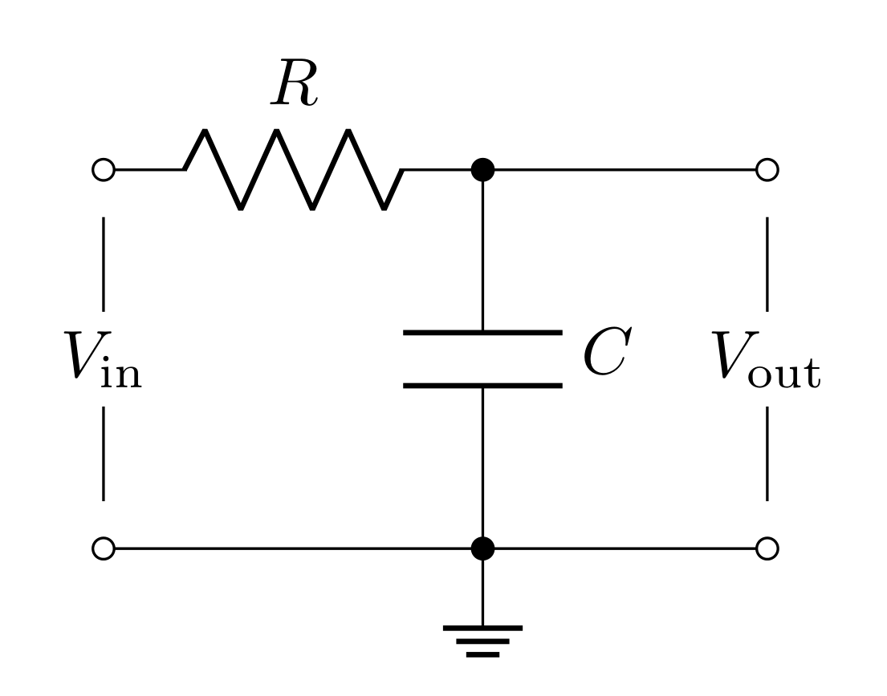
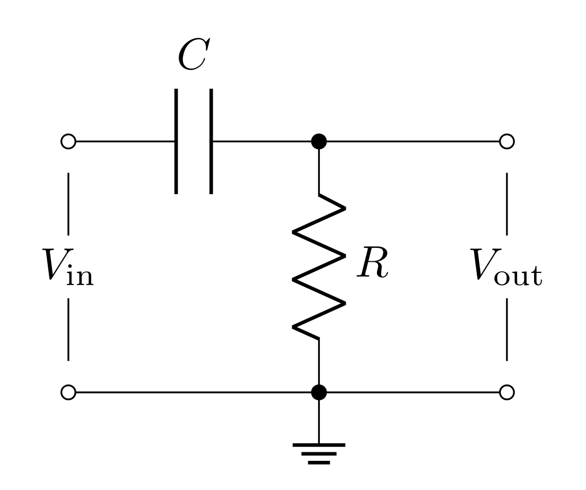
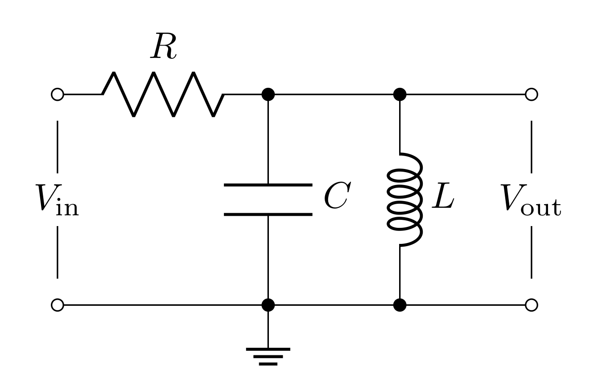

# Goals

In this lab, you will characterize the frequency dependence of three passive filters. You will gain more experience modeling circuits, comparing those models to experiment, and modeling the effects of measurement tools.

You will learn to use new equipment and devices

-   Oscilloscope probe

-   Capacitors and inductors

-   LCR meter

You will learn to model

-   the frequency dependence and effects on phase of passive filters

-   scope measurements to include the capacitance of the coax cable

You will also learn how to refine the oscilloscope measurement to reduce the effect of coax capacitance.

A frequent problem in physical experiments is to detect an electronic signal when it is hidden in a background of noise and unwanted signals. The process of removing background frequencies and preserving a desired frequency is known as ***filtering***. The signal of interest may be at a particular frequency, as in an NMR (nuclear magnetic resonance) experiment, or it may be an electrical pulse, as from a single photon detector. The background generally contains thermal noise from the transducer and amplifier, pick up of the 60 Hz wall power, transients from machinery, radiation from radio and TV stations, cell phone radiation, and so forth. The purpose of filtering is to enhance the signal of interest by recognizing its characteristic time dependence and to reduce the unwanted background to the lowest possible level. A radio does this when you tune to a particular station, using a resonant circuit to only allow a narrow band of frequency through (the center frequency of this band is *the station*). The signal you want may be less than $10^{-6}$ of the total radiation power at your antenna, yet you get a high-quality signal from the selected station due to the filtering. Many experiments require specific filters designed so that the signal from the phenomenon of interest lies in the pass-band of the filter, while the attenuation bands are chosen to suppress the background and noise.

The prelab and lab activities this week introduce you to the filtering properties of some widely used but simple circuits, employing only a resistor and capacitor for high- and low-pass filters and an LCR (inductor, capacitor, resistor) circuit for a band-pass filter.

# Definitions

**Scope probe** - a test probe used to increase the resistive impedance and lower the capacitive impedance compared to a simple coax cable probe.

**Transfer function** - the complex function $V_{out}/V_{in}$.

**Gain** - the magnitude of the transfer function is the voltage gain $G=|T|=|V_{out}/V_{in}|$. The power gain is the square of this: $|V_{out}/V_{in}|^2$. If the gain is not specified, you can assume it is the voltage (or amplitude) gain.

**Decibel (dB)** - a measure of the power transmitted by converting the power gain (or voltage gain) to a logarithmic scale. The difference in power between output and input in decibels (dB) is $10~log_{10}~|V_{out}/V_{in}|^2 =20~log_{10}~|V_{out}/V_{in}|$. One common reference point is where the ratio of output to input power is 1/2, which is $10~log_{10}(0.5) = -3~dB$. This corresponds to $|V_{out}/V_{in}| = 1/\sqrt 2 = 0.707 = 70.7\%$.

**Pass band** - the range of frequencies that can pass through a filter without being attenuated.

**Attenuation band** - the range of frequencies where the filter attenuates the signal.

**Half power point** or **cutoff frequency** or **corner frequency** or **3 dB frequency, $f_0$** - frequency separating the pass and attenuation bands. It is the frequency at the half-power $(-3\text{ dB})$ point, where the *power* transmitted is half the maximum power transmitted. The output voltage *amplitude* at $f = f_0$ is $\frac{1}{\sqrt{2}} = 70.7\%$ of the maximum amplitude.

**Low-pass filter** - a filter that passes low frequency signals and attenuates (reduces the amplitude of) signals with frequencies higher than the cutoff frequency. Also known as an integrator.

**High-pass filter** - a filter that passes high frequency signals and attenuates (reduces the amplitude of) signals with frequencies lower than the cutoff frequency. Also known as a differentiator.

**Band-pass filter** - passes frequencies within a certain range and attenuates frequencies outside that range.

**Band-pass filter bandwidth** - the range of frequencies between the upper ($f_+$) and lower ($f_-$) half power (3dB) points: $\Delta f = f_+ - f_-$.

# Voltage Divider Review

{#fig:vd width="10cm"}

You found last week that the voltage divider splits the total voltage $V_\text{in}$ across $R_1$ and $R_2$ so that the output voltage $V_\text{out}$ is the voltage just across the second resistor. Since

$$V_\text{in} = I (R_1+R_2)$$

$$V_\text{out} = IR_2$$

the transfer function is

$$T = \frac{V_\text{out}}{V_\text{in}} = \frac{R_2}{R_1+R_2}$$

In general, any two passive elements (resistors, capacitors, inductors) in this configuration lead to this same equation (since they all obey Ohm's law). We can generalize it in the following way

$$T = \frac{Z_2}{Z_1+Z_2}$$

where $Z_1$ and $Z_2$ are the *impedances* of the two passive elements (in the case of a resistor, the impedance is the resistance). For capacitors and inductors, the impedance is complex valued!

# Quick Complex Numbers Review

Capacitors and inductors have imaginary impedances. When these elements are used in voltage divider arrangements, this will lead to transfer functions that are complex functions (they have real and imaginary parts). When dealing with complex transfer functions, it much simpler to represent sinusoidal functions as complex exponentials:

$$e^{j\omega t} = \cos{\omega t} + j \sin{\omega t}$$

*Note:* in the context of electrical engineering and circuits, we use $j=\sqrt{-1}$ to avoid confusion with $i$ potentially representing a current.

Therefore for a sine-wave input with amplitude $V_\text{0}$ and angular frequency $\omega$, we can write the input as

$$V_\text{in}(t) = V_0e^{j\omega t}$$

Applying any transfer function $T$ to this input will lead to the following output

$$V_\text{out}(t) = TV_\text{in}(t) = V_0 T e^{j\omega t}$${#eq:complex-transfer}

When $T$ is a complex function, it is far easier to multiply it and the complex exponential when $T$ is put into its "magnitude and phase" form

$$T = |T|e^{j\delta}$$

where $|T|$ is the magnitude of $T$ and $\delta$ is the phase of $T$ in the complex plane.

$$|T| = \sqrt{TT^*} = \sqrt{\text{Re}[T]^2 + \text{Im}[T]^2}$$

$$\tan\delta = \frac{\text{Im}[T]}{\text{Re}[T]}$$

In this form, Equation @eq:complex-transfer becomes

$$V_\text{out} = |T|V_0e^{j\omega t + \delta}$$

So the magnitude of $T$ scales the amplitude of $V_\text{out}$ and the phase of $T$ creates an offset in time (or time delay).

If you need more review on complex numbers, see the dedicated page on Canvas!

# Prelab

## Capacitors

A capacitor is an object that stores energy in the form of electric fields (between two metal objects) when a voltage difference is applied. The capacitance is defined as the ratio of the induced charge (on the two metal objects) to the voltage applied; i.e.

$$Q = C\ \Delta V$$

Capacitance is purely determined by the geometry of the pieces of metal that are separated. You may remember that for parallel plates of area $A$ separated by distance $d$, the capacitance is

$$C = \varepsilon_r\varepsilon_0 \frac{A}{d}$$

where $\varepsilon_r$ is the relative dielectric constant of whatever material is between the plates.

With regards to Ohm's law $(\Delta V=IZ)$, the impedance of a capacitor is

$$Z_C = \frac{1}{j\omega C}$$

where $\omega$ is the angular frequency (in radians per second) and is related to the frequency (in Hertz) by

$$\omega = 2\pi f$$

Angular frequency $\omega$ is typically used when working out theory to avoid writing $2\pi$ over and over again. However, experimentally, you will be working with cycle frequency $f$ (inverse period) because it is easier to measure.

### Prelab Question {#1.1}

Evaluate the impedance of the capacitor at the two frequency extremes ($\omega = 0$ and $\omega\rightarrow\infty$). Describe what the capacitor acts like at these extremes (think in terms of open or short circuits).

## Capacitance of cables

Cables carry current to a load and then back to the source (creating a circuit). The two most common cable constructions are a pair of wires (sometimes twisted into a "twisted pair") or a coaxial cable. Either way, when used, there will be a voltage difference between the conductor carrying current to the load and the conductor carrying the current back to the source; therefore, the cable has capacitance!

{#fig:cap-geo width="10cm"}

For a coax cable, we can use Gauss's Law to determine the electric field between the conductors. Drawing a Gaussian cylinder co-axial to the cable and between the conductors $(a<r<b)$ will enclose the charge on the inner conductor. However, if you take the radius of the Gaussian cylinder to be greater than the whole cable $(r>b)$, then the charge on the outer conductor will cancel the charge on the inner conductor, so there is **no** field outside the cable (one of the advantages of this cable construction). If our Gaussian cylinder has radius $r$ and length $\ell$, then the surface area of the wall is $2\pi r\ell$. The charge enclosed then would be $2\pi a \ell\sigma$ (where $\sigma$ is the surface charge density), so Gauss's law says

$$\int\mathbf{E}\cdot d\mathbf{A} = \frac{\rho_\text{enclosed}}{\varepsilon_r\varepsilon_0}$$

$$2\pi E r\ell = \frac{2\pi a\ell\sigma}{\varepsilon_r\varepsilon_0}$$

$$\mathbf{E} = \frac{\sigma}{\varepsilon_r \varepsilon_0}\frac{a}{r}\hat{\mathbf{r}}$$

We can relate this to the voltage by integrating from $r=b$ (where the voltage is held at ground) to $r=a$

$$\Delta V = -\int_b^a \mathbf{E}\cdot d\mathbf{r}' = -\frac{\sigma a}{\varepsilon_r \varepsilon_0} \int_b^a\frac{dr}{r} = \frac{\sigma a}{\varepsilon_r \varepsilon_0}\ln\bigg(\frac{b}{a}\bigg)$$

The capacitance can then be found by dividing the charge by this voltage

$$C = \frac{Q}{V} = \varepsilon_r\varepsilon_0\frac{2\pi a L\sigma}{\sigma a\ln{(b/a)}} = \varepsilon_r\varepsilon_0\frac{2\pi \ell}{\ln{(b/a)}}$$

Often cables are labeled by their capacitance per unit length because this should be constant for any cable with same $a$ and $b$.

$$\frac{C}{\ell} = \varepsilon_r\varepsilon_0\frac{2\pi}{\ln{(b/a)}}$$

### Prelab question {#2.1}

A BNC cable has an inner conductor with a diameter of roughly 1.1 mm and a dielectric with a diameter of roughly 4.5 mm. The dielectric, Teflon, has a relative dielectric constant of roughly 2. Estimate the capacitance per unit length of this cable (report it in pF/m).


## Inductors

The inductor is an element that stores energy in the form of magnetic fields when current is passed through them. Any loop(s) of current has an associated magnetic field that it self generates, so all circuits have some amount of inductance (which is often ignored). When the current changes, naturally the strength of the self-induced magnetic field through the loop changes. Faraday's law states that this will create a back EMF (electromagnetic force). This can be written as a voltage drop across the inductor

$$\Delta V = L\frac{dI}{dt}$$

where $L$ is the inductance of the inductor. To make an inductor, long wires are wrapped carefully into compact coils or solenoids. The inductance of a solenoid can be calculated from its geometry

$$L = \mu_r\mu_0\frac{N^2 A}{\ell}$$

where $\mu_r$ is the relative magnetic permeability of any material the coil is wrapped around and $N$ is the number of turns, $A$ is the cross-sectional area of a loop, $\ell$ is the length of the solenoid.

The impedance of an inductor is

$$Z_L = j\omega L$$

### Prelab Question {#3.1}

Evaluate the impedances of the inductor at the two frequency extremes ($\omega = 0$ and $\omega\rightarrow\infty$). Describe what the capacitor acts like at these extremes (think in terms of open or short circuits).

## Low-Pass Filters

{#fig:lowpass width="10cm"}

The filter shown in Figure @fig:lowpass is like the voltage divider, except with $R_2$ replaced with a capacitor. Applying the impedance of these elements to the voltage divider equation yields

$$T_\text{low-pass}(\omega)=\frac{V_\text{out}}{V_\text{in}} = \frac{Z_C}{R+Z_C}= \frac{(j\omega C)^{-1}}{(R+(j\omega C)^{-1})} = \frac{1}{1+j\omega RC}$$

Note that the transfer function depends on frequency (and is complex)! This means that this circuit will affect different frequencies differently (this is how it acts as a filter)

For this filter's transfer function, you will find the magnitude in the following questions. The phase $\delta$ can be found to be

$$\delta = -\tan^{-1}(\omega RC)$$

### Prelab Question {#4.1}

Find $T_\text{low-pass}$ when $\omega=0$ and when $\omega\rightarrow\infty$. Based on these calculations, describe what frequencies the low-pass filter cuts and passes. Is this consistent with its name?

### Prelab Question {#4.2}

Find $|T_\text{low-pass}|$ (the magnitude of the complex number) and express it with respect to $f$ instead of $\omega$.

## High-Pass Filters

{#fig:highpass width="10cm"}

The filter shown in Figure @fig:highpass swaps the capacitor and resistor from the previous filter. We can simply swap $Z_C$ and $R$ in the voltage divider equation to get

$$T_\text{high-pass} = \frac{R}{(j\omega C)^{-1}+R} = \frac{j\omega RC}{1 + j\omega RC}$$

For this filter's transfer function, you will find the magnitude in the following questions. The phase $\delta$ can be found to be

$$\delta = \tan^{-1}\bigg(\frac{1}{\omega RC}\bigg)$$

### Prelab Question {#5.1}

Find $T_\text{high-pass}$ for $\omega=0$ and $\omega\rightarrow\infty$ to confirm this is a high-pass filter.

### Prelab Question {#5.2}

Calculate $|T_\text{high-pass}|$ and express it in terms of $f$ instead of $\omega$.

## Cutoff Frequency

Defining what frequency a filter starts to *cut* (as opposed to pass) is somewhat arbitrary. There is a smooth transition between where $T=1$ and $T=0$; however, everyone has decided to agree to define the cutoff frequency $f_0$ as **the frequency when the power has dropped half from its full power**.

***DEFINITION:*** **Half power point** or **cutoff frequency** or **corner frequency** or **3 dB frequency, $f_0$** - frequency separating the pass and attenuation bands. It is the frequency at the half-power $(-3\text{ dB})$ point, where the *power* transmitted is half the maximum power transmitted.

The relationship between voltage and power is

$$P = \frac{V^2}{Z}$$

Therefore, when the power is cut in half, the voltage is cut by a factor of $\frac{1}{\sqrt{2}}$

$$\frac{V_\text{out}}{V_\text{in}} = \sqrt{\frac{P_\text{out}}{P_\text{in}}} = \frac{1}{\sqrt{2}}\approx 0.707$$

So the cutoff frequency $f_0$ is the frequency at which $T\approx 0.707$

For both the low-pass and high-pass filter, you can take the magnitude of the transfer function you calculated and set it equal to $\frac{1}{\sqrt{2}}$. This will lead to the result for both kinds of filters:

$$f_0 = \frac{1}{2\pi RC}$$
{@eq:cutoff-freq}

### Prelab Question {#6.1}

Decibels is a "relative unit of measurement." In electronics, decibels are meant to describe how the power changes (sort of like a transfer function). You can calculate decibels with the following equation:

$$ 10\log_{10} \bigg[\frac{P_\text{out}}{P_\text{in}}\bigg]\text{ dB}$$

When you have negative decibels, it means the something is attenuated (gets smaller), and, when positive, it means that something has gain (gets larger)

Calculate the decibels for when the power is cut in half. Does it make sense that the half power point is also called the 3 dB point?

### Prelab Question {#6.2}

Plug the cutoff frequency from Equation @eq:cutoff-freq into the equations you found for $|T_\text{low-pass}|$ and $|T_\text{high-pass}|$ to confirm this is the half power point.

### Prelab Question {#6.3}

The cutoff frequency of these filters is related to the RC-time (resistance times capacitance has units of time) of the circuit: $f_0 = 1/(2\pi RC)$. This means that the cutoff frequency can be determined by measuring the RC-time constant related to the charging and discharging of the capacitor. For the low-pass filter, this can be done by applying a voltage long enough to fully charge the capacitor to the input voltage (i.e. when $V_\text{in}=V_\text{out}$), and then turning off the voltage to allow the capacitor to discharge. This discharge will be an exponential decay over time

$$V_\text{out}(t) = V_0e^{-t/\tau}$$

where $\tau$ is the time constant of the decay $(\tau=RC)$ and $t$ is the time since turning off the input voltage.


Evaluate $V_\text{out}(\tau)$; i.e. the voltage across the capacitor when $t=\tau$. Experimentally, by measuring the time it takes for the capacitors voltage to fall to this value, you have measured $RC$ and therefore can determine $f_0$ of the filter.

## Parallel LCR Bandpass Filters

{#fig:bandpass width="13cm"}

Figure @fig:bandpass shows a simple band-pass filter using a resistor, capacitor, and inductor. The capacitor and inductor can be treated as a single lumped element with an impedance equal to the elements' impedances in parallel

$$ \frac{1}{Z_{LC}} = \frac{1}{(j\omega C)^{-1}} + \frac{1}{j\omega L}$$

$$Z_{LC} = \frac{j\omega L}{1- \omega^2 LC}$$

Treating this as another generalized voltage divider leads to the transfer function

$$T_\text{bandpass} = \frac{Z_{LC}}{R+Z_{LC}} = \frac{j\omega L}{R-\omega^2 LRC + j\omega L}$$

$$|T_\text{bandpass}| = \frac{\omega L}{\sqrt{(R-\omega^2 LRC)^2+(\omega L)^2}}$$

$$\delta = \tan^{-1}\bigg(\frac{R-\omega^2LRC}{\omega L}\bigg)$$

### Prelab Question {#7.1}

As the name suggests, this filter passes a "band" of frequencies. This means that it should "cut" both low and high frequencies. Show that at $\omega=0$ and $\omega\rightarrow\infty$ the magnitude of $T$ goes is zero.

### Prelab Question {#7.2}

The *center frequency* is defined by the frequency that maximizes the transfer function (this is the frequency it passes "strongest"). For these simple LRC bandpass filters, this happens when 

$$|T_\text{bandpass}|=1$$

Find $f_c$ using this fact and the equation for $|T_\text{bandpass}|$ above $($*Hint:* $\omega_c=2\pi f_c)$

## Quality factor

For a low-pass and high-pass filter, the bandwidth can be described simply by the cutoff frequency. For a low-pass, the bandwidth is $0\text{ Hz} - f_c$ and for the high-pass filter, the bandwidth is $f_c-\infty\text{ Hz}$. The band-pass filter however, has two cutoff frequencies, one above, and one below the center frequency. The bandwidth is then

$$\Delta f = f_{0_+} - f_{0_-}$$

However, this bandwidth is usually represented as a dimensionless quantity called the *quality factor* $Q$ which is the center frequency divided by the bandwidth:

$$Q = \frac{f_c}{\Delta f}$$

A *quality factor* in general, is a property of any resonator (oscillator). Our LCR band-pass filter is a resonator ([here's a nice, short video explanation](https://www.youtube.com/watch?v=nh4q7mIhLrY)): the capacitor and inductor exchange electric field energy (in the capacitor) for magnetic field energy (in the inductor) with a frequency of $f_c$ (the center frequency).

In the context of the bandpass filter, the *quality factor* defines how "sharp" the filter is. The higher the *quality factor*, the smaller the bandwidth around the center frequency is. Conversely, the smaller the *quality factor*, the wider the bandwidth.

The two cut off frequencies can be found by setting the magnitude of the transfer function to the -3 dB ratio: $(1/\sqrt{2})$

$$\frac{\omega L}{\sqrt{(R-\omega^2 LRC)^2+(\omega L)^2}} = \frac{1}{\sqrt{2}}$$
$$\frac{(\omega L)^2}{(R-\omega^2 LRC)^2+(\omega L)^2} = \frac{1}{2}$$

Clearly, the left hand side equals $1/2$ when

$$(R-\omega^2 LRC)^2 = (\omega L)^2$$

$$R-\omega^2 LRC = \pm\omega L$$

$$RC \omega^2 \pm\omega - \frac{R}{L} = 0$$

$$\omega_{c_\pm} = \frac{\pm1+\sqrt{1+4\frac{R^2C}{L}}}{2RC}$$

$$\Delta\omega = \omega_{c_+}-\omega_{c_-} = \frac{1}{RC}$$

### Prelab Question {#8.1}

Express the quality factor $Q$ with respect to $L$, $R$, and $C$.

## Bode plots

Bode plots are log-log plots of a property vs frequency. You will find all sorts of Bode plots in datasheets for all kinds of devices, and they are also a useful way of visualizing how a filter acts.

In Python, log-log plots can be done in the following way

```python
import numpy as np
import matplotlib.pylab as plt

def function_to_plot(frequency):
    # code to compute function
    return result

# create an array frequencies, evenly spaced on a log scale
frequency = np.logspace(0, 8, 1000)

plt.figure()
plt.loglog(frequency, function_to_plot(frequency))
plt.show()
```

Here's [the documentation for matplotlib.pylab.loglog](https://matplotlib.org/stable/api/_as_gen/matplotlib.pyplot.loglog.html) which may be helpful to look at.

In Mathematica, log-log plots can be done in the following way

```Mathematica
FunctionToPlot[frequency_]:=(*function to compute*)

LogLogPlot[FunctionToPlot[f], {f, 1, 10^8}]
```

In both cases, these will plot from $10^0$ to $10^8$. Don't forget to label your axes and title your plots! 

### Prelab question {#9.1}

Create a Bode plot for $|T|$ and $\delta$ as a function of $f$ (from $1\text{ Hz}$ to $100\text{ kHz}$) for the low pass filter with $R=10\text{ k}\Omega$ and $C=1\text{ nF}$. Both of these should be on the same plot. Make sure to take the absolute value of $\delta$ in your code, so that the log-log plot will work (log of negative numbers undefined as far as we're concerned here). To make your Bode plots consistent with LTSpice, you should make the phase dashed; if you don't know how, [check out this page of matplotlib's documentation](https://matplotlib.org/stable/api/_as_gen/matplotlib.pyplot.plot.html).

### Prelab question {#9.2}

Create a new Bode plot for $|T|$ and $\delta$ as a function of $f$ (from $1\text{ Hz}$ to $100\text{ kHz}$) for the high pass filter with $R=10\text{ k}\Omega$ and $C=1\text{ nF}$. Both of these should be on the same plot.

### Prelab question {#9.3}

Create a new Bode plot for $|T|$ and $\delta$ as a function of $f$ (from $1\text{ Hz}$ to $100\text{ kHz}$) for the bandpass filter with $R=10\text{ k}\Omega$, $C=10\text{ nF}$, and $L=10\text{ mH}$. Both of these should be on the same plot.

<!--### Prelab question {#6.4}

Draw the 3 circuits in your lab notebook with the values labeled (the ones you used for the Bode plots). You will build these circuits in lab.-->

### Prelab question {#9.4}

During the lab section, you will enter your measurements into your Mathematica or Jupyter notebook and plot them with your model predictions. To prepare for this, create a list of "fake data" and plot it on your Bode plots. This will allow you to compare your model and measurements in real time avoiding lost time taking lots of data when something is wrong with your circuit. The point of this part is just to have you create working code to enter a list of data and plot it along with the function. The numerical values of the fake date are unimportant. There is a helpful guide about plotting data and theory together in Mathematica on the [Mathematica Resources page](/PHYS-3330/mathematica-resources).

For Python (using NumPy), there are two common schemes for data, which are considered C-like, and Fortran-like. In C, array data is stored from left to right, while in Fortran, it is stored from top to bottom. NumPy is cool with either way

``` Python
# C-like data
data = np.array([
    [x0, x1, x2, x3, ...],
    [y0, y1, y2, y3, ...]
])

"""You can get all the x's or all the y's by either calling just the row index, or by calling for the slice of all columns at a row"""
x = data[0]
y = data[1]
# or
x = data[0, :]
y = data[1, :]

"""You can get a single data point by slicing all the rows at a given column index"""
data_point4 = data[:, 4]
```

``` Python
# Fortran-like data
data = np.array([
    [x0, y0],
    [x1, y1],
    [x2, y2],
    [x3, y3],
    ...
])

"""To slice the x-data and y-data, you have to ask for all the rows at a given column"""
x = data[:, 0]
y = data[:, 1]

"""You can get a single point however by either slicing all the columns at a row, or just by asking for the row index"""

data_point4 = data[4]
# or
data_point4 = data[4, :]
```

Both C-like and Fortran-like data have their pros and cons, but Fortran-like is far more common when working with experimental data because of how simply it translates to and from saved data in the form of data files where the types of data are separated by columns (left to right) and data points are stored in successive rows (top to bottom). Ultimately it is up to you to determine your own workflows and preferences, so we'll leave this up to you to decide.

## Lab activities

### Prelab question {#10.1}
Read through all of the lab steps and identify the step (or sub-step) that you think will be the most challenging.

### Prelab question {#10.2}
List at least one question you have about the lab activity.

# Useful Readings

You can read more on passive elements and passive filters in the follow sections of the following texts.

1.  [Steck](https://atomoptics-nas.uoregon.edu/~dsteck/teaching/electronics/electronics-notes.pdf) Sections 2.1, 2.3, 2.4, 2.6

2.  Fischer-Cripps 3.4-3.18

3.  Horowitz & Hill 2<sup>nd</sup> Ed. 1.13-1.24 (and Appendix A on scope probes)

4. Horowitz & Hill 3<sup>rd</sup> Ed. 1.3-1.5, 1.7, 6.2 (and Appendix O.1.5 on scope probes)

# SPICE Activities

- Build the three filters you modeled in the prelab (low-pass, high-pass, and bandpass filter), using the same components with the same values as you used for your prelab plots.

- You will perform an AC-analysis on these circuits in the program. In order to set this up, right click on your voltage sources, and click "advanced."

- Use a separate voltage source for each circuit.

- Under "Small signal AC analysis" give it an AC amplitude of 1 and phase of 0. 

- When you go to configure the analysis, select the "AC Analysis" tab
    - Type of sweep: decade (this will make the plots log10)
    - Number of points per decade: 100
    - Start frequency: 1 (this means $1\text{ Hz}$)
    - End frequency: 100k (this means $10^8\text{ Hz}$ or $100\text{ kHz}$)

- Probe each circuit at $V_\text{out}$ to create dB vs frequency Bode plots.

1. Are the Bode plots visually consistent with your plots from the prelab?

2. Use the simulated plots to determine the 3 dB frequency for the low-pass and high-pass circuits. Are these consistent with your calculations from the prelab?

3. Use the simulated plot to determine the center frequency and the two 3 dB frequencies. Use the two 3 dB frequencies to find the bandwidth, and calculate $Q$. Is this consistent with your prelab solutions?

# Lab Activities

## Measure components, Predict, Build

### Preparation

1. Start by drawing the following circuits in your lab manual
    - the voltage divider,
    - the low-pass filter,
    - the high-pass filter,
    - the bandpass filter.

2. Gather the components to be able to build all four of these circuits (grab enough components to have them all built simultaneously)
    - voltage divider: $R_1 = 10\text{ k}\Omega$, $R_2=6.8\text{ k}\Omega$,
    - low-pass filter: $R = 10\text{ k}\Omega$, $C = 1000\text{ pF}$,
    - high-pass filter: $R = 10\text{ k}\Omega$, $C = 1000\text{ pF}$,
    - bandpass filter: $R = 10\text{ k}\Omega$, $C = 10\text{ nF}$, $L = 10\text{ mH}$.

*Reminder:* all components that aren't resistors are capacitors (which would include the $10\text{ mH}$ inductor) are found in the ***Guided Lab Activities*** bins on the wall next to the resistors and capacitors. 

3. Measure all components and keep track of which ones will go into which circuits. Label the values in your circuit diagrams.

### Building the Circuits

1. Build all four circuits on separate parts of your breadboard. Don't connect anything to power or ground yet. **The leads on the inductors are too thick to be inserted into the breadboards directly.** There should already be jumper wires soldered onto the ends of the inductor leads (please talk to your instructor or TA if that is not the case). 

2.  You should not design these circuits such that the signal and the ground wires from the header go to the long rails on the breadboard. Consider why that would be in terms of parasitic capacitance, and estimate the parasitic capacitance between two of the long rails. *Hint:* Measure the length of the rail and treat it like a parallel plate capacitor (this will underestimate the capacitance because it won't consider the fringe fields, but it should get you pretty close). You can take the gap between the rails to be $1.5\text{ mm}$ and the height of the wire grabbers enclosed to be $4\text{ mm}$.

3.  Explain why you would not want to put a signal and ground in the long rails next to each other (consider the fact that a signal will oscillate at some or many frequencies, and the impedance of a capacitor).

### Use the models to predict the behavior of the circuits

**The following steps will have you re-calculate and re-plot things you did in the prelab (using the measured values). It is best to *NOT SAVE OVER* your previous work. This is one reason why writing recyclable code is important and useful**.

1.  Re-calculate the expected attenuation $(T)$ of the resistive divider using the actual component values.

2.  Re-calculate the expected values of the cut-off frequencies for the high- and low-pass filters using the actual component values.

3.  Re-calculate the expected resonant (center) frequency $f_c$ and quality factor $Q$ for the band-pass filter using the actual component values.

4. Update your plots of the mathematical models for all three filter circuits (three independent Bode plots) using your actual component values. The frequency range should cover at least $10^{–3} f_0$ to $10^3 f_0$ (or $f_c$ for the bandpass) to show the full behavior.

{#fig:setup width="10cm"}

## Setting Up Test and Measurement Equipment and Testing Your Circuits

### Prepare to test the circuits

1.  Connect the circuit board to the function generator and the oscilloscope as shown in Figure @fig:setup. It is always helpful to display both the input voltage as well as the output voltage on the scope at the same time.

2.  Test your setup by creating a $1\text{ kHz}$ sine wave at $1\text{ V}_{pp}$ using the function generator and confirm the waveform frequency and amplitude by measuring the signal on the scope. Trigger the scope off of the Sync output of the function generator. Remember from Lab 1 that the output termination on the function generator can be set to either $50\ \Omega$ or HIGH Z. Consider which setting should be used here and [set appropriately](/PHYS-3330/lab-guides/lab1#appendix-b-changing-the-output-termination-on-the-function-generator-keysight-edu33212a). *Hint:* is your load $50\ \Omega$?

### Measure the frequency dependence of the voltage divider {#sec:vd-freq}

1. Connect the signal from the function generator to the input of the voltage divider. You will test this circuit at various frequencies. Write down you prediction of what the transfer function $V_\text{out}/V_\text{in}$ will behave as a function of frequency.

2. Measure the transfer function (attenuation) $V_\text{out}/V_\text{in}$ over a large range in frequency ($1\text{ kHz}$ to $15\text{ MHz}$ in approximately decade (x10) steps; i.e. on a log-scale; i.e. 10, 100, 1000, ...). Record your measurements in your lab notebook.

3. At low frequencies $(1\text{ kHz})$, compare your measured value of the attenuation to what your model predicted using your actual component values. Does your measurement agree with your prediction? Explicitly record what criteria you used to determine whether or not the model and measurements agree.

4. At high frequencies $(15\text{ MHz})$, compare your measured value of the attenuation to what your model predicted. Does this agree with your prediction? What do you think might be missing from your model that would accurately account for this discrepancy?

### Refining the measurement system of the voltage divider

1. Your voltage divider is cutting very high frequencies (like a low pass filter). Find the cutoff frequency (where the voltage is reduced to 0.707 of the low frequency value of the transfer function). Record the cut-off frequency. *Note:* in this case, because the voltage divider already attenuates a fixed amount, the cutoff frequency is the frequency when $V_\text{out}$ falls to $0.707\cdot V_\text{out}$ where $V_\text{out}$ is the low frequency output voltage (when it is acting like a pure voltage divider).

2. An ideal voltage divider containing only resistors should not have any frequency dependence. However, a coax cable has a capacitance of about $80\text{ pF/m}$. You could refine your model to include this capacitance by considering the fact that the cable carrying $V_\text{out}$ to the scope introduces capacitance in parallel to $R_2$. However, in this case, we will refine the physical system instead by using a scope probe (see definitions) in place of the coax cable to reduce the capacitance of the measurement probe. Repeat the measurements (and record them in your lab notebook) from @sec:vd-freq\.1 using the 10x probe to measure the output of the circuit. Whenever you use the 10x probe, you will need to change the probe setting in the channel menu to "10x".

3. Does you original model of just two resistors now predict the behavior of the circuit when you use a 10X probe? 

## Measure the frequency dependence of the low-pass

**In the previous section, you have shown with data that the 10X probe perturbs your measurements less than the coax cable. Use the probe for the rest of your measurements!** 

1.  Connect the signal from the function generator to the input of the low-pass filter. Measure the transfer function $|V_\text{out}/V_\text{in}|$ at a low frequency (say $100\text{ Hz}$) and confirm that the filter fully passes the low frequency; i.e. has a transfer function of 1.

2.  Change the frequency until the output is 0.707 of the input. Record the frequency and explain why this is the 3 dB point.

3.  Record a frequency and transfer function roughly an order of magnitude above and below and a few points in between.

4.  Plot the data you recorded on top of the theoretical model you already plotted. Do your measurements agree with your model?

## Measure the RC-time of the low-pass filter

1.  Change the waveform to a square wave and give it an offset so that the wave oscillates between $0$ and $5\text{ V}$.

2.  Adjust the frequency to be slow enough such that the capacitor fully charges. How are you able to tell that the capacitor charges?

3.  Set the trigger mode to trigger on a falling edge so that the scope's display centers around when the voltage falls from $5\text{ V}$ to $0$. At this moment, the capacitor will start to discharge. Use the cursors to measure the RC-time based on the exponential decay of the capacitor discharging. *Hint:* you worked this out in the prelab.

4.  Calculate the 3 dB point from the RC-time and compare it to your previous measure of the 3 dB point.

## Measure the frequency dependance of the high-pass filter

1. Over a large range in frequency, $100\text{ Hz}$ to $1\text{ MHz}$ at each decade (order of magnitude), with several extra steps within the decade around your expected cutoff frequency. Record your measurements in your lab notebook.

2. Determine and record the cut-off frequency for the high-pass filter. Compare your measured half power point with the cut-off frequency computed from the actual component values used. Include your comparison in your lab notebook.

3.  Test the predicted frequency response by plotting your data points directly on your Bode plot. Does the model agree with your data? Explicitly record what criteria you used to determine whether or not the model and measurements agree.

## Measure the frequency dependence of the band-pass filter

1.  When the input frequency is at the resonance value (i.e. center frequency) $f_c$, $V_\text{out}$ will be a maximum and the phase shift between the input and output waveforms will be zero. Consider both these facts and find the resonant frequency. Describe your procedure and compare this to your predicted value.

<!--Find the resonant frequency $f_0$ both ways. That is, adjust the frequency so that (1) $|V_{out}/V_{in}|$ is a maximum, and (2) there is zero phase difference between $V_{out}$ and $V_{in}$. Record both measurements of $f_0$. Which method is more precise? Explain why you think so. *Hint: try to estimate the uncertainty in both cases.*-->

<!--2.  The LCR meter measured the inductance of your inductor at a particular frequency. Your inductor's inductance changes slightly at different frequencies. Use your measurement of $f_c$ to get a more accurate measure of $L$ on resonance by doing the following. Compare the measured $f_c$ with the expected value $1/(2\pi\sqrt{LC})$. Refine the model of the inductor by calculating a corrected value of $L$ from the measured values of $f_0$ and $C$, and use this refined value below. Compare this value to the value you measured using the LCR meter in the lab.-->

2.  The LCR meter measured the inductance of your inductor at a particular frequency; however, the inductance itself is frequency dependent. In the prelab, you calculated the relationship between the resonant frequency and the capacitance and inductance. Use this equation and your measurements of the center frequency and the capacitance to refine your measure of the inductance.

3.  Determine the quality factor $Q$ by measuring the frequencies at the two half-power points $f_{c_+}$ and $f_{c_–}$. Record your measurements. Recall that $Q=f_0/\Delta f$ where $\Delta f=f_{c_+}-f_{c_-}$. *Hint:* The half-power points are where $V_{out}=V_{out}(max)/\sqrt 2$, not necessarily $V_\text{in}/\sqrt{2}$.

4.  Compare the measured value of $Q$ with your predicted value. Do they agree?

5.  It is common in all electrical circuits to find $Q$ values that are somewhat lower than values you predict. This is due to additional losses in the circuit. In this case the losses are primarily in the inductor. Measure the inductor's "equivalent series resistance" (ESR) using a DMM. You can refine your model by including this resistance in your circuit. Draw a schematic that includes this resistor. What is the predicted $Q$ when you include this resistance in your model? *See Appendix A.* Does this result in better agreement with your measured $Q$?

6.  Measure the gain $(|V_\text{out}/V_\text{in}|)$ as function of frequency. Use your model prediction to decide what values of frequency to take data. Plot your measurements on the same graph as your model. Does your data match your model prediction? Note, your transfer function did not include the refined value of $Q$.

# Appendix A: Refined LCR Band-Pass Filter Model {#appendix-a-refined-lcr-band-pass-filter-model .unnumbered}

Inductors often have considerable resistance as they are just wires wrapped around a ferrite core. One can include this resistance as a resistor in series with the inductor. The refined model of the Q of this system is

$$Q_\text{refined} = \frac{\frac{R}{R_{L}}}{R\sqrt{\frac{C}{L}} + \frac{1}{R_{L}}\sqrt{\frac{L}{C}}}$${#eq:10}

where $R_L$ is the equivalent series resistance of the inductor. This is non-trivial to derive.
