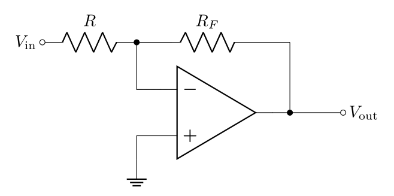
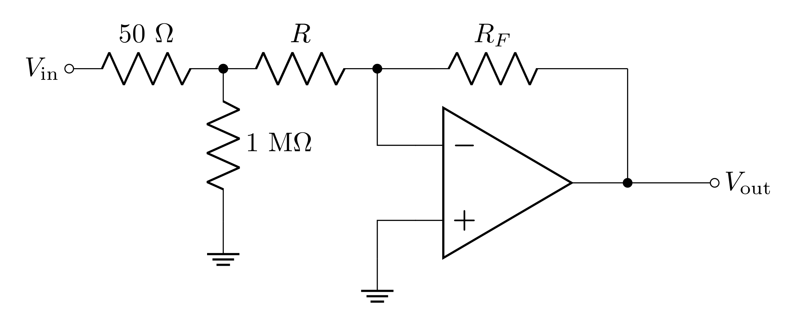
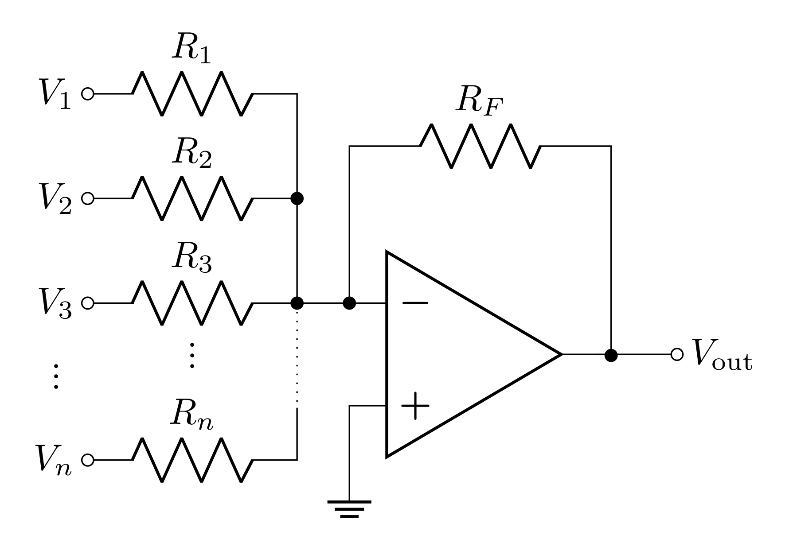
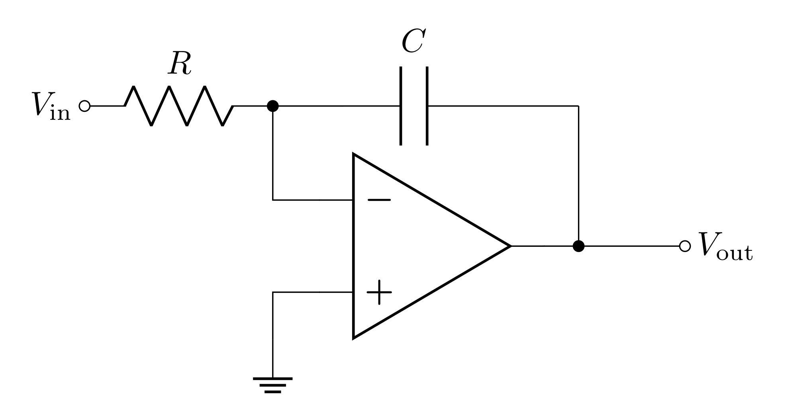
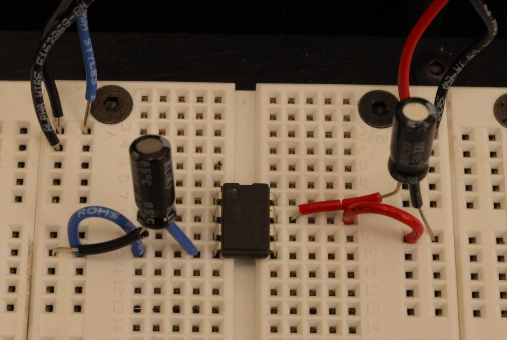
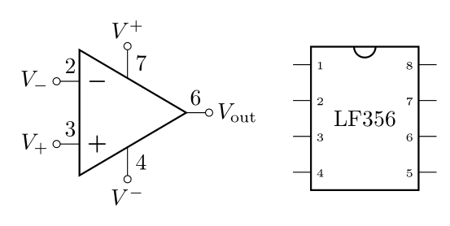

# Goals

In the last lab you used op-amps for the first time and applied negative feedback to the op-amp in order to make useful and stable circuits. You built:

-   a *voltage buffer* in order to apply a voltage with a very low output impedance
-   a *non-inverting amplifier* to boost a small signal

Now, you will build more op-amp circuits with negative feedback.

In this lab, you will build:

-   an inverting amplifier and explore one of its major limitations (its input impedance)

-   a summing amplifier designed to act as a digital-to-analog converter (DAC)

-   a signal integrator to integrate a signal over time

These three circuits have many applications. The inverting amplifier is like the non-inverting amplifier but with one advantage and one disadvantage. You will use the summing amplifier to build a DAC, but there are many applications of summing amplifiers in mixing signals. Finally the integrator has many uses and is commonly used to convert different wave-shapes in audio applications, and it is also used in control systems.

In this lab you will:

-   refine your ability to design and analyze op-amp circuits with negative feedback

-   develop more independence in designing, modeling, building, and characterizing circuits

# Op-amp Review

This section summarizes information covered in lab 4 (you may find this useful for a quick reference in the future).

The op-amp is a differential amplifier that outputs an amplified difference between the inputs:

$$V_\text{out}=A(V_+-V_-)$$

Feeding the output back into the inverting input drives the system into a very stable state which no longer depends on many of the details or imperfections of the internal workings. *Closed-loop* refers to the state of an op-amp with feedback, and *open-loop* refers to the state of an op-amp with no feedback.

## Golden Rules

The golden rules are approximations that make op-amp analysis relatively simple and straight forward.

1.  The open-loop gain is infinitely large: 
$$A\rightarrow\infty$$
2.  The input impedance is infinitely large, so no current flows in or out of the inputs:
$$I_+=I_-=0$$
3.  When negative feedback is applied, the output drives the inverting input to be the same voltage as the non-inverting input:
$$V_+=V_-$$

## Definitions

Here are all the terms we defined in the prelab from lab 4:

**Open-loop gain, $A$** - the gain of the op-amp when there is no feedback.

**Open-loop DC gain, $A_\text{VOL}$** - the open-loop gain at low frequencies before the frequency dependence starts to take over and the open-loop gain starts to decrease. This is cited in any op-amp datasheet (sometimes as $A_\text{OL}$ or $A_\text{VO}$).

**Open-loop 3 dB point, $f_0$** - the frequency that the open-loop gain falls -3 dB from $A_\text{VOL}$. Beyond this frequency, $A$ typically continues to fall with a constant dB per log-scale (quoted in dB/octave (log2) or dB/decade (log10)). This value is usually ***not*** quoted in datasheets. It can be calculated from other values, and people often aren't concerned with the value of $f_0$.

**Closed-loop gain, $G$** - when a fraction of the output is fed back into the inverting input $V_-$, the op-amp's gain is greatly reduced from $A$ to some value $G$. Just like the open-loop gain, this value is frequency dependent and starts to fall from $G_0$ near the 3 dB point, $f_B$.

**Closed-loop DC gain, $G_0$** - the closed-loop gain at frequencies well below the 3 dB point. Except in active filter design, the point of an op-amp is to operate at a frequency such that $G(f)=G_0$, so almost always, the closed-loop DC gain is referred to simply as ***THE* gain**.

**3 dB point, $f_B$** - the frequency where $G$ drops -3 dB from $G_0$. This is also often referred to as the bandwidth or operating bandwidth, as typical operation should be done below this frequency.

**Gain bandwidth product, $\text{GBW}$** - the product of the DC gain and the 3 dB point is a constant value. This should be cited in datasheets as it's a foundational property of each op-amp's internal design. Just like resistor values, however, the precise $\text{GBW}$ varies from op-amp to op-amp of the same name.

**Unity gain frequency, $f_T$** -  the 3 dB point when the gain is 1 (unity). Since this is mathematically equivalent to the $\text{GBW}$, these terms are often used interchangeably.

**Capacitive coupling** \- capacitive coupling is the process of sending a signal or energy through a capacitor (remember that the impedance of a capacitor is inversely proportional to the frequency). Capacitive coupling is a way of sending AC while blocking DC. Parasitic capacitance often leads to this happening by mistake.

**Decoupling capacitor** - decoupling is coupling to ground. Decoupling capacitors charge up and provide a reservoir of energy that can be supplied to the circuit as the circuit's current draw changes over time. Power supplies and transmission lines have inherent inductance which impedes changes in current, $dI/dt$, so the decoupling capacitors compensate  with the energy stored and provide the current necessary to maintain constant voltage.

# Prelab

## Inverting Amplifier

{#fig:invamp width="10cm"}

The inverting amplifier is shown in Figure @fig:invamp. Notice that this is very similar to the non-inverting amplifier, except for the fact that the input and ground are swapped.

There is still a voltage divider network feeding the output back to the inverting input with a transfer function $B$, such that

$$B=\frac{R}{R_F+R}$$

This simple swapping of the input and ground changes a few properties of the amplifier circuit

-   the gain is now negative (the signal inverts i.e. flips upside down),
-   the input impedance is greatly reduced.

The reduced input impedance has potential issues; however, there is one advantage of the inverting amplifier. Because one of the inputs is held at a constant voltage (ground), the voltage at the inputs barely fluctuates which puts less strain on the op-amp resulting in better performance in reproducing the output waveform.

### Prelab Question {#sec:1.1}

Applying the voltage golden rule, it should be clear that the voltage at both inputs is $0\text{ V}$. Even though the voltage at $V_-$ is zero, it is called a **virtual ground**, instead of **ground**, because there is no actual path to *Earth ground*, so it does not serve the full function of ground.

Since the path from $V_\text{in}$ to $V_-$ is like a path to ground, this path is like a load. With this knowledge, what do you think the input impedance of the inverting amplifier is?

## Deriving the Closed-Loop Gain of the Inverting Amplifier

By only using the current golden rule, the *closed-loop gain* of the inverting amplifier can be derived even with a finite *open-loop gain* $A$.

The current golden rule, says that no current flows into $V_-$, so all the current $I$ that flows through $R$ will also flow through $R_F$ (see @fig:invamp-finite).

Second, plugging $V_+=0$ into the op-amp equation

$$V_\text{out}=A(V_+-V_-)$$

yeilds

$$V_-=\frac{-V_\text{out}}{A}$$

<!-- Note that $$\lim_{A\rightarrow\infty}V_-=0$$ which is what the voltage golden rule says should happen with negative feedback and infinite open-loop gain. **This is the virtual ground**.-->

{#fig:invamp-finite width="15cm"}

We can now right down two equations based on Kircchoff's voltage law:

$$V_\text{out} = V_- + IR_F = \frac{-V_\text{out}}{A} + IR_F$$

$$V_\text{in} = V_- - IR = \frac{-V_\text{out}}{A} - IR$$

These equations can be manipulated to give

$$G_0=\frac{V_\text{out}}{V_\text{in}}=\frac{-AR_F}{R_F+(1+A)R}=-\frac{A(1-B)}{1+AB}$$

### Prelab Question {#sec:2.1}

Find the closed-loop gain in the limit as $A$ approaches infinity (open-loop gain golden rule); i.e.

$$\lim_{A\rightarrow\infty}G_0$$

*Hint:* L'Hôpital's rule may be helpful.

### Prelab Question {#sec:2.2}

Instead, start with the assumption that the voltage golden rule applies. What is the voltage at $V_-$ then? Derive expressions for $V_\text{out}$ and $V_\text{in}$ using this value for $V_-$ and Kircchoff's voltage rule. Does this lead to the same result for $G_0$ you found in question @sec:2.1? (You may need to do a little rearranging to show they are the same)

### Prelab Question {#sec:2.3}

Find $G_0$ (assume $A\rightarrow\infty$) for

1.  $R=100\ \Omega$ and $R_F=1\text{ k}\Omega$

2.  $R=10\text{ k}\Omega$ and $R_F=100\text{ k}\Omega$

## The Input and Output Impedance of the Inverting Amplifier

Formulas for the input and output impedance for an inverting amplifier are derived in Horowitz and Hill 2nd ed. section 4.26 (copies can be found in the lab).

$$R_{i}' = R\bigg(1 + \frac{1}{(1 + A)}\frac{R_{F}}{R}\bigg)$$

$$R_{o}' = \frac{R_{o}}{(1 + AB)}$$

*Note:* that the output impedance is the same equation as it was for the non-inverting amplifier.

For the input impedance, as long as the magnitude of the closed-loop gain is significantly less than the open-loop gain, $R_i'=R$. Typically in practice, $R\lesssim 100\text{ k}\Omega$. This is far less than typical op-amp's bare input impedance (the LF356 has $10^{12}\ \Omega$.. that's a **teraohm**!).

### Prelab Question {#sec:3.1}

Calculate $R_i'$ (using $A=2\cdot 10^{5}$) using

1.  $R=100\ \Omega$ and $R_F=1\text{ k}\Omega$

2.  $R=10\text{ k}\Omega$ and $R_F=100\text{ k}\Omega$

Is it reasonable to just say that $R_i'=R$?

### Prelab Question {#sec:3.2}

{#fig:invamp-meas-in width="12cm"}

If $V_\text{in}$ is coming from the function generator, there is a $50\ \Omega$ output impedance, and when you measure $V_\text{in}$ on the scope there is a $1\text{ M}\Omega$ measurement impedance (see Figure @fig:invamp-meas-in). In each of the following cases, decide whether the  $50\ \Omega$, the $1\text{ M}\Omega$, both, or neither impedances will significantly impact either the measurement of $V_\text{in}$ or $V_\text{out}$. In each case draw an updated diagram which simplifies the model appropriately.

1.  $R=100\ \Omega$ and $R_F=1\text{ k}\Omega$

2.  $R=10\text{ k}\Omega$ and $R_F=100\text{ k}\Omega$

*Hint 1:* The same voltage is across $R$ and the $1\text{ M}\Omega$ of the oscilloscope, so these resistors are in parallel.

*Hint 2:* Consider the voltage division between the output impedance (of the function generator) and the input impedance (of the amplifier).

### Prelab Question {#sec:3.3}

Between the two options for resistor values, do you think it is it more reasonable to choose the lower resistances, or the higher resistances for the same gain? Why?

### Prelab Question {#sec:3.4}

In LTspice, make an inverting amplifier. You will need to power the op-amp (Use the "Net Label" tool to avoid clutter).

- Screen shot your circuit.

- Make $V_\text{in}$ a $1\text{ V}$ sine wave at $1\text{ kHz}$.

- Run the simulation with $R=100\ \Omega$ and $R_F=1\text{ k}\Omega$ and measure $V_\text{out}$.

- Change the resistors to $R=10\text{ k}\Omega$ and $R_F=100\text{ k}\Omega$ and re-run the simulation. Measure $V_\text{out}$.

- Do your measurements depend on the input impedance? Why?

- Edit $V_\text{in}$ so that it has $50\ \Omega$ of output impedance (series resistance). You can do this by right clicking the source and finding the "series resistance option."

- Repeat the simulation and measurements for

    - $R=100\ \Omega$ and $R_F=1\text{ k}\Omega$

    - $R=10\text{ k}\Omega$ and $R_F=100\text{ k}\Omega$

- Do you get the same result compared to when the voltage source was ideal? Explain what causes the discrepancy.

## Frequency Dependance of the Inverting Amplifier

The frequency dependence of the non-inverting amplifier and the inverting amplifier are the same

$$A(f)=\frac{A_\text{VOL}}{1+j\frac{f}{f_0}}$$

$$G=\frac{G_0}{1+j\frac{f}{f_B}}$$

However, the relationship between the gain and the 3 dB frequency is different from the non-inverting amplifier (gain bandwidth product is a bit of a misnomer).

$$f_T = \frac{-G_0 f_B}{1 - B} = A_\text{VOL}f_0$$

Note though, that the gain of the non-inverting amplifier was $1/B$. With some algebra, you can show that

$$\frac{-G_0}{1 - B}=\frac{1}{B}$$

so for both inverting and non-inverting amplifiers

$$\text{GBW}=f_T = \frac{f_B}{B}= A_\text{VOL}f_0$$

### Prelab Question {#sec:4.1}

What is $f_B$ when $R=10\text{ k}\Omega$ and $R_F=100\text{ k}\Omega$?

## Summing Amplifier

{#fig:sumamp width="10cm"}

The Summing Amplifier, shown in Figure @fig:sumamp, is a very flexible circuit. Notice that it is just like the inverting amplifier op-amp configuration, but it has multiple inputs coming together at the inverting input. Since $V_-$ is a *virtual ground*, each input $i$ with input voltage $V_i$ has an input impedance of $R_i$.

Each input has a current through it which can be determined with Kircchoff's voltage law

$$V_i - I_iR_i=0$$

$$I_i = \frac{V_i}{R_i}$$

All of these current paths combine near the inverting input before going through $R_F$; by Kircchoff's current law, the current through $R_F$ is the sum of all of these input currents

$$I_F = \sum_{i=1}^n I_i=\sum_{i=1}^n\frac{V_i}{R_i}$$

Finally, the voltage rise from the *virtual ground* to $V_\text{out}$ can be calculated by Kircchoff's voltage law

$$V_\text{out} = 0-R_FI_F =  -R_F\sum_{i=1}^n \frac{V_i}{R_i}$$

*Note:* If you have the same input source, like the function generator, going into multiple inputs, it will have to supply current to all of these. Sources of current have current limits, and splitting the current into too many outputs can make it quickly reach its current limit.

### Prelab Question {#sec:5.1}

In the lab, you will use a summing amplifier to build a digital-to-analog converter (DAC). This is one of the many incredibly useful applications of the summing amplifier. In order to design the circuit, you will need to have some understanding of binary numbers (in digital circuits, all numbers are in binary). In binary there are only two states: 0 and 1 (aka **false** and **true** or **off** and **on**). In digital circuits, the 1 state is usually $5\text{ V}$ (but $3.3\text{ V}$ is also common).

You may or may not have experience with binary-decimal conversions, but it's pretty straight forward. A binary number like

$$101101$$

can be converted by knowing that each bit of a binary number represents $2^i$ where $i$ is represents a bit's place, so the number above is

$$1\cdot2^5+0\cdot2^4+1\cdot2^3+1\cdot2^2+0\cdot2^1+1\cdot2^0$$

The conversion in general can be formalized

$$\sum_{i=0}a_i2^i$$

where each $a_i$ is either 0 or 1 (this counts from right to left).

You will build a 3-bit DAC; this means that it will be able to convert 3 digit binary numbers (in binary, digits are referred to as bits).

**Make a table** with all 8 possible 3-bit binary numbers on the left and the corresponding decimal equivalents on the right. For example: 000 in binary is 0 in decimal. If you need more of a refresher on binary or counting in binary, [this Wikipedia entry](https://en.wikipedia.org/wiki/Binary_number#Counting_in_binary) will hopefully be useful.

### Prelab Question {#sec:5.2}

It makes the most sense to make $0\text{ V}$ represent binary 0. However, the choice of voltage to represent binary 1 is mostly arbitrary, but $5\text{ V}$ is the most commonly used.

With $R_F=27\text{ k}\Omega$, choose resistor values for the 3 input resistors such that $V_\text{out}$ corresponds to the analog voltage (decimal equivalent) corresponding to the digital 3-bit number input.

Calling the inputs $i=0,\ 1,\ 2$ corresponding to the 0th, 1st, and 2nd place of the binary number makes things easier to track since these correspond to the relevant exponents $2^i$ . You need to convert the 8 possible combinations of $0\text{ V}$ and $5\text{ V}$ input to $0-7\text{ V}$

*Hint:* Focusing on 001, 010, and 100 will make things easiest.

## Integrator

{#fig:integrator width="10cm"}

The integrator is shown in Figure @fig:integrator. This is like the inverting amplifier but with the feedback resistor replaced with a feedback capacitor.

Due to the complex impedance of the capacitor, the transfer function $B$ also becomes complex

$$B = \frac{R}{R+\frac{1}{j\omega C}}=\frac{j\omega R C}{1+j\omega R C}$$

The voltage and current golden rules can be applied to solve for $V_\text{out}$. If we assume the positive current direction runs from $V_\text{out}$ to $V_\text{in}$, the virtual ground means that

$$V_\text{in}+IR=0$$

Then we can consider the voltage across the capacitor and how that compares to the charge stored in it

$$Q=CV_\text{out}$$

By definition, current is the time derivative of charge, so taking the derivative of both sides gives

$$I = C \frac{dV_\text{out}}{dt}$$

Combining the two equations yields

$$\frac{dV_\text{out}}{dt}=-\frac{V_\text{in}}{RC}$$

To solve for $V_\text{out}$, integrate both sides

$$V_\text{out}(t) = \frac{-1}{RC}\int_0^t V_\text{in}(t')\; dt'$$

This relationship between $V_\text{in}$ and $V_\text{out}$ is why this circuit is called an integrator.

<!--### Prelab Question {#sec:6.1}

The sine wave analysis is the easiest because the integral of a sine wave is a sine wave (remember that sine and cosine are the same thing with phase shifts). If $V_\text{in}$ has an amplitude $V_0$ and frequency $f$, then

$$V_\text{out}(t) = \frac{-1}{RC}\int_0^{t} V_0 \sin{(2\pi f t')}\; dt'$$

Evaluate the integral to determine

1.  $V_\text{out}$ over the full period $T=1/f$. Does this result make sense for an oscillating output?

2.  $V_\text{out}$ over the half the period.

3.  Use your previous results to determine the amplitude of the output wave

4.  Use the peak-to-peak amplitude of $V_\text{in}$ and $V_\text{out}$ to determine the gain of the circuit for a square wave input. Express this in terms of $f$ instead of $T$.

### Prelab Question {#sec:6.2}

We just found that the gain not only depends on the RC time constant, but also the frequency of the input. What RC time constant would give a gain of 1 at $1\text{ kHz}$ for the square wave? -->

### Prelab Question {#sec:6.1}

Sketch (or plot in Mathematica or Python) the predicted waveform for the output when the input is a

1.  Sine wave
2.  Square wave
3.  Triangle Wave

These are Voltage vs time plots/sketches (like what you would see on the oscilliscope). For the square and triangle waves, it will help to break them up into piecewise continuous functions with continuous derivatives.

-   *Hint:* the square wave takes on a constant value in the regions where the function is continuous.

-   *Calculus refresher:* the derivative is discontinuous where the function *isn't smooth*.

## Complex Analysis of the Integrator's Gain

Here, by complex, we mean "involving imaginary numbers." Remember that the impedance of a capacitor is

$$Z_C = \frac{1}{j\omega C}$$

so we can treat the capacitor in the circuit as an element with this impedance. In this case, using the same analysis that was done on the inverting amplifier, the equations found with Kircchoff's voltage law become

$$V_\text{in}+IR=0$$

$$V_\text{out}-\frac{I}{j\omega C}=0$$

Remembering that $j=\exp(j\pi/2)$, the gain can be written

$$G_0 = \frac{-e^{\frac{-j\pi}{2}}}{2\pi f RC}$$

Note that this treatment for the gain works on individual sine wave components. To apply this gain to different waveforms, you would need to break them up into Fourier series and apply this gain to the individual sine wave terms of the series (this is not something we expect you to do).

For a sine wave (or sine wave component of a Fourier series) the magnitude of the gain is

$$|G_0| = \frac{1}{2 \pi f RC}$$

The complex exponential in the gain has a phase of $\phi=-\frac{\pi}{2}$; this means that the gain will phase shift the output by this much. Note that $\sin(\omega t - \frac{\pi}{2})=-\cos(\omega t)$, so this phase shift is equivalent to integrating.

Notice that the gain falls off as a function of frequency. This makes it act like a low-pass filter. Integrators are often used as low-pass filters, but there are better ways to make a proper low-pass filter with op-amps. If you're interested in reading more about the technical difference of a proper op-amp low-pass filter and an integrator, here's a
[technical paper](https://ieeexplore.ieee.org/document/4313498) (that you can access as long as you're on the university network) and a [forum discussion](https://stackoverflow.com/questions/37067763/what-is-the-difference-between-an-integrator-and-a-low-pass-filter) on the topic.

### Prelab Question {#sec:7.1}

Calculate an RC time constant that results in a gain of

$$|G_0| = \frac{10}{2\pi}\approx 1.6$$

for a $1\text{ kHz}$ sine wave.

## Considerations for $R$ and $C$ selections for the integrator

Choosing values for the resistor and capacitor depends on several considerations. First, one needs to determine the desired RC time constant. This will depend on the expected signal (size, shape, and frequency), and the desired output (remembering the op-amp limitations on maximum output voltage and slew rate). Once $RC$ is determined, some considerations for choosing $R$ and $C$ are:

-   For this application, non-polarized capacitors should be selected because the applied voltage will oscillate around $0$.

-   Availability: resistors from $1\ \Omega$ to $10\text{ M}\Omega$ and non-polarized capacitors from $2\text{ pF}$ to $1\ \text{μF}$ are readily available in the lab.

-   Input impedance: generally a high input impedance is desired to avoid voltage dividing the input signal with the $50\ \Omega$ output impedance of the function generator. $1\text{ k}\Omega$ input impedance will have a transfer function of $0.952$ voltage dividing with $50\ \Omega$, and it is recommended to have at least this much input impedance (but more is better).

-   Avoiding stray capacitance effects: there are many sources of capacitance, such as cables, which can unintentionally couple to or decouple your signal. For this reason, it is advisable to avoid very small capacitors as the stray capacitances may end up dominating. A few hundred picofarads should be sufficient.

**Dealing with DC offsets:** A DC offset, however small, integrates to a linear growth over time (the capacitor builds up charge) which will cause the output to hit one of the op-amp's maximum output voltages. Op-amps usually have small DC offsets even if the input signal has no offset. One way to mitigate this is to add a resistor in parallel with the capacitor so that charge can leak out of the capacitor overtime.

A real capacitor can be accurately modeled as an ideal capacitor with resistance in series and in parallel with it (see Figure @fig:cap-measure). Good capacitors have very small series resistance and very large parallel resistance. The parallel resistance often has to do with the dielectric material inside "leaking" charge through it. When the LCR meter is used to measure a capcitance, it is unable to apply the series+parallel resistance model with a single measurement; it can be set to either measure with a parallel resistance model *or* a series resistance model (see Figure @fig:LCR). For this application in particular, it is a good idea to measure the capacitor with a parallel resistance model so that you know how much resistance should be added in parallel to reach a specific parallel resistance to get the right amount of "leakage."

{#fig:cap-measure width="15cm"}

{#fig:LCR width="15cm"}

### Prelab Question {#sec:8.1}

Design an integrator that would have

-   an input impedance of $10\text{ k}\Omega$
-   an $RC$ value that you calculated in Prelab Question @sec:7.1

## Lab activities

### Prelab Question {#sec:9.1}

Please review the lab activities so that you're better prepared when you arrive to your lab section.

# Useful Readings

You can find more on these circuits from these recommended sources:

1.  [Steck](https://atomoptics-nas.uoregon.edu/~dsteck/teaching/electronics/electronics-notes.pdf) Sections 7.1, 7.2, 7.3.1, 7.3.2, 7.3.4, 2.2.1, 7.4.2

2.  Fischer-Cripps Sections 12.2--12.15

3.  Horowitz and Hill 2nd Ed., Sections 4.04--4.08, 4.19, 4.20 and Sections 1.13--1.15

# IC Tips

In this lab, we will use ICs (integrated circuits) for the second time. Here's a review of the tips from last lab. **Read through them all** again before you begin using any IC chips. You should refer back to this section in future labs to remind yourself of these useful tips.

{#fig:power-example width="15cm"}

1. Always unplug the power supply from your circuit while you're wiring it.

2. Chips sit across the groove on the breadboard (see Figure @fig:power-example). Any other placement will cause legs to short together.

    -   Before inserting a chip, ensure the pins are straight (using a needle-nose pliers or something similar).

    -   After insertion, check visually that no pin is broken or bent under the chip. 

    -   To remove the chip, use the dedicated IC pliers (found in the tool trays at your lab station). Removing ICs by hand often results in bent legs and/or a leg puncturing your finger.

3. Use the long columns on your breadboard for your power and ground voltages (with power and ground next to each other) to take advantage of the parasitic decoupling capacitance of the long line.

4. Color code your wires. We recommend:

    -    0V (ground) Black

    -    +15V Red

    -    -15V Blue

    -    Use other colors for any other connections which aren't to $\pm$ power or ground

5. Connect capacitors between the power pin(s) of the IC (as close to the pin as possible as in Figure @fig:power-example) to ground. These are called decoupling or bypass capacitors and are critical for maintaining constant voltage at the pin as the current needs change. Use nice, big polarized (electrolytic) capacitors ($>1\ \mu\text{F}$) so that they're able to collect enough charge to deliver the necessary current when needed.

6. Measure all your passive elements (resistors, capacitors, inductors, diodes) before putting them in the circuits; trying to measure while they are plugged into the breadboard can lead to mistakes.

7. Always have a diagram of your circuit with pin numbers labeled (like the left side of Figure @fig:pin-diagram).

8. Make sure any polarized (electrolytic) capacitors are oriented such that the higher voltage is applied to the correct lead of the capacitor. Remember: **ground** is a ***HIGHER*** voltage than $-15\ \text{V}$. Getting this backward will cause the capacitor to explode: this is loud, smelly, and a bit embarrassing.

9. Wires that your signal go through should be kept short and compact. This minimizes the parasitic inductance and capacitance and will better preserve the signal. Don't put your signals into the long columns running down the breadboard.

10. Don't make any connections that cross over the top of the IC (like the feedback connection for an op-amp); instead, go around the IC.

    1. This makes it so you can pull out the IC without disturbing the rest of the circuit.

    2. This helps ensure magnetic fields generated by the current in the wire don't interact with the inner workings of the IC.

11. Compare your physical circuit to the diagram before connecting the power supply (especially polarized capacitor orientations).

# Lab activities

## Inverting amplifier

1.  Use your test circuit from lab 4 to confirm that your op-amp is working.

1.  Find and measure resistors with the following values: $100\ \Omega$, $1\text{ k}\Omega$, $10\text{ k}\Omega$, and $100\text{ k}\Omega$.

2.  Draw a circuit diagram that appropriately models the behavior of the inverting amplifier with $R=100\ \Omega$, $R_F=1\text{ k}\Omega$, considering the output impedance of the function generator and/or the input impedance of the oscilliscope (check in with an instructor if you're unsure your models are reasonable).

3.  Build an inverting amplifier with $R=100\ \Omega$ and $R_F=1\text{ k}\Omega$. (Don't forget to follow all the IC tips above). Below is the LF356 pin diagram for easy reference.

{#fig:pin-diagram width="10cm"}

4.  Use the function generator and the oscilliscope to measure $G_0$ of the amplifier.

5.  Compare these to your expectated values from your model.

6.  Swap out the resistors so that $R=10\text{ k}\Omega$ and $R_F=100\text{ k}\Omega$. Measure the resistors before putting them in the circuit (Don't forget to follow all the IC tips above). Below is the LF356 pin diagram for easy reference.

7.  Measure $G_0$ of the amplifier.

8.  Measure $f_B$ of the amplifier.

9.  Compare these to your expectated values from your model.

10.  Was there any signficant difference between the amplifiers you built.

11.  Use the gain-bandwidth relation and your measurements of $G_0$ and $f_B$ to determine $f_T$ for your . Does your measured value of $f_T$ agree with what you found last week?

## Summing Amplifier Application - Digital-to-Analog Conversion

1.  Find resistor values close to what you calculated in your prelab for the 3-bit digital-to-analog converter (you may want to check with an instructor to be sure they make sense). Precision isn't super important here, so don't worry about combining a bunch of resistors to get exactly the right values. Measure all the resistors.

2.  Draw a circuit diagram for the summing amplifier with these resistor values and make a table with predicted output voltages for all 8 3-bit inputs.

3.  Either make a new circuit or modify your inverting amplifier circuit to make the summing amplifier you designed. 

4.  Measure the output of your circuit for all 8 3-bit combintations.
    -   You can use the same two voltage sources $(0\text{ V}$ and $5\text{ V})$ to connect to your 3 inputs 

5.  Compare these to your predictions.

## Integrator Application

By now, you should be somewhat comfortable with experimental design and reporting of outcomes, especially with op-amps and voltage dividers. In this last section, you will design and characterize an integrator. Your starting point should be the integrator circuit you designed in the prelab. Here are some things to consider and items you may wish to include in your lab notebook:

-   The integration is over *time*.

-   Describe the circuit you are building and testing (design your integrator for the conditions detailed in the prelab).

-   Draw the schematic of the circuit with component values labeled (don't forget to measure the parallel resistance of your capacitor).

-   Design for a parallel resistance of ~$800\text{ k}\Omega$ for the capacitor. Factor in the capacitor's measured parallel resistance for targeting this value.

-   List your predictions / models. It is fine to start by using ideal models.

-   How do you plan to test it? Be sure to use square, triangle, and sine waves at various frequencies.

-   Use sine waves to test the gain at $1\text{ kHz}$, $10\text{ kHz}$, $100\text{ kHz}$

-   Do the results match your model? What didn't match?

-   How would you refine your model or physical system to get better agreement? *Hint:* We didn't consider the parallel resistance in the model. How could you modify analysis above to consider this resistance in your model? Can you correct any major discrepancies between your measured results and the original model?

## The Differentiator Amplifier

We did not cover this in the prelab, but as you may be able to guess, by swapping the input resistor and the feedback capacitor (to an input capacitor and a feedback resistor), instead of integrating the signal, you will differentiate the signal

$$V_\text{out} = - RC \frac{dV_\text{in}}{dt}$$

Differentiator amplifiers, like integrators are used to shape waveforms and in control systems. They can also be used in analog computing applications to solve differential equations (final project idea?).

In this case, the input impedance is related to the impedance of the capacitor (it's the magnitude of the complex impedance)

$$R'_i \approx \frac{1}{2\pi f C}$$

This means to get at least $10\text{ k}\Omega$ of input impedance at $1\text{ kHz}$, the capacitance should be no more than $16\text{ nF}$.

1.  Is your choice of capacitor sufficiently small for $1\text{ kHz}$? (i.e. will there be enough input impedance).

2.  Swap your resistor and capacitor and test a triangle wave input at $1\text{ kHz}$ to confirm that this circuit takes the time derivative of the input.