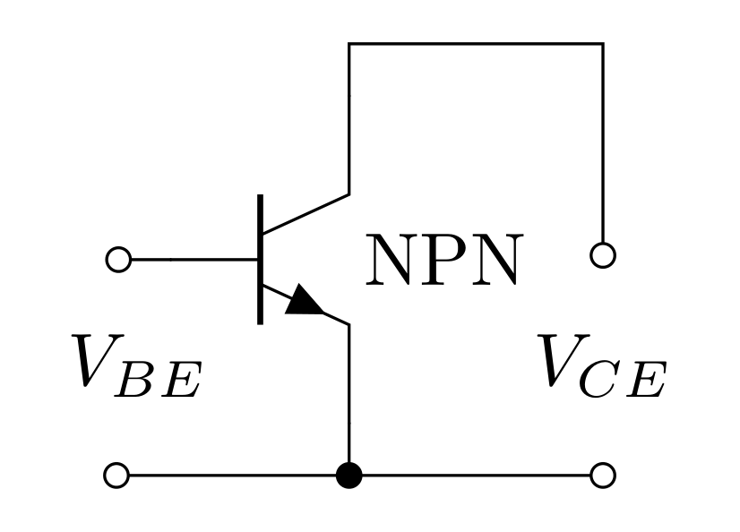
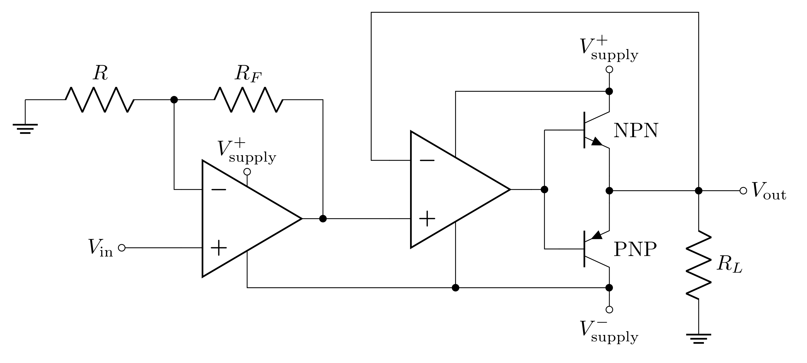
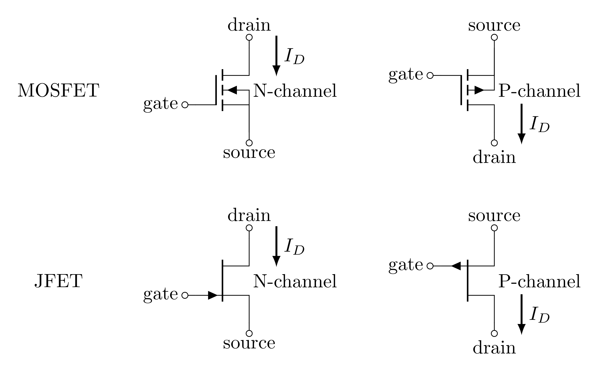
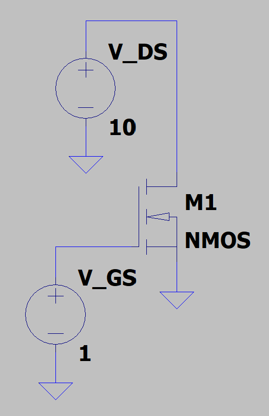
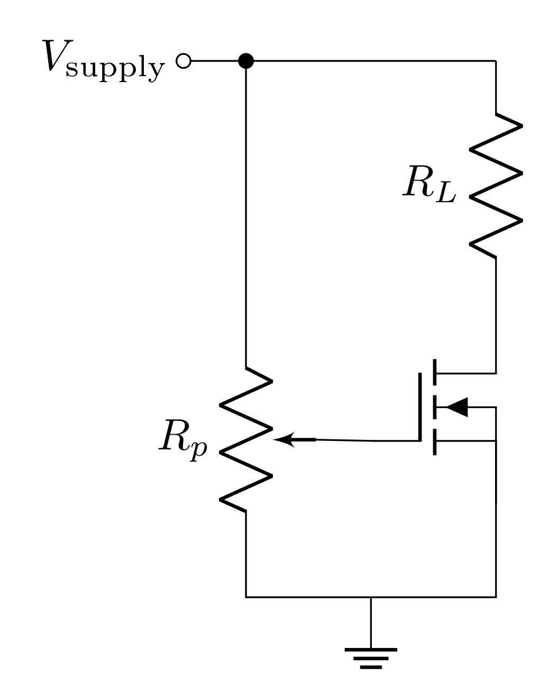
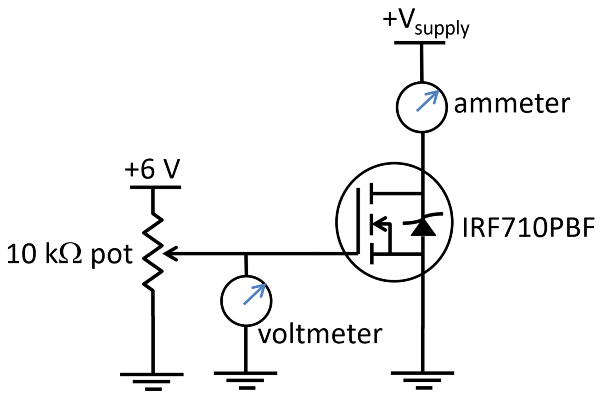

# Goals

Transistors are 3 terminal devices that control the flow of current as a function of small electrical signals (voltage or current). The vacuum tube predecessor for transistors were called [triodes](https://en.wikipedia.org/wiki/Triode). Transistors are incredibly useful devices that are involved in almost every electronic technology made today. For example, the op-amps you have been using the past few weeks are made of several transistors, and whatever device you're using to read this has billions of transistors in it.

There are two general categories of transistors: bipolar and field-effect. Bipolar transistors control the flow of current as a function of small currents, and field-effect transistors control the flow of current as a function of applied voltage. In this lab, you will learn how to model, analyze, and simulate simple circuits containing both kinds of transistors.

The physics of transistors is very interesting, and we could easily spend an entire semester learning about them. In this class, we will focus on how they are used at a basic level.

<!--The difference between these two types is that for bipolar devices an *input current* controls the large current flow through the device, while for field-effect transistors an *input voltage* provides the current control. In this lab, you explore using the FET type transistors as a current controller to create an electromagnet. In the next week's lab, you will use the transistor as a voltage amplifier. 


# Definitions

**Threshold voltage, V~th~** -- minimum gate-to-source voltage to allow current to flow.

**V~GS~** -- Gate to Source voltage difference

**V~DS~** -- Drain to Source voltage difference-->

# SPICE Activities

## Intro to Bipolar Junction Transistors (BJT)

The kind of bipolar transistor we will use this week and next are bipolar junction transistors (BJT). BJTs have two PN-junctions; this can be done by sandwiching a p-type region with two n-type regions (NPN) or by sandwiching a n-type region with two p-type regions (PNP).

{#fig:bjt width="16cm"}

The symbols for NPNs and PNPs are shown above. The BJT is similar to two diodes pointing in opposite directions; however, the doping of the emitter and the collector are not symmetrical. [This video does a nice job of describing this](https://www.youtube.com/watch?v=2uowMENwiHQ&t=55s).

The arrow in the diagram (as seen in Figure @fig:bjt) for each the NPN and the PNP describes the direction current will flow and which junction you should think of as "diode-like." Notice that the arrow is between the emitter and the base for both kinds.

We will consider the **NPN** in the following discussion:

The "control current" for a BJT is the current that goes into the base. The base current $I_B$ will cause a much larger current to flow through into the collector $I_C$. This is typically represented by a current gain $h_{FE}$ (sometimes written $\beta$):

$$I_C = h_{FE} I_B$$

With current flowing into the base and collector, all of this current will have to flow out of the emitter, such that

$$I_E = I_C + I_B = \bigg(\frac{1}{h_{FE}}+1\bigg)I_C$$

In many use cases, the current gain is quite large, such that it is safe to assume

$$I_E\approx I_C$$

There are a lot of great resources for learning more about how BJTs work. [Here is a video](https://www.youtube.com/watch?v=7ukDKVHnac4) discussing more of the physics.

### Question {#1.1}

The current gain for a BJT depends on a lot of factors. Look for the [datasheet](/PHYS-3330/manuals-data-sheets) for the 2N3904 BJT and find the section for current gain under "On Characteristics" in the tables. Notice that it gives current gains for different conditions.

1. What parameters does the current gain depend on?

2. What is the maximum possible current gain for this transistor?

3. On the first page, there are some "Absolute Maximum Ratings." The "Collector Current - Continuous" represents the maximum current that the transistor can have continuously running through it. What is this value for the 2N3904?

## Basic BJT Operation

In order to push current into the base of an NPN, it must be biased with voltages. The two important voltages to consider are (1) the voltage measured at the base relative to the emitter (base-emitter voltage) $V_{BE}$ and (2) the voltage measured at the collector relative to the emitter (collector-emitter voltage) voltage $V_{CE}$.

{#fig:bjt-bias width="6cm"}

Typically the $V_{CE}$ is some power source that is powering your circuit, and $V_{BE}$ could be some signal that controls the collector current. However, due to the diode like nature of the base-emitter junction, in order to get current to flow into the base, this junction needs to be forward biased. This means that $I_B>0$ only if $V_{BE} > V_{th}$ where $V_{th}$ is a threshold voltage. For silicon BJTs, $V_{th}\approx 0.6\text{ V}$ (just like for silicon diodes).

### Question {#2.1}

Consider the following circuit

{#fig:bjt-simple width="8cm"}

When $V_\text{in}=0\text{ V}$, clearly, there won't be a voltage across $R_B$ and $I_B$ will be zero. However, if $V_\text{in} > V_{th}$, it should be expected that current flows, so $V_{BE}=V_{th}$.

For the following, assume $V_\text{in} > V_{th}$:

1. What is the voltage at the base relative to ground?

2. What is the voltage across the resistor $R_B$? Consider the voltage at one side of the resistor $(V_\text{in})$ and the other side of the resistor (the voltage at the base).

3. Use Ohm's law to determine the current through $R_B$. This will be the current going into the base.

4. If the current gain is $h_{FE}$, write $I_C$ with respect to $V_\text{in}$, $V_{th}$, $R_B$, and $h_{FE}$?

5. Since $I_C$ flows through $R_C$, what will be the voltage drop across $R_C$? Considering this drop in voltage, what will the voltage be at the collector relative to ground?

6. Write $V_{CE}$ as a function of $R_C$, $R_B$, $V_\text{in}$, $V_{th}$, and $V_S$.

### Question {#2.2}

Make the circuit above in LTspice with $V_S=9\text{ V}$, $R_B=1\text{ k}\Omega$, and $R_C=8\ \Omega$. We can consider this circuit being used to control the current through an $8\ \Omega$ load as a function of $V_\text{in}$. To create a BJT, in the components menu, search "NPN" (or "PNP" if that's the kind of BJT you want).

We will do a new kind of simulation: a "DC sweep". In the Configure Analysis menu, select the "DC sweep" tab and under "1st Source" enter:

- "Name of 1st source:" The name of your $V_\text{in}$ voltage; if you haven't explicitly named it, it will likely be V1 or V2 (depending on what order you placed the two voltages).

- "Type of sweep:" Linear.

- "Start Value:" 0

- "Stop Value:" 5

- "Increment:" 0.1

This will configure a voltage sweep from $0\text{ V}$ to $5\text{ V}$ for the input voltage. Run the simulation.

1. Click to measure the $V_\text{in}$ voltage. You should see a y=x plot from $0\text{ V}$ to $5\text{ V}$. The $x$-axis of a DC sweep will be the sweep of voltages you configured. Since you are measuring this voltage, you should expect to see this relationship.

2. Now measure the voltage at the base. Approximately what is the threshold voltage of this transistor?

3. Measure the base current. You can do this by measuring the current through $R_B$ or by clicking on the base of the transistor. If the current measurement is wanting ot measure the current in the wrong direction (such that it's saying the current is negative), you can use the "move" tool to select the resistor, and rotate it with Ctrl+R (twice to rotate 180 degrees) and the current will now read in the direction you want (you'll have to re-run the simulation after the rotation). Use this measurement to determine the minimum $V_\text{in}$ needed to start to drive any current.

4. Come up with a method to determine the current gain of this transistor. You can do this in any way you wish, and may configure a new simulation to do so. Please record your methodology and results.

### Question {#2.3}

In the same simulation, remove the $8\ \Omega$ resistor so that the $9\text{ V}$ is directly applied to the collector. Fix the input voltage to $1\text{ V}$ and change the DC sweep to sweep the supply voltage $V_S$ from $0\text{ V}$ to $9\text{ V}$ in $0.005\text{ V}$ increments.

1. Run the simulation and measure the collector current (the current that would have gone through the $8\ \Omega$ load) by clicking on the corner of the collector.

2. Right click the graph "File > Export Data as text" and save the data in a data directory where you have your Jupyter Notebook.

3. Repeat with: 
   
   - $V_\text{ in} = 2\text{ V}$

   - $V_\text{ in} = 3\text{ V}$

   - $V_\text{ in} = 4\text{ V}$

   - $V_\text{ in} = 5\text{ V}$

4. You can load the data into python with the following code (assuming your files are in a directory called "simulated_data" and the file names are such. You can name your data the same as below or modify the code to accomadate your naming scheme)

```python
import numpy as np
from pathlib import Path

data_dir = Path("simulated_data")

data_1V = np.loadtxt(data_dir / "ICvsVCE-data-1V.txt", skiprows=1)

data_2V = np.loadtxt(data_dir / "ICvsVCE-data-2V.txt", skiprows=1)

data_3V = np.loadtxt(data_dir / "ICvsVCE-data-3V.txt", skiprows=1)

data_4V = np.loadtxt(data_dir / "ICvsVCE-data-4V.txt", skiprows=1)

data_5V = np.loadtxt(data_dir / "ICvsVCE-data-5V.txt", skiprows=1)
```

The `data_xV` values will be numpy arrays with as many rows as data points in your data and 2 columns (the input voltage, and the corresponding collector currents). You can "slice" the collector voltages for each array with `data_xV[:, 0]` and you can "slice" the collector currents with `data_xV[:, 1]`. Plot all 5 of these on the same $I_C$ vs $V_{CE}$ plot with a legend labeling the $V_\text{in}$ of each curve.

The plot you just created is the classic way people represent the $IV$-characteristics of a BJT.

### Question {#2.4}

Now re-consider the $8\ \Omega$ load ($R_C$ in the circuit). When a collector current flows through the resistor, voltage will drop across it and $V_{CE}$ will then be less than the supply voltage $V_S$. The voltage drop across $R_C$ is

$$\Delta V = V_S-V_{CE}= I_C R_C$$

This can be rearranged to be a function $I_C(V_{CE})$ that we can plot on your graph from the previous question.

1. Write the function $I_C(V_{CE})$ and make a Python function that calculates $I_C$ using $V_{CE}$, $R_C$, and $V_S$ as inputs.

2. Use this Python function to plot this $I_C(V_{CE})$ on the same graph you made above using $R_C=8\ \Omega$ and $V_S=5\text{ V}$. This line is referred to as a [load line](https://en.wikipedia.org/wiki/Load_line_(electronics)) and represents a constraint on the $IV$-characteristics.

3. One way to predict the behavior of a BJT in this configuration is to pick the correct curve on the plot corresponding to the input voltage, then find where it intersects the load line. This intersection will represent the collector current and  collector-emitter voltage for this particular choice of $V_S$ and $R_C$. Use your plot to record $I_C$ for each choice of $V_\text{in}$.

4. Compare the $I_C$ vs $V_\text{in}$ from the graph to the equations you derived in Question @2.1 (you should use these equations to calculate $I_C$ for each $V_\text{in}$).

## BJT Switch

A common application for a transistor is as a voltage controlled switch. Consider the circuit in @fig:bjt-simple where $R_C$ is some device, like an electromagnet (that is used to move the bolt of a lock), that can be turned on with some large current. Often in electronic systems that control things (like the magnetic lock we're considering), the control voltages/currents are small, but the things they control may need much more power to operate. We will use Arduino microcontrollers for this purpose in Lab 10.

The BJT switch is a classic way to operate the on/off state of a device that requires more power than the control voltages or currents that can be provided by a controller. Often these switches are designed in a way so that the collector current $I_C$ saturates at the desired operating current for running the device.

### Question {#3.1}

In the following steps, you will design a BJT switch to operate an electromagnet with a series resistance of $600\ \Omega$ (this is $R_C$). The recommended operating voltage for the electromagnet is $12\text{ V}$.

1. What is the current in the electromagnet when the operating voltage is applied (consider applying this voltage directly to the electromagnet)?

2. How much base current is needed to get this much collector current (use $h_{FE}=100$).

3. As we saw in the data sheet, $h_{FE}$ is not a constant value in real BJTs, so we don't want to design the switch to rely on a particular value of the current gain. This can be done by selecting $V_S$ such that it can't possibly supply more current than desired. When a BJT has a saturated collector current (i.e. $V_S$ can't supply any more current), $V_{CE}\approx 0$. If $V_{CE}=0$, and one side of the electromagnet is at $V_S$, what is the voltage across the electromagnet? What choice of $V_S$ will result in $12\text{ V}$ across the electromagnet when $V_{CE}=0$ (i.e. when the collector current is saturated)?

4. Assuming the worst possible current gain is $h_{FE}=30$ for this transistor, how much base current is needed to saturate $I_C$?

5. If the controller supplies a $5\text{ V}$ signal, what choice of $R_B$ will result in this current (don't forget to consider $V_{th}=0.9\text{ V}$)?

This design no longer depends on $h_{FE}$ as long as it is above 30. When $h_{FE}$ does exceed 30, it is impossible for the BJT to supply more collector current because it is limited by the supply voltage $V_S$.

## PNPs

We have been looking at NPN BJTs where a positive current into the base controls a positive current into the collector (such that all the current leaves the emitter). A PNP operates almost identically to the NPN, except for the fact that a negative current (current flowing out of the base) controls a current out of the collector (such that all the current enters through the emitter).

Each kind of BJT only works with current in one direction, so to amplify both positive and negative currents, an NPN and a PNP are needed in what's referred to as a push-pull configuration

{#fig:push-pull-basic width="10cm"}

The circuit above is an example of a push-pull amplifier. When $V_\text{in}>V_{th}$, current will flow into the base of the NPN and "push" current into the load $R_L$, and $V_\text{out}$ will be $V_\text{in}-V_{th}$. When $V_\text{in}<-V_{th}$, current will flow out of the PNP and "pull" current from the load, and $V_\text{out}$ will be $V_\text{in}+V_{th}$. However, when $-V_{th}<V_\text{in}<V_{th}$, no current will flow and $V_\text{out}=0$. This means that the output voltage won't follow exactly the input voltage, and there will be what's called crossover distortion. In the following questions, you will explore this crossover distortion and a solution to it.

<!--Horowitz and Hill 2.15 details push-pull amplifiers, the crossover distortion, and how to design around it. This section could prove valuable for your final project.-->

### Question {#4.1}

Build the circuit shown in @fig:push-pull-basic in LTspice with 

- $V_{S,+}=15\text{ V}$

- $V_{S,-}=-15\text{ V}$

- $R_L=8\ \Omega$

Make $V_\text{in}$ a sine wave with

- $f=1\text{ kHz}$

- an amplitude of $5\text{ V}$

- an output impedance of $50\ \Omega$ (to emulate the function generator)

Configure a transient analysis with a stop time of $5\text{ ms}$.

1. Measure $V_\text{in}$ and $V_\text{out}$ and save the plot.

2. Describe the crossover distortion you are seeing and why it occurs.

## Improving the Push-Pull Amplifier

The push-pull amplifier in Figure @fig:push-pull-basic may seem relatively useless since it just attempts to reproduce a voltage, but distorts it. However, this amplifier can be incredibly useful in overcoming current limits of op-amps. Recall, in lab 4, when you built a buffer (a.k.a. follower) and a non-inverting amplifier. You found that the buffer was useful as an output stage because it's able to drive the voltage with a near zero output impedance; however, the LF356 is limited in that it can only output about $27\text{ mA}$ (which isn't a lot). The push-pull amplifier is capable of driving lots of current (remember, the output current of the op-amp will have the current gain of the active BJT applied to it). There are even current limitations here, and there are further solutions to get more and more current (with Darlington pairs: this can all be found in chapter 2 of Horowitz and Hill). However, there are also heat management considerations that need to be made with large current applications.

{#fig:push-pull width="17cm"}

Consider the circuit above (it may look complicated, but we'll break it down). Starting left to right, you'll notice an op-amp with negative feedback. The input is going into the $V_+$ input, so this is a non-inverting amplifier. The voltage gain of the amplifier, as you know, is

$$G = 1 + \frac{R_F}{R}$$

The rest of the circuit is a push-pull amplifier that uses an op-amp with negative feedback to mitigate crossover distortion. The output of the push-pull amplifier is fed back into the $V_-$ input of the op-amp, and the output of the op-amp feeds into the input of the push-pull amplifier. Having the op-amp in the circuit in this way helps make $V_\text{out}=V_\text{in}$ instead of $V_\text{out}=V_\text{in}\pm V_{th}$ because the feedback of the op-amp will drive the system toward $V_+=V_-$; since $V_\text{out}=V_-$, the output voltage will now be $V_\text{in}$.

Since the push-pull amplifier (with the second op-amp) has a voltage gain of 1, the total voltage gain of the circuit will be the voltage gain of the non-inverting amplifier. The advantage of this circuit over a non-inverting amplifier followed by just an op-amp buffer, is that the amount of current the BJTs can supply is much greater than the LF356.

### Question {#5.1}

Build the circuit shown in Figure @fig:push-pull in LTspice with

- OP113 op-amps

- $R_F=100\text{ k}\Omega$

- $R=1\text{ k}\Omega$

- $V_{S,+}=15\text{ V}$

- $V_{S,-}=-15\text{ V}$

- $R_L=8\ \Omega$

Make $V_\text{in}$ a sine wave with

- $f=1\text{ kHz}$

- an amplitude of $50\text{ mV}$

- an output impedance of $50\ \Omega$ (to emulate the function generator)

Configure a transient analysis with a stop time of $5\text{ ms}$.

1. Before running the simulation, calculate the predicted voltage gain and $V_\text{out}$.

2. Run the simulation and measure the input voltage and the voltage at the output of the non-inverting amplifier. Is the voltage gain what you predicted?

3. Measure the voltage at the output of the circuit, compare this to the output of the non-inverting amplifier. Is there any crossover distortion?

3. Measure the current in the load, what is the maximum current? Would the LF356 be able to supply this current without the BJTs?


## FET Basics

Field effect transistors (FET) differ from bipolar transistors in that they are controlled by an applied voltage instead of an applied current. Since voltage and current are often related, functionally they are very similar and often can be exchanged in various applications. Instead of having a base, collector, and emitter, a FET has a gate, source, and drain. [This video describes how FETs work](https://www.youtube.com/watch?v=IcrBqCFLHIY).

A commonly used FET is a metal-oxide semiconductor FET (MOSFET), where a small insulating layer separates the gate terminal from the semiconductor. This creates a capacitor-like structure that insulates DC currents, and when the gate terminal is charged, it will generate electric fields across the insulator and influence the behavior of the doped semiconductor on the other side. In integrated digital circuits, small MOSFETs are ubiquitous and are used in everything from simple logic circuits to the billions of transistors found in Intel and AMD central processor chips (CPUs). Small MOSFETs are also used in some op-amps, particularly when very low supply current is needed, as in portable battery-powered circuits. Small discrete (single) MOSFETs are not normally used because they are extremely fragile. Large discrete MOSFETs are used in all sorts of high power applications, including commercial radio transmitters. The primary advantages of MOSFETs are that they are extremely simple to manufacture at scale (in a process called CMOS), and because the active state involves essentially charging a capacitor, there is no passive power consumption (for a BJT, to keep it on, you have to continue to sink current into the base which costs energy). A disadvantage of MOSFETs is in high frequency applications where the capacitive coupling in the metal-oxide starts to act like a short circuit.

Junction FETs (JFETs) are also very common. JFETs add very little intrinsic noise to a circuit and have very large input impedance. Op-amps that use JFETs for the input stage are often the first choice for low-noise amplification (such as the LF356). Discrete JFETs are commonly seen in scientific instruments. Consider using a JFET when low-noise is critical. We will not cover JFETs in this activity, but you can read about them in Chapter 3 of Horowitz and Hill (either edition) and they may be useful in your final project.

{#fig:fetdiagram width="15cm"}

FETS are similar to BJTs. The table below relates the two:

|                  | BJT             | FET                | 
| :--------------: | :-------------: | :----------------: |
| Type of control  | Current $(I_B)$ | Voltage $(V_{GS})$ |
| Positive control | NPN             | N-channel          |
| Negative control | PNP             | P-channel          |
| Pins:            | Base            | Gate               |
|                  | Collector       | Drain              |
|                  | Emitter         | Source             |

A voltage from the gate to the source (gate-source voltage $V_{GS}$) controls current from drain to source (drain current $I_D$). For an N-channel, a positive $V_{GS}$ drives a positive $I_D$ (current flows from drain to source), and for a P-channel, a negative $V_{GS}$ drives a negative $I_D$ (current flows from source to drain).

### Question {#6.1}

State whether a BJT, MOSFET, or JFET is most ideal for the following applications:

1. You wish to fabricate a microcontroller chip with hundreds of thousands of transistors to perform digital logic.

2. You wish to design an amplifier for $1\text{ MHz}$ signals.

3. You wish to design a low noise amplifier.

## MOSFET Current-Voltage Relations

MOSFETs can operate in three distinct regions. The first region is where the gate-to-source voltage, $V_{GS}$, is less than the threshold voltage, $V_{th}$. In this region, the MOSFET is turned off and no drain current can flow. The second region (the linear region) is when $V_{GS} > V_{th}$ and $V_{DS} < (V_{GS} - V_{th})$, where $V_{DS}$ is the drain-to-source voltage. In this linear region, the transistor is turned on, and a channel has been created that allows current to flow between the drain and the source. In this region, the MOSFET operates like a voltage controlled resistor, controlled by the gate voltage relative to both the source and drain voltages. In the third region (the saturation region), $V_{GS} > V_{th}$ and $V_{DS} \ge (V_{GS} - V_{th})$. In the saturation region, the current is controlled by the gate voltage and is nearly independent of $V_{DS}$. One of the most common applications of a MOSFET is as a switch (for binary logic for example), where it is operated in the saturation region. The linear and saturation regions are separated by the dotted line in Figure @fig:mosfetchar. In the saturation region, the dependence of current on $V_{GS}$ is modeled by $I_D = k(V_{GS} - V_{th})^2$, where $k$ is a constant that depends on the device.

{#fig:mosfetchar width="15cm"}

### Question {#7.1}

Create a simple n-channel MOSFET circuit with the source grounded and individual voltages applied at the gate and the drain (see the figure below). You can create a n-channel MOSFET by searching "nmos" in the components menu.

{#fig:mosfetspice width="6cm"}

Configure a linear DC sweep on $V_{DS}$ from $0$ to $10\text{ V}$ with an increment of $0.1\text{ V}$ for the following values of $V_{GS}$, measure the current into the drain $(I_D)$ and export the data as you did for the BJT in question @2.3 (so that you can import it into your Jupyter Notebook)

- $V_{GS} = 2\text{ V}$

- $V_{GS} = 4\text{ V}$

- $V_{GS} = 6\text{ V}$

- $V_{GS} = 8\text{ V}$

1. Import the four sets of data and plot them on one graph with a legend labeling the value of $V_{GS}$ for each curve. Make the units of $y$-axis in $\text{mA}$ by multiplying $I_D$ by $1000$ (LTspice exports in Amps).

2. Does your plot generally resemble the one shown in Figure @fig:mosfetchar (if not, identify the mistake and resolve it)?

### Question {#7.2}

1. Identify the $I_D$ in the saturation region for each $V_{GS}$ (where $I_D$ is constant with respect to $V_{DS}$). Record this data as NumPy arrays. Record $I_D$ in **MICROAMPS** $\mu\text{A}$.

```Python
v_gs = np.array([2, 4, 6, 8])
i_d = np.array([i0, i1, i2, i3])
```

We will fit this data to

$$I_D = k(V_{GS}-V_{th})^2$$

The threshold voltage for this simulated MOSFET is $0\text{ V}$. (You can convince yourself of this by doing a DC sweep of $V_{GS}$ at a fixed $V_{DS}$). We can then define the fitting function as

```Python
def fitting_function_mosfet(V_GS, k):
   """
   :param V_GS: array of gate-source voltages
   :param k: device dependent constant
   :return: drain current
   """
   return k * V_GS ** 2
```

2. Fit the data to the fitting function to determine the constant $k$. You can utilize `curve_fit` function ([Documentation can be found here](https://docs.scipy.org/doc/scipy/reference/generated/scipy.optimize.curve_fit.html)). You can access this function with `from scipy.optimize import cure_fit`.

```Python
initial_guess = (1,) # the initial guess for fitting parameters.

popt, pcov = curve_fit(fitting_function_mosfet, v_gs, i_d, initial_guess)
```

If there are $n$ fitting parameters, then the `initial_guess` needs to be a tuple (or list) with $n$ elements. `popt` will be a list with elements representing the results of the fit (so it will be $n$-long), and `pcov` is a covariance matrix (of size $n\times n$). The estimate of the error can be determined with `perr = np.sqrt(np.diag(pcov))`.

3. Fit the data and plot the data with the fit

```Python
fig, ax = plt.subplots(1, 1, figsize=(4, 3))

ax.scatter(v_gs, i_d, color='k', s=100)

v_gs_fit = np.linspace(0, 10, 100)
ax.plot(v_gs_fit, function(v_gs_fit, popt[0]), 'r')

ax.set_xlabel("$V_{{GS}}$ (V)")
ax.set_ylabel("$I_D$ (mA)")
ax.set_title("$I_D = k(V_{{GS}}-V_{{th}})^2$")

loc = (0, 850)
ax.annotate(f"$(k={popt[0]:.4f} \pm {perr[0]:.4f})$", loc)

fig.tight_layout()
```

4. The annotation will print your fitting result on the plot. However, it's missing units. Determine the units of $k$ and include these units in the annotation, also adjust the number of significant figures (by editing the `4` in `:.4f`) so that the digits displayed are correct. As a refresher, there should only be one significant digit in the error (unless it starts with 1, then you can take two), and the number of digits past the decimal should match in both the parameter and the error.

## A dial controlled current

Consider the circuit below:

{#fig:mosfet-cir width="7cm"}

The potentiometer with total resistance $R_p$ acts as a voltage divider to set a gate-source voltage $V_{GS}$. We can consider the resistance from the wiper to ground as $R_{GS}$, such that the transfer function is $R_{GS}/R_p$ (since $R_p$ is $R_{GS}$ plus the resistance from the gate to the supply voltage $V_S$). This leads to

$$V_{GS} = \frac{R_{GS}}{R_p}V_S$$

The potentiometer then simply sets the gate-source voltage, giving you a way of controlling it through a dial. The load (with resistance $R_L$) will have current $I_D$ run through it depending on the dial position then. This will lead to a voltage drop, such that the voltage at the drain (and therefore $V_{DS}$) is less than $V_S$. This idea should be familiar from the BJT analysis you did.

### Question {#7.3}

One way to determine the behavior of this circuit is using a load line on the plot you made using LTspice to determine what value of $V_{GS}$ you need to get a desired $I_D$. Recall, that the plot is specific to each individual MOSFET design, so you would use the plots supplied by the manufacturer in a datasheet in general; however, we will consider the MOSFET in your simulation since you already have that loaded into your Jupyter Notebook.

1. Use Ohm's law to write down $I_D$ as a function of $R_L$, $V_S$, and $V_{DS}$ (this is your load line equation). Implement it as a Python function that returns  the drain current in $\text{mA}$ (by multiplying by $1000$) and takes $V_S$ and $V_{DS}$ in Volts and $R_L$ in Ohms.

2. Plot your load line on a graph with your $I_D$ vs $V_{DS}$ curves using $V_S=9\text{ V}$ and $R_L = 10\text{ k}\Omega$. *Hint:* You'll want to make an $x$-axis array with something like `v_ds = np.linspace(0, 10, 100)` and plug this into your function to get the $y$-axis.

3. Which values of $V_{GS}$ result in the MOSFET operating in the *linear region* and which values result in the MOSFET operating in the *saturation region*?

4. What value of $V_{GS}$ get you closest to $0.5\text{ mA}$?

### Question {#7.4}

With a supply voltage of $9\text{ V}$ and a load of $10\text{ k}\Omega$, the MOSFET operated in the linear region or the saturation region depending on the choice of $V_{GS}$; however, for a load of $R_L=100\ \Omega$, the MOSFET will operate in the saturation region for all four choices of $V_{GS}$.

1. Show that the MOSFET is in the saturation region for all the $V_{GS}$ on your graph by plotting the new load line with $V_S=9\text{ V}$ and $R_L = 100\ \Omega$ (on a new plot). Adjust the axes with `ax.ylim()` to show the plot nicely.

2. Looking at your plot, is it consistent with the $I_D$ vs $V_{GS}$ plot you made in Question @7.2\?

Since we are in the saturation region, the value of $k$ you determined from your fit can be used to determine the value of $V_{GS}$ needed to get a particular current $I_D$ through the load.

3. Using the value of $k$ you determined from the fit, what $V_{GS}$ would you need to get a drain current of $0.5\text{ mA}$? *Hint:* remember that $V_{th}=0\text{ V}$.

4. Notice that the $V_{GS}$ needed to get the same current of $I_D=0.5\text{ mA}$ differs depending on the load. As the load decreases the load line will become steeper, so it will continue to intersect the $I_D$ vs $V_{DS}$ curves in the *saturation region*. Considering this, what $V_{GS}$ would achieve $I_D=0.5\text{ mA}$ for a $8\ \Omega$ load?

## Op-amp design

Op-amps are made of several transistors (often a mix of BJTs and JFETs). Op-amp design involves combining many kinds of transistor circuits like differential pairs (aka long-tail pairs), emitter amplifiers, current mirrors, darlington pairs, and push-pull amplifiers. Chapter 3 in Horowitz and Hill has a lot of great information on all of these (and more). It is worth thumbing through this chapter for ideas to incorporate in your final project.

A great final project idea is to build an op-amp from discrete transistors! This op-amp, without doubt, will under perform compared to the LF365, but it will be a great learning experience. You can even implement it as an audio amplifier to drive a large speaker to make it more interesting. The following resources are a good starting point to starting off on a project like this.

- [Architecture and Design Techniques of Op-Amps](https://www.allaboutcircuits.com/video-tutorials/op-amp-basics-internal-circuitry/)

- [Discrete Operational Amplifier](https://sound-au.com/project07.htm)

- [Being discrete](https://www.psaudio.com/blogs/pauls-posts/being-discrete)

- [Op-amp Cookbook](https://www.nutsvolts.com/magazine/article/op-amp-cookbook)

### Question {#8.1}

Read through the first article. What are the 3 primary stages of an op-amp? Describe the function of each one.

<!--# Useful Readings

1.  [Steck](https://atomoptics-nas.uoregon.edu/~dsteck/teaching/electronics/electronics-notes.pdf) Sections 5.2, 5.3, and 5.4.1

2.  Horowitz and Hill 2^nd^ Ed. Sections 3.01-3.10

3.  The data sheet for the IRF710PBF, the n-channel MOSFET we will be using (on Canvas).

# Prelab

Answer the following questions using Mathematica for the plots. You can use either Mathematica for the rest of the questions as well or do them by hand. **Make sure to have the Mathematica notebook for your lab section as well. You will use it to plot and fit your data during the lab session.**

## Characterizing the MOSFET {#sec:fetcharpre}

1. What is the range of the Gate-Source threshold voltage for the IRF710PBF transistor? The data sheet is on the [Data Sheets and Instrument Manuals page](/PHYS-3330/manuals-data-sheets).
2. Plot $I_D$ vs. $V_{DS}$ for a value of $V_{GS}$ that will give you about 0.5 A in the saturation regime. You can do this by plotting a bunch of points obtained from Figure 1 on the data sheet. This can give you an idea about where in the saturation region we can operate.
3.  Plot $I_D$ vs. $V_{GS}$ for $V_{DS} = 10 ~V$ using the data available in Figure 1 on the data sheet. Just plot the points in the saturation region. In this region, the drain current dependence on $V_{GS}$ can be modeled as $I_D = k(V_{GS} ~–~ V_{th})^2$. Fit your data points using this model to obtain values for the constant, $k$, and the threshold voltage, $V_{th}$, along with their associated uncertainties. You can refer to your work in [Lab Skills Activity 2](/PHYS-3330/lab-guides/lsa2) for an example of fitting data to a function. Be sure to enter your best estimate of the uncertainties on the input data points. Also, be sure to include the resulting uncertainties when reporting the fitted values of $k$ and $V_{th}$.

## MOSFET controlled electromagnet {#sec:fetmagpre}

1. What is an equation for the magnetic field on axis from a loop of current carrying wire in terms of the radius of the loop, current through the loop, number of turns, and distance from the plane of the loop?
2. Come up with a way of qualitatively measuring the strength of the electromagnet you are going to create and ways of testing at least two of the parameters of the model that determine magnetic field strength.

## Lab activities

1. Read through all of the lab steps and identify the step (or sub-step) that you think will be the most challenging.
2.  List at least one question you have about the lab activity.

# IRF710PBF Pin-Out and Schematic

{#fig:mosfetpo width="15cm"}

**CAUTION!**

1. These transistors are vulnerable to static discharges. Discharge yourself before handling the device. Also, never apply power to a MOSFET before the gate is properly terminated. If the gate is left open, it will turn on when the power supply is connected to the circuit.
2. As you may dissipate lots of power in your transistor, make sure you have a heat-sink attached to your MOSFET. Also, do not touch the FET until you are sure it has cooled off after use.
3. Note that the drain is connected to the back flange of the transistors as well as the center pin.

# Device Characterization

{#fig:testcir width="15cm"}

## Characterizing the MOSFET {#sec:fetchar}

1. Build the test circuit for the MOSFET shown in Figure @fig:testcir. Make sure to attach a heat sink fin to the FET. (See notes of caution above.) You can use the 10-turn pot on the interface panel of your protoboard. The 10-turn pot allows more intuitive control of the $V_{GS}$ than the knobs on the DC power supply. You can measure the resistance between pairs of the three leads to make sure you have it wired correctly. 
2. Devise a quick way to determine the approximate threshold voltage for your device and write down your method. Proceed with finding the approximate threshold voltage. Is this value within the specified range for the IRF710PBF? 
3. Measure the characteristic $I_D$ vs. $V_{DS}$ curve for a value of $V_{GS}$ that will give you about 0.5 A in the saturation regime (see @sec:fetcharpre\.2). Plot the measurements on the same graph as your prelab predictions. Do your measurements agree qualitatively with the predictions from the data sheet?
4. Measure the relationship between $I_D$ and $V_{GS}$ for one value of $V_{DS}$. Use your measurements from @sec:fetchar\.3 and the data sheet to determine the $V_{DS}$ value so as to operate in the saturated regime. Describe how you determined the value of $V_{DS}$ to use. Plot $I_D$ vs. $V_{GS}$ on the same graph as your prelab predictions. Do your measurements agree qualitatively with the predictions from the data sheet? If there is a difference, what could account for the discrepancy? Fit your data to obtain values for $k$ and $V_{th}$, including uncertainties. Do these match your predictions from @sec:fetcharpre\.3? Does the value for $V_{th}$ agree with your result from @sec:fetchar\.2?  

# Voltage Controlled Electromagnet

{#fig:magcircuit width="15cm"}

## Electromagnetic coil

1. Build, or find in the lab, a 25-turn coil (about 1 inch in diameter) made from magnet wire. Note that you will need to strip insulating varnish off the ends of the wire. You can do this with a lighter and/or sandpaper.
2. Measure the resistance of the coil using the 4-terminal measurement as you did in Lab 1 (run a large current through the wire and measure the voltage across it). Describe your procedure and measurements.
3. Modify your model of the magnetic field you developed in the prelab to include the actual number of turns and diameter of your coil.

## Electromagnet 

1. Build the circuit shown in Figure @fig:magcircuit using your coil.
2. Using the data you acquired in section @sec:fetchar, determine $V_{supply}$ and $V_{GS}$ to operate your electromagnet with 1 A of current in the saturation region. Remember to include the voltage drop across your coil in your calculations (HINT: $V_{DS} = V_{supply} ~–~ I_DR_{coil}$). To reduce the heat load on the FET, you should use the minimum $V_{supply}$ that fulfills the requirements.
3. Test out your electromagnet. Choose a way to test your model of the magnetic field produced. Explain the model you are testing and what your predictions are (even qualitative, such as how things scale).
4. Describe your procedures, results/measurements, and refinements to your model. Some starter suggestions are listed below. Be creative! You should try a few different things:
   - Measure the magnetic field as a function of distance from the plane of the loop using the Gaussmeter in lab (or a magnetometer app on your phone). You can also slide the wire loops off-center and see the dependence. 
   - Look at the force applied by a permanent magnet on the coil and see how that scales with current or number of turns.
   - By changing $V_{GS}$, you can vary the current through the coil. Measure the field strength as a function of the current. 
   - Vary the number of turns on your loop of wire and verify the dependence.
   - Slide a screwdriver (steel) or another steel rod into the coil and report what happens.
   - Check the effect of your coil on a compass and compare to the known magnetic field of the Earth. 
   - Get a power supply that can supply more current and pick up objects, test how the number or weight of objects you can pick up depends on the current. 
   - Wrap your coil around an iron core and test how the magnetic field changes, refine your model to include the iron.
   -->