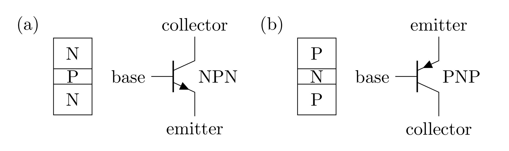
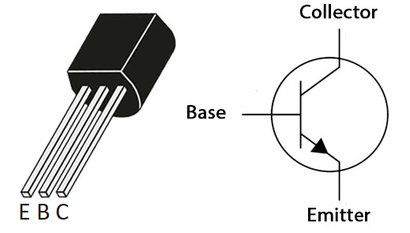
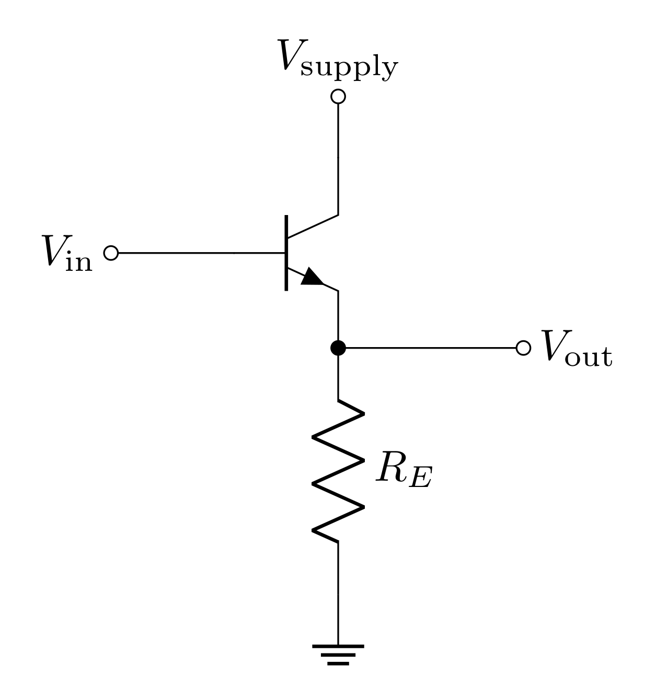
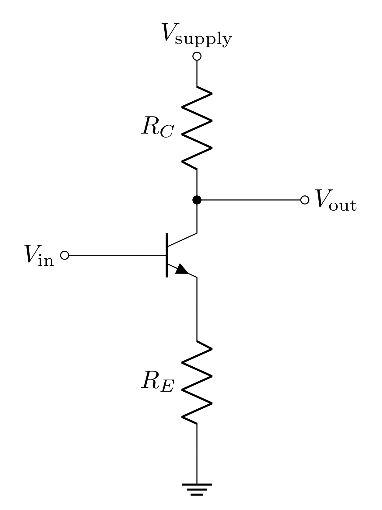
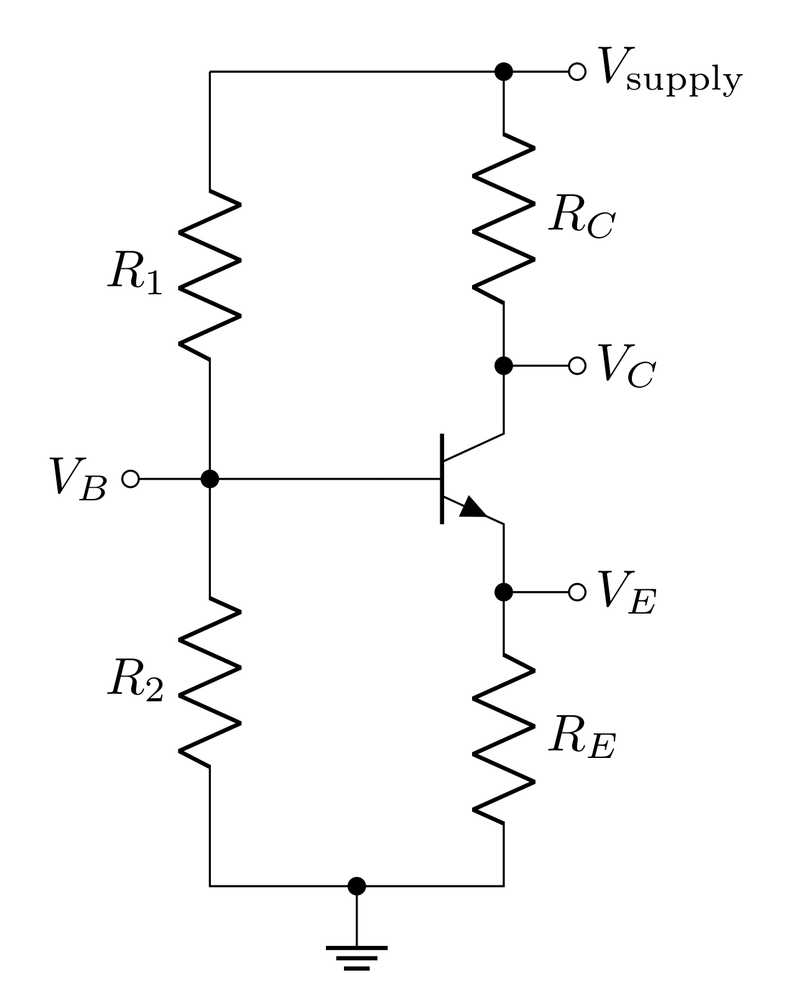
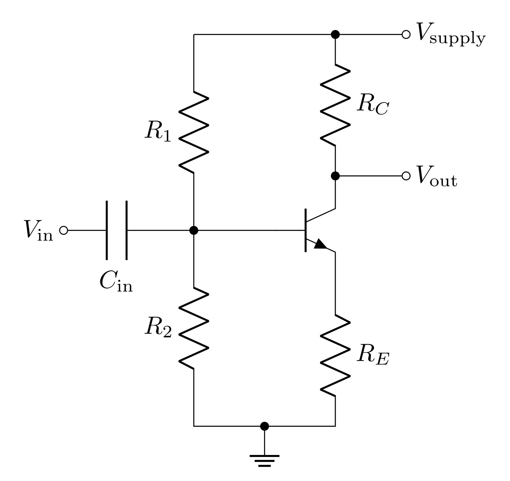
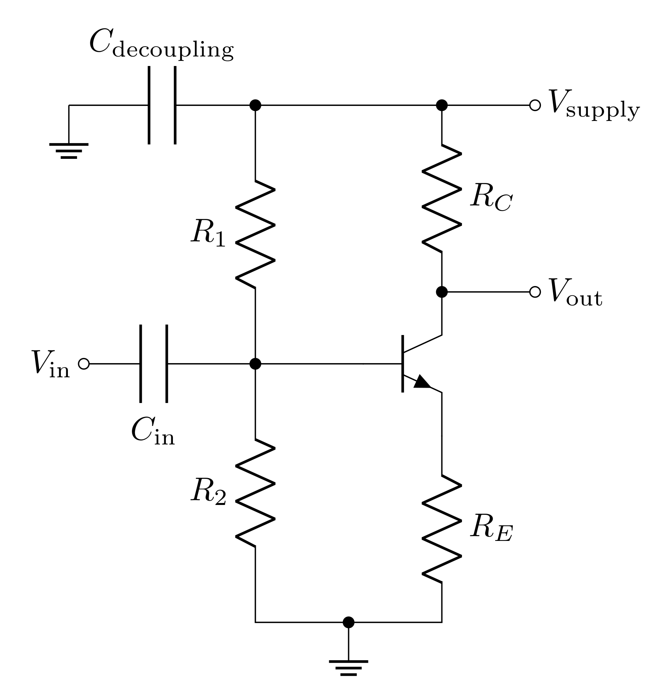
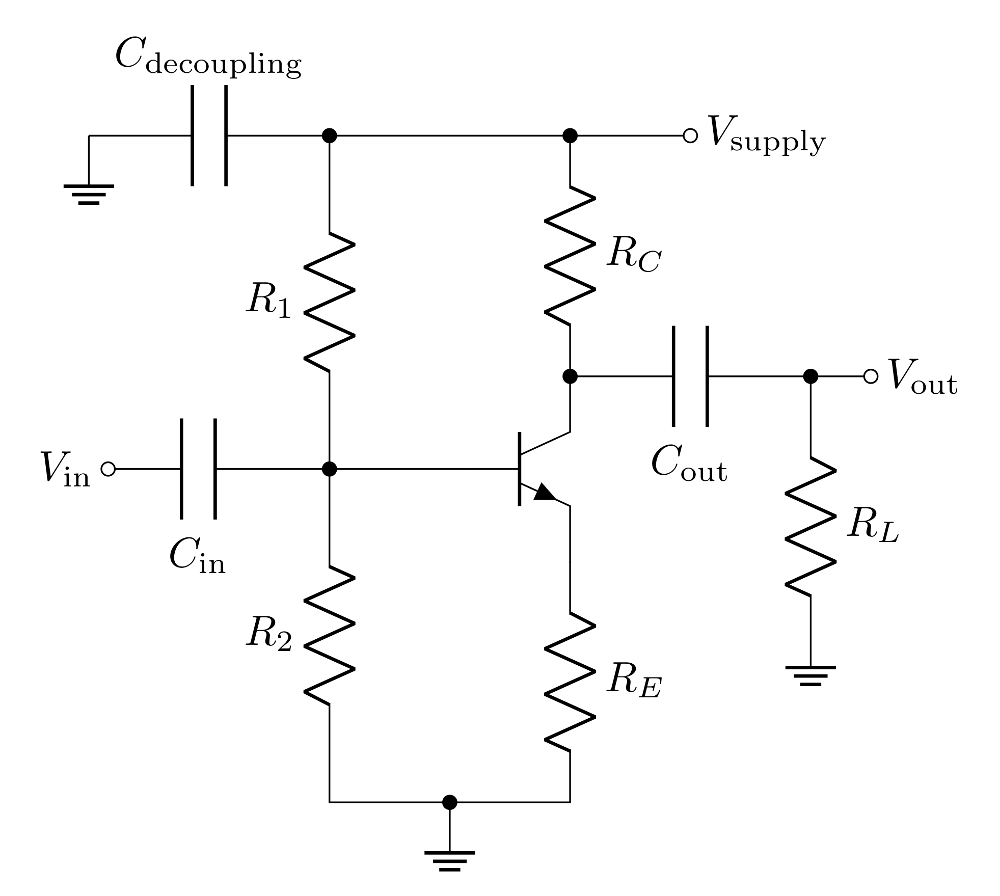
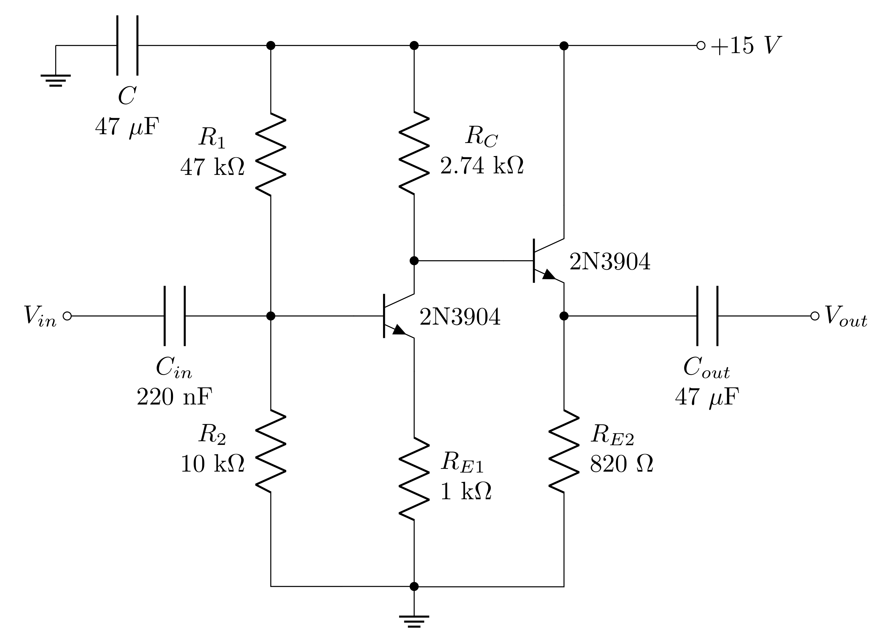

# Goals

In this lab, you will continue learning how transistors work by creating a dual-stage amplifier out of discrete transistors. The two stages of the amplifier can each be made from a single transistor; one stage will be a common emitter amplifier, and the other will be an emitter follower. We will use this as an audio amplifier.

Last week you learned some basics about bipolar junction transistors (BJT) and used LTspice to build some basic BJT circuits. This week we will get hands on experience with BJTs. You will also refine your ability to model and predict the behavior of BJTs.

## Definitions

**AC component of a voltage**: $v$ - A voltage $V$ which has an AC signal riding on a DC offset can be defined as $V=v+V_{DC}$, where $v$ defines the amplitude of the AC signal and $V_{DC}$ is the DC offset.

**NPN** - A BJT where positive current (current into the base) pulls current into the collector and out of the emitter.

**PNP** - A BJT where a negative current (current out of the base) pulls current into the emitter and out of the collector. It is simplest to think of a PNP as an NPN where all the currents are negative relative to an NPN.

**Base current**: $I_B$ - The amount of current that flows into the base. This current controls the BJT.

**Collector current**: $I_C$ - the current that is controlled by the base current.

**Emitter current**: $I_E$ - The collector current and base current combine, such that $I_E=I_C+I_B$.

**Current gain**: $h_{FE}$ **or** $\beta$ - The control current $I_B$ is related to the controlled current $I_C$ by the current gain, such that $I_C = h_{FE}I_B$. This value generally depends on current and temperature.

**Base voltage**: $V_B$ - the voltage at the base relative to ground.

**Collector voltage**: $V_C$ - the voltage at the collector relative to ground.

**Emitter voltage**: $V_E$ - the voltage at the emitter relative to ground.

**Collector-emitter voltage**: $V_{CE}$ - The voltage difference between the collector and emitter.

**Base-emitter voltage**: $V_{BE}$ - The voltage difference from the base to the emitter; when the transistor is active, this will be a diode-like voltage drop (about 0.6 V for silicon).

**Coupling capacitor** - A capacitor in series with a signal that essentially acts as a short for high frequencies and an open circuit for DC. This allows you to "couple" a signal into a circuit in a way that DC currents can't flow back into the signal source.

**Decoupling capacitor** - A capacitor between a supply voltage and ground. This compensates for a power supply's inductance and acts as a power reservoir. You have used these for powering your op-amp circuits.

## Bipolar Junction Transistors - Review

You have seen how a BJT is a current amplifier. However because currents and voltages are related, it is possible to use current amplification to make a voltage amplifier. In this experiment we will build a simple two-stage voltage amplifier using two BJTs.

In many practical applications it is easier to use an op-amp as a source of gain rather than to build an amplifier from discrete transistors. A good understanding of transistor fundamentals is nevertheless essential because op-amps are built from transistors. We will learn later about digital circuits, which are also made from transistors. In addition to the importance of transistors as components of op-amps, digital circuits, and an enormous variety of other integrated circuits, single transistors (usually called "discrete" transistors) are used in many applications. They are important as interface devices between integrated circuits and sensors, indicators, and other devices used to communicate with the outside world. High-performance amplifiers operating from DC through microwave frequencies use discrete transistor "front-ends" to achieve the lowest possible noise. Discrete transistors can also be much faster than op-amps; for example, the device we will use this week has a gain-bandwidth product of 300 MHz (compared to 5 MHz for the LF356 op-amp you have been using).

As a refresher, the three terminals of a bipolar transistor are called the collector, base, and emitter (Figure @fig:NPN-PNP). A small current into the base controls a large current flow from the collector to the emitter. This means that the transistor acts as a current amplifier with a current gain $h_{FE}$ (or $\beta$). Moreover, the large collector current flow is almost independent of the voltage across the transistor from collector to emitter $V_{CE}$. This makes it possible to obtain a large amplification of voltage by having the collector current flow through a resistor.

{#fig:NPN-PNP width="16cm"}

From the simplest point of view a bipolar transistor is a current amplifier. The current flowing from collector to emitter is equal to the base current multiplied by a factor. An NPN transistor like the 2N3904 operates with the collector voltage at least a few tenths of a volt above the emitter, and with a current flowing into the base. There are also PNP transistors with opposite polarity voltages and currents. The base-emitter junction acts like a forward-biased diode with a $0.6\text{ V}$ drop:

$$V_E \approx V_B-0.6\text{ V}$$

$$V_{BE} \approx 0.6\text{ V}$$

Under these conditions, the collector current is proportional to the base current:

$$I_C = h_{FE}I_B$$

The constant of proportionality ('current gain') is called $h_{FE}$ because it is one of the \"h-parameters\", which are a set of numbers that give a complete description of the small-signal properties of a transistor. It is important to keep in mind that $h_{FE}$ is not a constant. It depends on collector current, and it can vary by 50% or more from device to device.

The emitter current can be determined by current conservation:

$$I_E = I_B+I_C = I_C\left(\frac{1}{h_{fe}}+1\right)$$

The difference between $I_C$ and $I_E$ is almost never important since $h_{FE}$ is normally in the range between $50$ and $1000$, so you can generally assume that $I_E = I_C$. Another way to say this is that the base current is very small compared to the collector and emitter currents.

# Prelab

{#fig:NPN}

## Emitter Follower

{#fig:emitterf width="7cm"}

The emitter follower (EF) is a very simple BJT circuit that just involves a single BJT and a single resistor. This looks similar to the switch you designed last week. However, because the emitter is not directly grounded, it is not necessary to have a base limiting resistor (between $V_\text{in}$ and the base); the emitter resistor $R_E$ will limit the current.

The fact this circuit is called a follower should clue you in to what its function is, which you will solve in the following questions.

### Prelab Question {#1.1}

1. When $V_\text{in}>V_{th}$, what will the base-emitter voltage $V_{BE}$ be?

2. Use $V_{BE}$ to determine $V_\text{out}$.

3. Use $V_\text{out}$ to determine the current through $R_E$.

## Common Emitter Amplifier

{#fig:emittera width="7cm"}

In the lab, you will begin by constructing a common emitter amplifier (CEA), which operates on the principle of a current amplifier. However, a major fault of the common emitter amplifier is its high output impedance. This problem can be fixed by adding an emitter follower as a second stage. The common-emitter amplifier and the emitter follower are two common bipolar transistor circuits.

The common emitter amplifier is similar to the emitter follower but with the output at the collector instead of the emitter and with a collector resistor $R_C$. Again the base-emitter voltage $V_{BC}$ will be $V_{th}$ when active, so $V_E = V_\text{in} - V_{th}$, and therefore

$$I_E = \frac{V_\text{in}-V_{th}}{R_E}$$

Since $I_C\approx I_E$, we can then consider this as the current through $R_C$, then the voltage drop across $R_C$ can be used to determine $V_\text{out}$

$$V_\text{supply}-V_\text{out} = I_C R_C \approx I_E R_C$$

$$V_\text{out} = V_\text{supply} - \frac{R_C}{R_E}(V_\text{in}-V_{th}) $$

This analysis suggests that the output rides on a DC offset of $(V_\text{supply}+V_{th} R_C/R_E)$. Trying to define the gain as $V_\text{out}/V_\text{in}$ clearly leads to a weird result. It is better to define it in terms of only the AC component of the signal.

$$G = \frac{v_\text{out}}{v_\text{in}}$$

where

$$v_\text{out} = -v_\text{in}\frac{R_C}{R_E}$$

so

$$G = -\frac{R_C}{R_E}$$

Notice how none of this depended on the specific value of $h_{FE}$. This is a good thing because $h_{FE}$ is not a constant, so the amplifier can act stable under various conditions.

### Prelab Question {#2.1}

1. When $V_\text{in}<V_{th}$, is the transistor active?

2. When $V_\text{in}<V_{th}$, what is $I_C$?

3. When $V_\text{in}<V_{th}$, what is $V_\text{out}$?

### Prelab Question {#2.2}

Consider the common emitter amplifier with 

- $V_\text{supply}=15\text{ V}$,

- $R_C=2.74\text{ k}\Omega$,

- $R_E=1\text{ k}\Omega$.

1. What is the voltage gain?

Consider an input signal that is a sine wave that oscillates around $0\text{ V}$ with an amplitude of $4\text{ V}$ ($8\text{ V}$ peak-to-peak)

2. Sketch a plot (you can use Python) with $V_\text{in}$ and $V_\text{out}$. *Hint:* consider your solutions in Question @2.1\.

### Prelab Question {#2.3}

We found that the output will clip at a maximum of $V_\text{max} = V_\text{supply}$ when $V_\text{in}<V_{th}$. Now consider the clipping for the minimum value of $V_\text{out}$; i.e. $V_\text{min}$. The equation for he output voltage can be rewritten

$$V_C = V_\text{supply}-\frac{R_C}{R_E}(V_B-V_{th}) = V_\text{supply}-\frac{R_C}{R_E}V_E$$

by recognizing that $V_\text{out}$ is the collector voltage $V_C$ and $V_\text{in}$ is the base voltage $V_B$. We can determine the lower clipping value by knowing that it is impossible for $V_{CE}$ to be negative. This can also be stated that $V_C$ must be greater than $V_E$:

$$V_C\ge V_E$$

1. You can determine the minimum $V_C$ $(V_\text{out})$ by finding the value of $V_C$ that occurs when $V_C=V_E$. Use this condition to express the minimum $V_C$ with respect to $V_\text{supply}$, $R_C$, and $R_E$.

2. Determine the minimum output voltage for $V_\text{supply}=15\text{ V}$, $R_C=2.74\text{ k}\Omega$, and $R_E=1\text{ k}\Omega$.

3. What is the maximum input voltage that corresponds to this minimum output voltage (recall this is an inverting amplifier)? *Hint:* Express the equation above under the $V_C=V_E$ condition in terms of $V_E$ instead of $V_C$ and then express it in terms of $V_B$. *Recall:* $V_B=V_C-V_{th}$.

## Input and Output Impedances of the Common Emitter Amplifier and Emitter Follower

The input impedance is defined by

$$R_\text{in} = \frac{V_\text{in}}{I_\text{in}}$$

Since the the input current $I_\text{in}$ goes into the base, $I_\text{in}=I_B$, so

$$I_\text{in}= \frac{I_C}{h_{FE}}$$

Since $I_C\approx I_C=V_\text{in}$

The input impedance is the same for both the emitter follower and the common emitter amplifier. The input impedance 

 The input impedance looking into the base of the common emitter amplifier is

$$r_\text{in} = R_E h_{FE}$$

where $R_E$ is whatever impedance is connected to the emitter. If there is no load attached, it is just the emitter resistor. However, if there is a load attached, $R_E$ will be the emitter resistor in parallel with the input impedance of the load (or the next stage). This input impedance is for the base of the transistor. If there is a biasing network in place, then the input impedance of the *circuit* will be $r_{in}$ in parallel with the base bias resistors.

The output impedance of the common emitter amplifier (Figure @fig:emittera) is just equal to the collector resistor $R_C$:

$$r_{out} = R_C ~~\text{(common emitter)}$$

The output impedance of the emitter follower is found to be:

$$r_{out} = \frac{R_B}{h_{fe} +1}~~ \text{(emitter follower)}$$

where $R_B$ indicates whatever impedance is connected to the base. To be more precise, one should also include the emitter resistor in parallel with rout for the true output impedance of the circuit, but this is usually not necessary as rout is usually much smaller than $R_E$. Also, please note the next section gives a more precise estimate of $r_{out}$.

## Quiescent Voltage and Biasing a Transistor Amplifier

Your plot in Question @2.2 shows that the common emitter amplifier is unable to effectively amplify signals that oscillate around $0\text{ V}$ due to the fact that the output signal gets clipped at $V_\text{supply}$. One solution to this issue is to 'bias' the input of the amplifier so that the input oscillates around a DC offset instead of around $0\text{ V}$. You found above that when the input voltage is less than the threshold voltage, $V_\text{out}=V_\text{supply}$. We can define the *quiescent voltage* as:

**DEFINITION: Quiescent voltage**: $V_Q$ - the DC voltage at an output terminal with reference to ground when no signal is applied. *Note:* quiescent means 'at rest'.

So the common emitter amplifier we considered above has a quiescent voltage $V_Q=V_\text{supply}$. This clearly is a major issue since the maximum clipping voltage is also $V_\text{supply}$. In order to amplify signals that oscillate around zero, the quiescent voltage needs to be lowered (to roughly halfway between the clipping voltages). Consider the circuit below:

{#fig:emitter-biased width="13cm"}

$R_1$ and $R_2$ form a voltage divider to set a 'static state' voltage at the base of the BJT. The transfer function of the bias network is

$$T_\text{bias} = \frac{R_2}{R_1+R_2}$$

This makes the 'static state' base voltage

$$V_B = \frac{R_2}{R_1+R_2}V_\text{supply}$$

The base voltage should be above the threshold voltage such that the transistor is active in the 'static state,' so

$$V_E = \frac{R_2}{R_1+R_2}V_\text{supply} - V_{th}$$

The 'static state' current through $R_E$ is then

$$I_E = \frac{V_E}{R_E} = \frac{1}{R_E}\bigg(\frac{R_2}{R_1+R_2}V_\text{supply} - V_{th}\bigg)$$

Assuming $I_C=I_E$, the collector voltage, and therefore the quiescent voltage, can be determined

$$V_Q = V_C = V_\text{supply} - I_CR_C =  \bigg(1-\frac{R_CR_2}{R_E(R_1+R_2)}\bigg)V_\text{supply} + \frac{R_C}{R_E}V_{th}$$

### Prelab Question {#3.1}

The circuit you will build will use a supply voltage of $V_\text{supply}=15\text{ V}$ and collector and emitter resistors of $R_C=2.74\text{ k}\Omega$ and $R_E = 1\text{ k}\Omega$ (you already determined the AC voltage gain for these resistance values). We need to set a quiescent voltage that is roughly half way between the two clipping voltages.

1. What quiescent voltage is halfway between the two clipping voltages?

2. Determine the 'static state' base voltage value that will result in the quiescent voltage you determined.

3. If $R_2=10\text{ k}\Omega$, what value of $R_1$ will result in the desired quiescent voltage?

## Completing the Common Emitter Amplifier

A simple way to add a DC voltage and an AC voltage is to simply connect them together; however, this can lead to currents flowing into the source of the AC voltage (the function generator), which can lead to issues (like breaking the function generator). To mitigate this, a coupling capacitor should be used to couple the AC signal into the circuit. Since a capacitor acts as an open circuit to DC currents, the bias network will be unable to send a current back into the function generator.

{#fig:emitter-biased width="13cm"}

The signal at the base then will be the addition of the DC bias set by the biasing network and the AC signal set by $V_\text{in}$. If $v_\text{in}$ is the AC component of $V_\text{in}$, then

$$V_B = v_\text{in} + \frac{R_2}{R_1+R_2}V_\text{supply}$$

*Note:* If $V_\text{in}$ is purely an AC signal, then $V_\text{in}=v_\text{in}$.

Another issue we haven't considered, yet, is the fact that the power supply has series impedance, this makes it so that the current through $R_C$ (which is responsible for setting $V_\text{out}$) cannot change without disrupting the voltage supplied to the circuit (we discussed this in detail for lab 4). The solution is to add a decoupling capacitor between the supply voltage and ground.

{#fig:emitter-decoupling width="13cm"}

Finally, the output of the circuit will oscillate around the quiescent voltage. We can show this by solving the circuit:

$$V_E = V_B - V_{th} = v_\text{in} + \frac{R_2}{R_1+R_2}V_\text{supply} - V_{th}$$

So

$$I_C=I_E = \frac{v_\text{in}}{R_E} + \frac{R_2}{R_E(R_1+R_2)}V_\text{supply} - \frac{V_{th}}{R_E}$$

And finally

$$V_\text{out} = \bigg(1-\frac{R_CR_2}{R_E(R_1+R_2)}\bigg)V_\text{supply} + \frac{R_C}{R_E}V_{th} - \frac{R_C}{R_E}v_\text{in} = V_Q - \frac{R_C}{R_E}v_\text{in}$$

The AC component of $V_\text{out}$ is

$$v_\text{out} = -\frac{R_C}{R_E}v_\text{in}$$

To access just the AC component, you can simply use the AC coupling feature on the oscilloscope to remove the quiescent voltage from the measurement. However, in order to only send the AC component to a load, you will need to use a coupling capacitor to send the AC signal across while blocking the quiescent voltage.

{#fig:emittera-full width="13cm"}

This circuit above is a \"complete\" common emitter amplifier. The resistors $R_C$ and $R_E$ set the AC voltage gain. The resistors $R_1$ and $R_2$ bias the transistor and set the quiescent voltage $V_Q$. The input coupling capacitor $C_\text{in}$ allows you to safely add $v_\text{in}$ (the AC component of $V_\text{in}$) to the voltage set by the biasing network formed by $R_1$ and $R_2$. The decoupling capacitor provides a power reservoir and offsets the effects of the power supply's series inductance. And finally the output coupling capacitor $C_\text{out}$ blocks the DC offset (quiescent voltage) while passing the AC signal to the load $R_L$.

### Prelab Question {#4.1}

Notice that the output coupling capacitor and the load form a RC filter (like the ones we studied in lab 3).

1. Is this a low pass or a high pass filter?

2. Write an expression for the cutoff frequency of the filter.

3. Explain, from the perspective of the filter, how the coupling capacitor \"blocks\" the quiescent voltage from getting to the load.

# Ebers-Moll Model of a Bipolar Transistor

Instead of using the current amplifier model, one can take the view that the collector current $I_C$ is controlled by the base-emitter voltage $V_{BE}$. For our purposes, the Ebers-Moll model modifies our current amplifier model of the transistor in only one important way. For small variations about the quiescent point, the transistor now acts as if it has a small internal resistor, $r_e$, in series with the emitter. The magnitude of the intrinsic emitter resistance, $r_e$, depends on the collector current $I_C$:

$$r_e = 25~\Omega \left(\frac{1~mA}{I_C}\right)$$

The presence of the intrinsic emitter resistance, $r_e$, modifies the above input and output impedances to:

$$r_{in} = reservoir(R_e + r_e)~h_{fe}~~ \text{(CEA and EF)}$$

$$r_{out} = \frac{R_B}{h_{fe}+1}+r_e~~ \text{(EF)}$$

In addition, this modifies the gain of the common emitter amplifier to:

$$G = \frac{-R_C}{R_E+r_e}$$

which shows that the common emitter gain is not infinite when the external emitter resistor goes to zero.

# Useful Readings

1.  [Steck](https://atomoptics-nas.uoregon.edu/~dsteck/teaching/electronics/electronics-notes.pdf) Sections 4.1, 4.2, 4.3, 4.4, 4.6, 4.6.1, 4.8, 4.9, and 4.11.3

2.  Fischer-Cripps Chapters 5 and 6

3.  Horowitz and Hill 2^nd^ Ed. Chapter 2

# Prelab

## Biasing the transistor 

1. Explain why we need to have the biasing resistors $R_1$ and $R_2$ in Figure @fig:emitterabn if we are going to amplify an AC signal? That is, why won’t Figure @fig:emittera work as is?
2. Calculate the quiescent voltages (the DC voltages with no signal present) $V_B$, $V_E$, and $V_C$ and the currents $I_E$ and $I_C$ for the common emitter circuit in Figure @fig:emitterabn. You may assume that $h_{fe}$ is so large that the base current is negligible.
3. How much power is dissipated in the transistor itself? Is the power safely below $P_{max}$? See the 2N3904 data sheet posted on Canvas.
4. What is the purpose of the input and output coupling capacitors, $C_{in}$ and $C_{out}$?

## Common emitter amplifier {#sec:cea}

1. What is the maximum $h_{fe}$ value at 10 mA collector current? See the 2N3904 data sheet posted on Canvas. (You may use this value for calculations below.)
2. What is the AC voltage gain of the circuit in Figure @fig:emitterabn for 10 kHz sine waves?
3. What are the maximum and minimum possible output voltages without the output coupling capacitor in place?
4. Since the gain is negative, this is an inverting amplifier. Therefore, the maximum output voltage occurs with a small input voltage and the minimum output voltage occurs with a large input voltage. What is the largest input voltage that gives the minimum output voltage and what is the smallest input voltage that gives the maximum output voltage? In this case, you should consider the input coupling capacitor to be in place.
5. What are the input and output impedances $r_{in}$ and $r_{out}$ at 10 kHz? The input impedance with the bias resistor network in place is the input resistance of the common emitter in parallel with both $R_1$ and $R_2$. That is, $r_{in}$ (total) = $r_{in}$ (common emitter) || $R_1$ || $R_2$.
6. Calculate the fraction of the original amplitude obtained when a 470 $\Omega$ load is connected to the output via a coupling capacitor ($C_{out}$ in Figure @fig:emitterabn) to ground. HINT: the 470 $\Omega$ resistor is in series with the output impedance of the circuit to ground. The output capacitor only blocks the DC component; it passes the AC signal just fine.

## Dual stage amplifier {#sec:dsa}

1. What is the AC voltage gain for 10 kHz sine waves of the entire dual-stage amplifier (common emitter + emitter follower) shown in Figure @fig:dualsa?
2. Calculate the quiescent voltages (the DC voltages with no signal present) $V_B$, $V_E$, and $V_C$ as well as the currents $I_E$ and $I_C$ for the emitter follower part of the circuit in Figure @fig:dualsa. You may assume that $h_{fe}$ is so large that the base current is negligible.
3. How much power is dissipated in the transistor of the emitter follower? Is the power safely below $P_{max}$? See 2N3904 data sheet posted on Canvas. What if we connected an 8 $\Omega$ speaker to $V_{out}$ without using the $C_{out}$ coupling capacitor? This basically changes $R_E$ to 8 $\Omega$. How much power would be dissipated in the emitter follower transistor in that case? Is that safe to do?
4. For the entire dual stage amplifier in Figure @fig:dualsa, what is the output impedance $r_{out}$ at 10 kHz? You should use the Eber-Molls model. Also, the impedance at the base of the emitter follower is simply the collector resistor of the common emitter amplifier.
5. Calculate the fraction of the original amplitude obtained when a 470 $\Omega$ load is connected to the output via a coupling capacitor ($C_{out}$ in Figure @fig:dualsa). HINT: the 470 $\Omega$ resistor will be in series with the output impedance of the circuit to ground. Even at only 10 kHz, the output capacitor acts as a wire for the AC impedance. It serves to block only the DC voltage.

## Audio amplifier

1. A standard non-amplified speaker has an input impedance of 8 $\Omega$. If your computer headphone jack had an output voltage at 1 V unloaded and an output impedance of 8 $\Omega$, what would the loaded voltage be if you hooked it up to the 8 $\Omega$ speaker? HINT: Think voltage divider
2. Now, instead you can use the common emitter to amplify the signal from the computer first. If your common emitter amplifier has an unloaded output voltage of 2.7 V (assuming a gain of 2.7), what is the output voltage if you connect an 8 $\Omega$ speaker to the amplifier? HINT: Think voltage divider with the output impedance of the common emitter.
3. Finally, consider using the two-stage amplifier shown in Figure @fig:dualsa to drive the speaker. If the emitter follower amplifier output stage has an unloaded output voltage of 2.7 V (assuming a gain of 2.7), what is the output voltage if you connect an 8 $\Omega$ speaker to the amplifier? Note that in the lab you will be using the output of the lab’s laptop computer headphone jack. HINT: Think voltage divider with the output impedance of the emitter follower.

## Lab activities

1.  Read through all of the lab steps and identify the step (or sub-step) that you think will be the most challenging.

2.  List at least one question you have about the lab activity.

# Common Emitter Amplifier

## Quiescent scale

1. Build the common emitter amplifier shown in Figure @fig:emitterabn without the capacitors $C_{in}$ and $C_{out}$ (and without $V_{in}$). Measure the resistors before putting them in the circuit, and if they differ from the values used in your calculations, recalculate the predicted quiescent voltages. Draw the circuit schematic in your lab book and label all components.
2. Measure the DC voltages (quiescent voltages) $V_B$ (at the transistor base), $V_E$ (at the emitter), and $V_C$ (at the collector)? Do they agree with your predictions?

## Check limits with AC signal

1. Add the input coupling capacitor $C_{in}$ and the input AC source $V_{in}$ (and use the sync output to trigger the scope). The capacitor allows one to transmit an AC signal while maintaining the DC voltages established by the bias network. When you switch on the power, you may see high frequency spontaneous oscillations. These must be suppressed before you can proceed. Also, reducing the length of your circuit wires can help. Do not add $C_{out}$ yet.
2. Assemble a test setup to observe the input (before $C_{in}$) and output of the amplifier with 10 kHz sine waves. Check that your setup works, and you can measure both the input and output.
3. Vary the input amplitude to determine the output amplitude at which clipping begins. Compare your results to section @sec:cea\.3? and @sec:cea\.4. You will want to stay below half of the clipping voltage to ensure the amplifier is not distorting the output waveform.
4. For the scope channel connected to the output, switch the coupling between DC and AC coupling and adjust the scope to see the signal in both cases. Explain the different behavior and say why you may want one or the other.

## Measuring the AC gain

1. Add the output coupling capacitor $C_{out}$. It will be polarized. Since the left side is connected to a positive DC voltage of $V_C$ and the right side will be connected to ground through the scope, you should have the negative side (the one that is marked and has the shorter lead) on the right. Move your scope measurement to occur after $C_{out}$. When you first turn it on, you may find that the output voltage has a large DC offset due to charging of the output coupling capacitor. This should discharge since the scope provides a 1 M$\Omega$ path to ground but if it doesn’t, you can add a 220 k$\Omega$ resistor to ground after $C_{out}$. Check that the output now oscillates around 0 V with the scope channel set to DC coupling.
2. Measure the gain of the amplifier for 10 kHz sine waves using an amplitude that ensures the voltages are less than half of the clipping voltage (either positive or negative). You should use the 10X scope probe for measuring the output. Does your measurement agree with your prediction? Screen shots here would be good.

## Output impedance

1. The common emitter amplifier often has a large output impedance. Connect a 470 $\Omega$ load from the output to ground. What fraction of the original output do you now see? Does this agree with your prediction from section @sec:cea\.6? If not, can you use your measurements of the output voltage before and after the resistor was in place to refine the model of your amplifier’s output impedance?
2.  Remove the 470 $\Omega$ load resistor.
3. Attach the speaker to your circuit board. Connect the black wire to ground and connect the red wire to a free row on the circuit board. Drive the speaker directly with the function generator output. You should hear a tone. Vary the frequency and amplitude to check the effect on the output of the speaker. Then setup the same amplitude that you used in the previous section and a frequency of 1 kHz
4. Switch back to driving the common emitter amplifier circuit with the function generator and connect the speaker to the output, just like you did with the 470 $\Omega$ load resistor. Describe the results of both speaker tests. Does the gain provided by the common emitter amplifier result in a louder tone from the speaker? Explain your results. You may want to measure the impedance of the speaker with your DMM and do a calculation similar to section @sec:cea\.6 to understand what is going on.

{#fig:dualsa width="15cm"}

# Dual Stage Amplifier

## Quiescent scale

1. Ordinarily, the quiescent base voltage is determined by a bias circuit (as was done for the common emitter stage). In the present case, the collector voltage VC of the previous circuit already has a value suitable for biasing the emitter follower, so a direct DC connection can be made between the two circuits. Add the emitter follower to your circuit to build the dual stage amplifier shown in Figure @fig:dualsa.
2. Using your measured resistor values, calculate the DC voltages for the emitter follower’s base, emitter, and collector (see section @sec:dsa\.2).
3. Measure the quiescent (DC) voltages ($V_B$, $V_E$, $V_C$) for the emitter follower part. Do the measurements agree with your predictions? Correct for/reconcile any errors before proceeding.

## Low frequency AC gain

1. Drive the complete system with the function generator at 10 kHz. Measure the AC amplitudes at the input of the common emitter, the input of the emitter follower, and at the output. What is the gain of the full circuit? What is the gain of just the emitter follower? Do these measurements agree with your predictions? HINT: As before, you may need a 220 k$\Omega$ resistor to ground after $C_{out}$ to keep the DC level near ground as the large output capacitor can slowly charge up. You may also want to put the scope on AC coupling when you probe points with large DC offsets but switch it back to DC coupling if you want to measure quiescent voltages.

## Output impedance

1. The emitter follower amplifier should have a low output impedance. Connect a 470 $\Omega$ load from the output to ground. What fraction of the original output do you now see? Does this agree with your prelab predictions? If not, can you use your measurements of the output voltage before and after the resistor was in place to refine the model of your amplifier’s output impedance?
2. Remove the load resistor and drive a speaker with the output of the amplifier. Explain how you hooked up the speaker. Drive your amplifier with the function generator. Describe your measurements and observations. Do they agree with your model of the output impedance of the dual stage amplifier? Compare your results with the output from just the common emitter amplifier. Do the results make sense?
3. Now drive your amplifier with the audio source (computer). Describe your measurements and observations. Do they agree with your model of the output impedance of the dual stage amplifier?
